# 🔄 Proceso de Recodificación Vue - 6 Agentes

## Arquitectura de Base de Datos

### Base de Datos por Sistema
Cada sistema tiene su propia base de datos con esquema `public`:

| Sistema | Base de Datos | Esquema |
|---------|---------------|---------|
| Distribución | distribucion_db | public |
| Cementerios | cementerios_db | public |
| Aseo Contratado | aseo_contratado_db | public |
| Mercados | mercados_db | public |
| Otras Obligaciones | otras_obligaciones_db | public |
| Padrón Licencias | padron_licencias_db | public |
| Multas y Reglamentos | multas_reglamentos_db | public |
| Estacionamiento Exclusivo | estacionamiento_exclusivo_db | public |
| Estacionamiento Público | estacionamiento_publico_db | public |

### Base de Datos Común
- **Base de datos:** `padron_licencias`
- **Esquema:** `comun`
- **Propósito:** Datos compartidos entre todos los sistemas (catálogos, configuraciones, etc.)

---

## 📁 Estructura de Archivos

### NO MOVER NI BORRAR
```
RefactorX/Base/[modulo]/           → TEMPLATE (no tocar)
├── database/
│   └── ok/                         → Stored Procedures originales
├── docs/
│   └── CONTROL_IMPLEMENTACION_VUE.md
└── *.vue                           → Archivos Vue origen
```

### Destino de Archivos Vue
```
RefactorX/FrontEnd/src/views/modules/[modulo]/
```

### Archivos Originales Delphi
```
C:\Sistemas\RefactorX\Guadalajara\Originales\Code\197\aplicaciones\Ingresos\[modulo]/
├── *.pas   → Lógica de negocio
├── *.dfm   → Diseño de formularios
└── *.dcu   → Unidades compiladas
```

---

## 🤖 Proceso de 6 Agentes

### 1️⃣ AGENTE ORQUESTADOR

**Responsabilidad:** Administrar y organizar el flujo completo

**Tareas:**
- Definir dependencias y orden de ejecución
- Revisar `CONTROL_IMPLEMENTACION_VUE.md` en `RefactorX/Base/[modulo]/docs`
- Identificar el siguiente componente Vue a procesar
- Coordinar los 5 agentes restantes

**Control de proceso:**
```markdown
# CONTROL_IMPLEMENTACION_VUE.md
## Módulo: [nombre_modulo]

| Componente | Estado | SP | Vue | UX | Validado | Limpio |
|------------|--------|-----|-----|-----|----------|--------|
| archivo1.vue | ✅ | ✅ | ✅ | ✅ | ✅ | ✅ |
| archivo2.vue | 🔄 | ✅ | 🔄 | ⏳ | ⏳ | ⏳ |
| archivo3.vue | ⏳ | ⏳ | ⏳ | ⏳ | ⏳ | ⏳ |
```

**Prompt Claude Code:**
```
Eres el Agente Orquestador. Revisa el archivo CONTROL_IMPLEMENTACION_VUE.md
en RefactorX/Base/[modulo]/docs y determina cuáles son los siguientes 5
componentes Vue que deben procesarse según el orden de prioridad.

Módulo actual: [modulo]
Archivos disponibles: [lista de archivos .vue]
```

---

### 2️⃣ AGENTE SP (Stored Procedures)

**Responsabilidad:** Migrar y ajustar stored procedures al esquema INFORMIX

**Tareas:**
1. Tomar SP existentes de `RefactorX/Base/[modulo]/database/ok/`
2. Migrarlos al esquema INFORMIX
3. Validar parámetros y tipos de datos
4. Probar contra la base de datos real
5. Documentar los SP migrados

**Restricciones CRÍTICAS:**
- ❌ NO crear ni modificar tablas
- ❌ NO generar datos locales, hardcodeados, ni archivos
- ❌ NO crear listas de datos ficticios
- ✅ TODO debe provenir de la base de datos real

**Esquemas de conexión:**
- Sistema específico: `[modulo]_db.public`
- Datos comunes: `padron_licencias.comun`

**Prompt Claude Code:**
```
Eres el Agente SP (Stored Procedures). Tu tarea es migrar los SP del archivo:
RefactorX/Base/[modulo]/database/ok/[archivo_sp.sql]

Requisitos:
1. Migrar a INFORMIX syntax
2. Validar tipos de datos
3. Asegurar que consulta la base de datos real: [modulo]_db.public
4. Si necesita datos comunes, usar: padron_licencias.comun
5. NO crear tablas ni datos hardcodeados
6. Probar el SP antes de continuar

Genera el SP migrado y pruébalo.
```

**Ejemplo de SP migrado:**
```sql
-- Archivo: sp_get_folios_publicos.sql
-- Base de datos: estacionamiento_publico_db.public

CREATE OR REPLACE FUNCTION public.sp_get_folios_publicos(
    p_fecha_inicio DATE,
    p_fecha_fin DATE,
    p_offset INTEGER DEFAULT 0,
    p_limit INTEGER DEFAULT 50
)
RETURNS TABLE (
    folio_id INTEGER,
    folio_numero VARCHAR(50),
    fecha_emision TIMESTAMP,
    monto DECIMAL(10,2),
    estado VARCHAR(20)
)
LANGUAGE plpgsql
AS $$
BEGIN
    RETURN QUERY
    SELECT
        f.id,
        f.numero_folio,
        f.fecha_emision,
        f.monto_total,
        f.estado
    FROM public.folios_publicos f
    WHERE f.fecha_emision BETWEEN p_fecha_inicio AND p_fecha_fin
    ORDER BY f.fecha_emision DESC
    OFFSET p_offset
    LIMIT p_limit;
END;
$$;
```

---

### 3️⃣ AGENTE VUE (Integración)

**Responsabilidad:** Implementar los SP en el componente Vue

**Tareas:**
1. Leer archivo Vue origen en `RefactorX/Base/[modulo]/[archivo.vue]`
2. Revisar archivos Delphi originales en `C:\Sistemas\RefactorX\Guadalajara\Originales\Code\197\aplicaciones\Ingresos\[modulo]/`
3. Verificar lógica completa del archivo `.pas` y `.dfm`
4. Implementar llamadas a SP mediante API genérico
5. Mantener TODAS las funcionalidades del original
6. Guardar en `RefactorX/FrontEnd/src/views/modules/[modulo]/`

**Servicio API Genérico (ÚNICO PARA TODOS LOS SISTEMAS):**

**⚠️ REGLA CRÍTICA:**
- ❌ NO crear servicios individuales por sistema (distribucion.service.js, cementerios.service.js, etc.)
- ✅ SOLO existe UN servicio: `services/api.service.js`
- ✅ TODOS los componentes Vue importan: `import { apiService } from '@/services/api.service'`

```javascript
// services/api.service.js (único para todos los sistemas)
import axios from 'axios'

const API_BASE_URL = process.env.VUE_APP_API_URL || 'http://localhost:8000/api'

export const apiService = {
  // Ejecutar Stored Procedure genérico
  async callSP(database, schema, spName, params = {}) {
    try {
      const response = await axios.post(`${API_BASE_URL}/sp/execute`, {
        database,
        schema,
        sp_name: spName,
        params
      })
      return response.data
    } catch (error) {
      console.error(`Error calling SP ${spName}:`, error)
      throw error
    }
  },

  // Método específico para sistemas (esquema public)
  async executeSystemSP(systemName, spName, params = {}) {
    const database = `${systemName}_db`
    const schema = 'public'
    return this.callSP(database, schema, spName, params)
  },

  // Método para datos comunes (esquema comun)
  async executeCommonSP(spName, params = {}) {
    const database = 'padron_licencias'
    const schema = 'comun'
    return this.callSP(database, schema, spName, params)
  }
}
```

**Prompt Claude Code:**
```
Eres el Agente Vue (Integración). Tu tarea es implementar el SP en el componente Vue.

Archivo origen: RefactorX/Base/[modulo]/[archivo.vue]
Archivo Delphi: C:\Sistemas\RefactorX\Guadalajara\Originales\Code\197\aplicaciones\Ingresos\[modulo]/[archivo.pas]
Destino: RefactorX/FrontEnd/src/views/modules/[modulo]/[archivo.vue]

Requisitos:
1. Leer el archivo Vue origen y el archivo Delphi .pas
2. Verificar TODA la lógica del archivo original
3. Implementar llamadas al SP usando apiService.executeSystemSP('[modulo]', 'sp_nombre', params)
4. Para datos comunes usar apiService.executeCommonSP('sp_nombre', params)
5. Mantener TODAS las funcionalidades del original
6. No eliminar ninguna función existente
7. Solo inyectar datos del API

Sistema: [modulo]
Base de datos: [modulo]_db.public
```

**Ejemplo de integración Vue:**
```vue
<script setup>
import { ref, onMounted } from 'vue'
import { apiService } from '@/services/api.service'

const folios = ref([])
const loading = ref(false)
const pagination = ref({
  currentPage: 1,
  pageSize: 50,
  total: 0
})

// Llamar SP del sistema específico
async function loadFolios() {
  loading.value = true
  try {
    const params = {
      fecha_inicio: filters.value.fechaInicio,
      fecha_fin: filters.value.fechaFin,
      offset: (pagination.value.currentPage - 1) * pagination.value.pageSize,
      limit: pagination.value.pageSize
    }

    const result = await apiService.executeSystemSP(
      'estacionamiento_publico',
      'sp_get_folios_publicos',
      params
    )

    folios.value = result.data
    pagination.value.total = result.total
  } catch (error) {
    console.error('Error al cargar folios:', error)
  } finally {
    loading.value = false
  }
}

// Llamar SP de datos comunes
async function loadCatalogos() {
  try {
    const result = await apiService.executeCommonSP(
      'sp_get_catalogos_generales',
      { tipo: 'estados' }
    )
    catalogos.value = result.data
  } catch (error) {
    console.error('Error al cargar catálogos:', error)
  }
}

onMounted(() => {
  loadFolios()
  loadCatalogos()
})
</script>
```

---

### 4️⃣ AGENTE BOOTSTRAP / UX

**Responsabilidad:** Aplicar estilos Bootstrap y validar UX

**Tareas:**
1. Usar Bootstrap con estilos de `municipal-theme.css`
2. Implementar loading spinners
3. Migrar estilos del componente al CSS global
4. Aplicar colores institucionales
5. Validar responsive design

**Archivo de referencia:**
```
RefactorX/FrontEnd/src/views/modules/padron_licencias/consultausuariosfrm.vue
```

**Validaciones:**
- ✅ Tablas paginadas (server side)
- ✅ Detalles en popup (modal)
- ✅ CRUD funcional contra base de datos real
- ✅ Loading states
- ✅ Manejo de errores visual
- ✅ Responsive design

**Estilos globales:**
```css
/* municipal-theme.css */
:root {
  --color-primary: #1e40af;      /* Azul institucional */
  --color-secondary: #64748b;    /* Gris */
  --color-success: #16a34a;      /* Verde */
  --color-danger: #dc2626;       /* Rojo */
  --color-warning: #f59e0b;      /* Amarillo */
  --color-info: #0891b2;         /* Cyan */
}

/* Tablas municipales */
.table-municipal {
  border: 1px solid var(--color-secondary);
}

.table-municipal thead {
  background-color: var(--color-primary);
  color: white;
}

/* Botones municipales */
.btn-municipal {
  background-color: var(--color-primary);
  color: white;
}

/* Modales */
.modal-municipal .modal-header {
  background-color: var(--color-primary);
  color: white;
}
```

**Prompt Claude Code:**
```
Eres el Agente Bootstrap/UX. Tu tarea es aplicar estilos y validar UX.

Archivo: RefactorX/FrontEnd/src/views/modules/[modulo]/[archivo.vue]
Referencia: RefactorX/FrontEnd/src/views/modules/padron_licencias/consultausuariosfrm.vue

Requisitos:
1. Usar Bootstrap con municipal-theme.css
2. Implementar loading spinners con:
   <div class="spinner-border text-primary" v-if="loading"></div>
3. Migrar estilos <style> del componente a municipal-theme.css
4. Asegurar:
   - Tablas con paginación server-side
   - Detalles en modal Bootstrap
   - CRUD funcional
   - Responsive design
5. Aplicar colores institucionales de :root variables
```

**Ejemplo de implementación:**
```vue
<template>
  <div class="container-fluid">
    <div class="card">
      <div class="card-header bg-primary text-white">
        <h5 class="mb-0">Folios Estacionamiento Público</h5>
      </div>

      <div class="card-body">
        <!-- Loading spinner -->
        <div v-if="loading" class="text-center py-5">
          <div class="spinner-border text-primary" role="status">
            <span class="visually-hidden">Cargando...</span>
          </div>
        </div>

        <!-- Tabla -->
        <table v-else class="table table-municipal table-striped table-hover">
          <thead>
            <tr>
              <th>Folio</th>
              <th>Fecha</th>
              <th>Monto</th>
              <th>Estado</th>
              <th>Acciones</th>
            </tr>
          </thead>
          <tbody>
            <tr v-for="folio in folios" :key="folio.folio_id">
              <td>{{ folio.folio_numero }}</td>
              <td>{{ formatDate(folio.fecha_emision) }}</td>
              <td>{{ formatCurrency(folio.monto) }}</td>
              <td>
                <span :class="getBadgeClass(folio.estado)">
                  {{ folio.estado }}
                </span>
              </td>
              <td>
                <button
                  class="btn btn-sm btn-municipal"
                  @click="showDetail(folio)"
                >
                  Ver Detalle
                </button>
              </td>
            </tr>
          </tbody>
        </table>

        <!-- Paginación -->
        <nav aria-label="Paginación">
          <ul class="pagination justify-content-center">
            <li class="page-item" :class="{ disabled: currentPage === 1 }">
              <a class="page-link" @click="changePage(currentPage - 1)">Anterior</a>
            </li>
            <li
              v-for="page in totalPages"
              :key="page"
              class="page-item"
              :class="{ active: page === currentPage }"
            >
              <a class="page-link" @click="changePage(page)">{{ page }}</a>
            </li>
            <li class="page-item" :class="{ disabled: currentPage === totalPages }">
              <a class="page-link" @click="changePage(currentPage + 1)">Siguiente</a>
            </li>
          </ul>
        </nav>
      </div>
    </div>

    <!-- Modal detalle -->
    <div
      class="modal fade"
      id="detailModal"
      tabindex="-1"
      ref="detailModal"
    >
      <div class="modal-dialog modal-lg">
        <div class="modal-content">
          <div class="modal-header bg-primary text-white">
            <h5 class="modal-title">Detalle del Folio</h5>
            <button
              type="button"
              class="btn-close btn-close-white"
              data-bs-dismiss="modal"
            ></button>
          </div>
          <div class="modal-body">
            <!-- Contenido del detalle -->
            <div v-if="selectedFolio">
              <dl class="row">
                <dt class="col-sm-3">Folio:</dt>
                <dd class="col-sm-9">{{ selectedFolio.folio_numero }}</dd>

                <dt class="col-sm-3">Fecha:</dt>
                <dd class="col-sm-9">{{ formatDate(selectedFolio.fecha_emision) }}</dd>

                <dt class="col-sm-3">Monto:</dt>
                <dd class="col-sm-9">{{ formatCurrency(selectedFolio.monto) }}</dd>
              </dl>
            </div>
          </div>
          <div class="modal-footer">
            <button type="button" class="btn btn-secondary" data-bs-dismiss="modal">
              Cerrar
            </button>
          </div>
        </div>
      </div>
    </div>
  </div>
</template>

<script setup>
import { ref } from 'vue'
import { Modal } from 'bootstrap'

const selectedFolio = ref(null)
const detailModal = ref(null)

function showDetail(folio) {
  selectedFolio.value = folio
  const modal = new Modal(detailModal.value)
  modal.show()
}

function getBadgeClass(estado) {
  const classes = {
    'PAGADO': 'badge bg-success',
    'PENDIENTE': 'badge bg-warning',
    'CANCELADO': 'badge bg-danger'
  }
  return classes[estado] || 'badge bg-secondary'
}
</script>

<style scoped>
/* Solo estilos muy específicos aquí */
/* Los estilos generales van en municipal-theme.css */
</style>
```

---

### 5️⃣ AGENTE VALIDADOR GLOBAL

**Responsabilidad:** Revisar el trabajo de todos los agentes

**Checklist de validación:**

#### ✅ Validación SP
- [ ] SP migrado correctamente a INFORMIX
- [ ] Parámetros validados
- [ ] Consulta base de datos real (no datos hardcodeados)
- [ ] Probar SP manualmente
- [ ] Performance aceptable (<2s)

#### ✅ Validación Vue
- [ ] Archivo en ubicación correcta: `RefactorX/FrontEnd/src/views/modules/[modulo]/`
- [ ] Lógica completa del archivo Delphi original implementada
- [ ] Llamadas API correctas usando `apiService`
- [ ] Manejo de errores implementado
- [ ] Loading states implementados

#### ✅ Validación UX
- [ ] Bootstrap aplicado correctamente
- [ ] Estilos de municipal-theme.css usados
- [ ] Tablas paginadas (server-side)
- [ ] Detalles en modal
- [ ] Responsive design funcional
- [ ] Sin estilos inline (<style scoped> vacío o mínimo)

#### ✅ Validación CRUD
- [ ] Create funciona contra BD real
- [ ] Read funciona con paginación
- [ ] Update funciona contra BD real
- [ ] Delete funciona contra BD real
- [ ] Validaciones de formulario implementadas

#### ✅ Validación NavMenu
- [ ] Componente marcado con "*" en NavMenu si todo está correcto
- [ ] Ruta agregada al router de Vue

**Prompt Claude Code:**
```
Eres el Agente Validador Global. Tu tarea es revisar el componente completo.

Archivo: RefactorX/FrontEnd/src/views/modules/[modulo]/[archivo.vue]
SP asociados: [lista de SPs]

Ejecuta el siguiente checklist:
1. ✅ SP: Probar manualmente los SP
2. ✅ Vue: Verificar lógica completa del original
3. ✅ API: Validar llamadas a apiService
4. ✅ UX: Verificar Bootstrap y estilos
5. ✅ CRUD: Probar contra BD real
6. ✅ NavMenu: Marcar con "*" si todo funciona

Si encuentras errores, corrígelos y vuelve a validar.
```

**Archivo NavMenu.vue:**
```vue
<template>
  <nav class="navbar navbar-expand-lg navbar-dark bg-primary">
    <div class="container-fluid">
      <a class="navbar-brand" href="#">Sistema Municipal</a>
      <div class="collapse navbar-collapse">
        <ul class="navbar-nav">
          <!-- Estacionamiento Público -->
          <li class="nav-item dropdown">
            <a class="nav-link dropdown-toggle" href="#" data-bs-toggle="dropdown">
              Estacionamiento Público
            </a>
            <ul class="dropdown-menu">
              <li><a class="dropdown-item" href="#/estacionamiento_publico/folios">* Folios</a></li>
              <li><a class="dropdown-item" href="#/estacionamiento_publico/pagos">* Pagos</a></li>
              <li><a class="dropdown-item" href="#/estacionamiento_publico/consulta">Consulta General</a></li>
            </ul>
          </li>
        </ul>
      </div>
    </div>
  </nav>
</template>
```

---

### 6️⃣ AGENTE LIMPIEZA

**Responsabilidad:** Eliminar archivos temporales y actualizar control

**Tareas:**
1. Eliminar archivos temporales en carpeta raíz de la solución
2. Limpiar console.logs de debug
3. Remover comentarios innecesarios
4. Verificar que no hay archivos duplicados
5. Actualizar `CONTROL_IMPLEMENTACION_VUE.md`
6. Marcar componente en NavMenu con "*"

**Archivos temporales a eliminar:**
```
C:\Sistemas\RefactorX\Guadalajara\RecodePHP\GDL\
├── *.tmp
├── *.bak
├── *.log (no de sistema)
└── debug_*.js
```

**Actualizar CONTROL_IMPLEMENTACION_VUE.md:**
```markdown
## Módulo: estacionamiento_publico

### Estado de Implementación

| Componente | SP | Vue | UX | Validado | NavMenu | Completo |
|------------|-----|-----|-----|----------|---------|----------|
| Acceso.vue | ✅ | ✅ | ✅ | ✅ | ✅ | ✅ |
| AplicaPgo_DivAdmin.vue | ✅ | ✅ | ✅ | ✅ | ✅ | ✅ |
| Bja_Multiple.vue | ✅ | ✅ | ✅ | ✅ | ✅ | ✅ |

### Resumen
- Total componentes: 61
- Completados: 3
- En proceso: 0
- Pendientes: 58
- Progreso: 4.9%
```

**Prompt Claude Code:**
```
Eres el Agente Limpieza. Tu tarea es limpiar y finalizar el proceso.

Tareas:
1. Eliminar archivos temporales en la raíz del proyecto
2. Limpiar console.logs de debug del archivo:
   RefactorX/FrontEnd/src/views/modules/[modulo]/[archivo.vue]
3. Remover comentarios innecesarios
4. Actualizar CONTROL_IMPLEMENTACION_VUE.md:
   RefactorX/Base/[modulo]/docs/CONTROL_IMPLEMENTACION_VUE.md
5. Marcar con "✅" todas las columnas del componente
6. Si no existe CONTROL_IMPLEMENTACION_VUE.md, créalo

Módulo: [modulo]
Componente: [archivo.vue]
```

---

## 🔄 Flujo Completo por Componente

```mermaid
graph TD
    A[1. Orquestador] --> B[2. Agente SP]
    B --> C[3. Agente Vue]
    C --> D[4. Agente UX]
    D --> E[5. Validador]
    E --> F{¿Todo OK?}
    F -->|No| B
    F -->|Sí| G[6. Limpieza]
    G --> H[Siguiente componente]
```



---

## 📝 Ejemplo Completo: Procesando "folios_alta.vue"

### Paso 1: Orquestador
```bash
# Revisar CONTROL_IMPLEMENTACION_VUE.md
Sistema: estacionamiento_publico
Siguiente componente: folios_alta.vue
Estado actual: ⏳ Pendiente
```

### Paso 2: Agente SP
```sql
-- Migrar SP de RefactorX/Base/estacionamiento_publico/database/ok/sp_folios_alta.sql
CREATE OR REPLACE FUNCTION public.sp_crear_folio_publico(
    p_numero_folio VARCHAR(50),
    p_placa VARCHAR(20),
    p_monto DECIMAL(10,2)
)
RETURNS TABLE (
    folio_id INTEGER,
    mensaje VARCHAR(200)
)
LANGUAGE plpgsql
AS $$
BEGIN
    -- Lógica del SP
END;
$$;
```

### Paso 3: Agente Vue
```vue
<script setup>
import { apiService } from '@/services/api.service'

async function crearFolio() {
  const result = await apiService.executeSystemSP(
    'estacionamiento_publico',
    'sp_crear_folio_publico',
    {
      numero_folio: form.value.numeroFolio,
      placa: form.value.placa,
      monto: form.value.monto
    }
  )
  // Procesar resultado
}
</script>
```

### Paso 4: Agente UX
```vue
<template>
  <div class="card">
    <div class="card-header bg-primary text-white">
      <h5>Alta de Folio</h5>
    </div>
    <div class="card-body">
      <!-- Formulario con Bootstrap -->
      <div v-if="loading" class="spinner-border"></div>
      <!-- ... -->
    </div>
  </div>
</template>
```

### Paso 5: Validador
```
✅ SP probado manualmente
✅ Vue con lógica completa
✅ API correcta
✅ UX con Bootstrap
✅ CRUD funcional
✅ NavMenu actualizado
```

### Paso 6: Limpieza
```markdown
# CONTROL_IMPLEMENTACION_VUE.md actualizado
| folios_alta.vue | ✅ | ✅ | ✅ | ✅ | ✅ | ✅ |
```

---

## 🎯 Checklist General por Sistema

Para cada uno de los 9 sistemas:

- [ ] Crear `CONTROL_IMPLEMENTACION_VUE.md` en `RefactorX/Base/[modulo]/docs/`
- [ ] Procesar cada componente Vue con los 6 agentes
- [ ] Validar conectividad a `[modulo]_db.public`
- [ ] Validar conectividad a `padron_licencias.comun` (si usa datos comunes)
- [ ] Actualizar NavMenu con "*" para componentes completados
- [ ] Ejecutar pruebas de integración
- [ ] Deploy a staging

---

**Fecha de creación:** 2025-11-03
**Versión:** 1.0
**Proceso:** 6 Agentes por componente Vue
