# Manual de Usuario - Módulo de Cementerios

**Sistema RefactorX - Municipio de Guadalajara**

---

## Índice

1. [Introducción](#1-introducción)
2. [Acceso al Sistema](#2-acceso-al-sistema)
3. [Menú Principal](#3-menú-principal)
4. [Catálogos](#4-catálogos)
5. [Consultas](#5-consultas)
6. [Títulos y Perpetuidad](#6-títulos-y-perpetuidad)
7. [Traslados](#7-traslados)
8. [Pagos y Liquidaciones](#8-pagos-y-liquidaciones)
9. [Bonificaciones y Descuentos](#9-bonificaciones-y-descuentos)
10. [Reportes](#10-reportes)
11. [Glosario de Términos](#11-glosario-de-términos)

---

## 1. Introducción

### 1.1 Objetivo del Sistema

El Módulo de Cementerios del Sistema RefactorX es una herramienta integral diseñada para la administración y gestión de los cementerios municipales de Guadalajara. Este sistema permite llevar un control eficiente de:

- Folios de perpetuidad de fosas
- Títulos de propiedad
- Pagos y adeudos de mantenimiento
- Bonificaciones y descuentos autorizados
- Traslados de restos entre ubicaciones
- Liquidaciones de cuotas

### 1.2 Cementerios Gestionados

El sistema administra los siguientes cementerios municipales:

- **Guadalajara** - Cementerio principal de la ciudad
- **Mezquitán** - Cementerio histórico
- **San Andrés** - Cementerio tradicional
- **Jardín** - Cementerio jardín

### 1.3 Usuarios del Sistema

Este manual está dirigido a:

- Personal de ventanilla de cementerios
- Coordinadores de cementerios
- Personal administrativo
- Supervisores y jefes de departamento

---

## 2. Acceso al Sistema

### 2.1 Inicio de Sesión

Para acceder al módulo de cementerios:

1. Ingrese al sistema RefactorX con sus credenciales
2. Introduzca su usuario y contraseña
3. Haga clic en el botón "Iniciar Sesión"

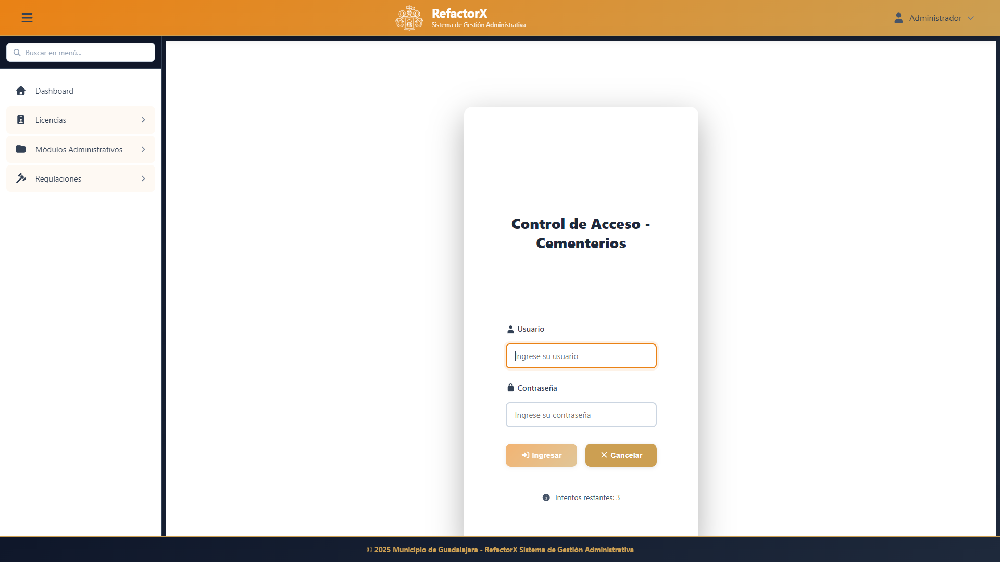

### 2.2 Cambio de Contraseña

Para cambiar su contraseña:

1. Acceda al menú de usuario
2. Seleccione "Cambiar Contraseña"
3. Introduzca su contraseña actual
4. Ingrese la nueva contraseña dos veces
5. Haga clic en "Guardar"

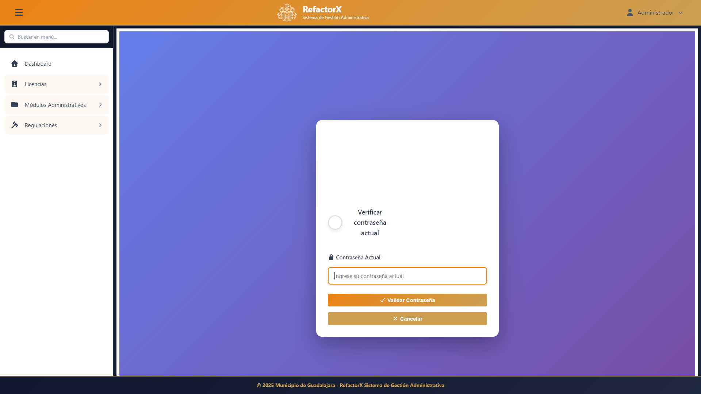

**Recomendaciones de seguridad:**
- Use contraseñas de al menos 8 caracteres
- Combine letras mayúsculas, minúsculas y números
- No comparta su contraseña con terceros
- Cambie su contraseña periódicamente

---

## 3. Menú Principal

### 3.1 Estructura del Menú

Al ingresar al módulo de cementerios, encontrará el menú principal organizado en secciones funcionales:

**Secciones disponibles:**

1. **Gestión de Datos** - Catálogos básicos (Cementerios, Folios, Pagos, Recargos)
2. **Consultas** - Búsquedas por diferentes criterios
3. **Consultas por Cementerio** - Acceso directo por ubicación
4. **Operaciones Especiales** - Bonificaciones, Descuentos, Duplicados, Traslados
5. **Títulos y Liquidaciones** - Gestión de títulos de propiedad y cálculos
6. **Reportes y Estadísticas** - Informes y análisis

### 3.2 Navegación

- Haga clic en cualquier tarjeta para acceder a la función correspondiente
- Use el botón "Ayuda" (icono ?) para obtener información contextual
- El botón "Documentación" proporciona información técnica adicional

---

## 4. Catálogos

Los catálogos son las bases de datos maestras del sistema que almacenan información fundamental.

### 4.1 ABC Cementerios

Gestión de los cementerios municipales registrados en el sistema.

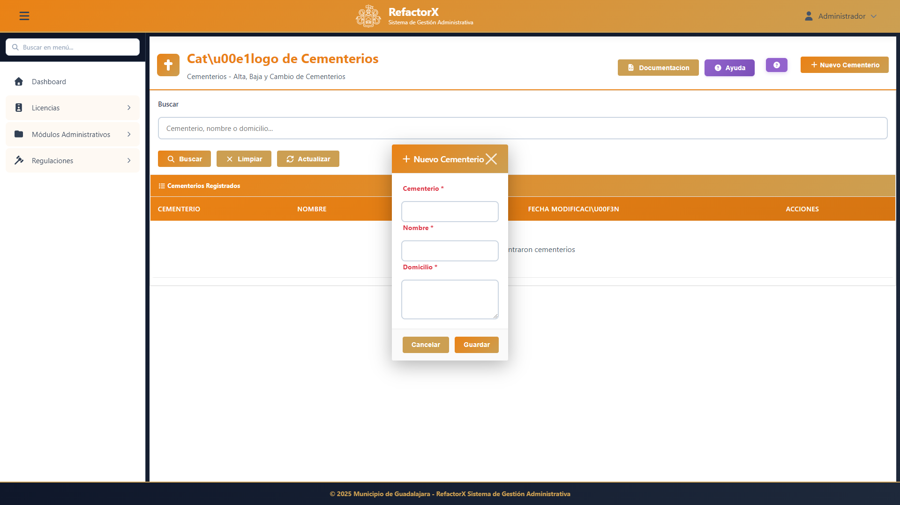

**Funciones disponibles:**

#### Registrar Nuevo Cementerio

1. Haga clic en el botón "Nuevo Cementerio"
2. Complete los datos requeridos:
   - **Cementerio**: Código identificador único (máx. 10 caracteres)
   - **Nombre**: Nombre completo del cementerio
   - **Domicilio**: Dirección completa del cementerio
3. Haga clic en "Guardar"

#### Modificar Cementerio

1. Localice el cementerio en la lista
2. Haga clic en el botón de edición (icono de lápiz)
3. Modifique los datos necesarios
4. Haga clic en "Guardar"

#### Eliminar Cementerio

1. Localice el cementerio en la lista
2. Haga clic en el botón de eliminación (icono de basura)
3. Confirme la operación

**Nota:** Solo se pueden eliminar cementerios que no tengan fosas asociadas.

#### Buscar Cementerio

Use el campo de búsqueda para filtrar por:
- Código de cementerio
- Nombre
- Domicilio

### 4.2 ABC Folios

Gestión de folios de perpetuidad de fosas en los cementerios.

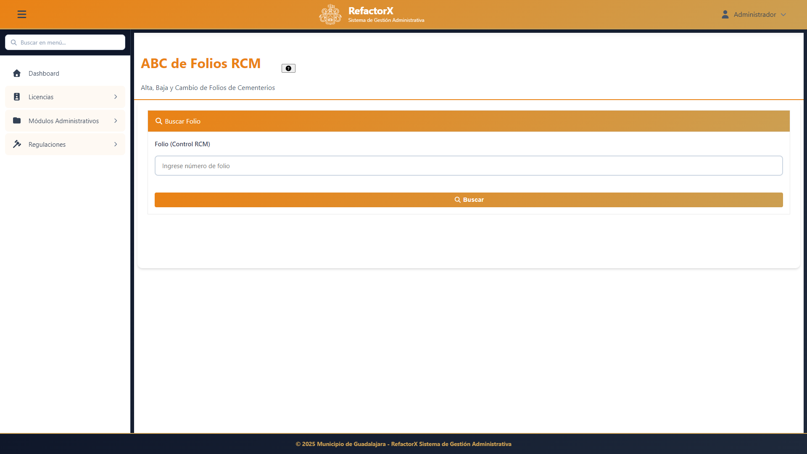

**Información del Folio:**

- **Control RCM**: Número único de control
- **Cementerio**: Ubicación del espacio
- **Clase, Sección, Línea, Fosa**: Ubicación física exacta
- **Propietario**: Datos del titular
- **Metros**: Dimensiones del espacio
- **Tipo**: Fosa, Urna o Cripta

**Operaciones:**

1. **Alta de Folio**: Registrar un nuevo espacio
2. **Modificación**: Actualizar datos del folio
3. **Baja**: Cancelar un folio (validación de requisitos)
4. **Consulta**: Búsqueda de folios existentes

### 4.3 ABC Pagos

Registro y gestión de pagos realizados por servicios de cementerios.

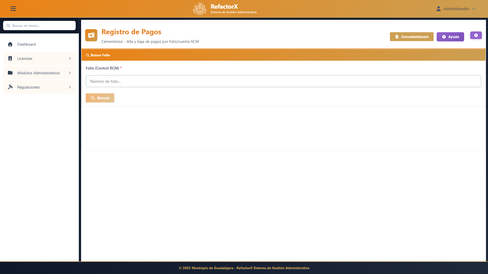

**Tipos de Pagos:**

- Cuotas de mantenimiento anual
- Perpetuidad de fosas
- Servicios adicionales
- Derechos de traslado
- Emisión de títulos

**Información del Pago:**

- **Folio**: Número de cuenta asociada
- **Operación**: Número único de operación
- **Fecha**: Fecha del pago
- **Importe**: Cantidad pagada
- **Conceptos**: Detalle de lo pagado
- **Recibo**: Número de recibo oficial

**Funciones:**

1. Registrar nuevos pagos
2. Consultar historial de pagos por folio
3. Modificar pagos (según permisos)
4. Anular pagos (requiere autorización)

### 4.4 ABC Recargos

Configuración de recargos aplicables a adeudos.

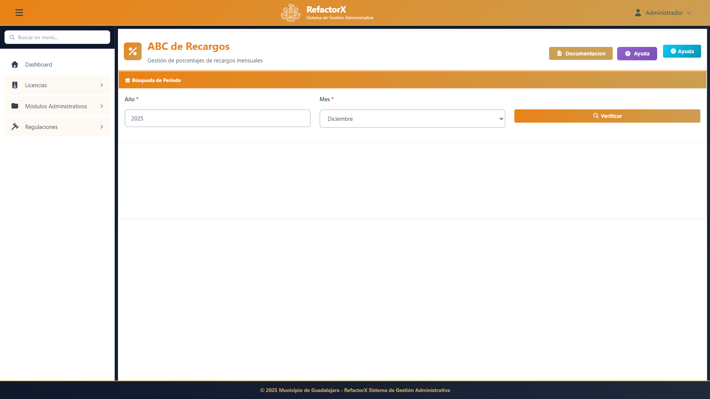

**Configuración de Recargos:**

- **Porcentaje mensual**: Tasa de recargo por mes de atraso
- **Fecha de aplicación**: Desde cuándo se aplica el recargo
- **Tipo de concepto**: A qué servicios aplica
- **Límite máximo**: Tope de recargos acumulables

**Cálculo Automático:**

El sistema calcula automáticamente los recargos basándose en:
- Meses de atraso desde el vencimiento
- Porcentaje configurado
- Importe original del adeudo

---

## 5. Consultas

El sistema ofrece múltiples opciones de consulta para localizar información rápidamente.

### 5.1 Consulta por Folio

Búsqueda de un espacio específico por su número de folio (Control RCM).

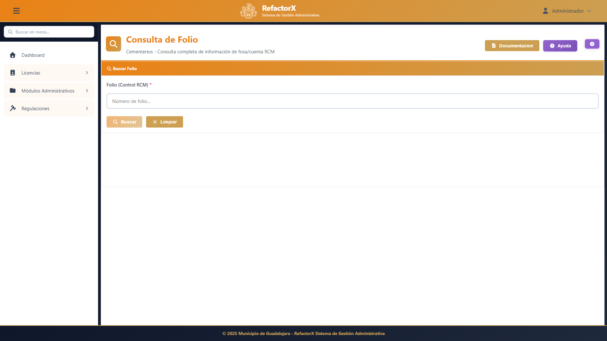

**Cómo consultar:**

1. Ingrese el número de folio (Control RCM)
2. Haga clic en "Buscar"
3. El sistema mostrará:
   - Datos del propietario
   - Ubicación física completa
   - Historial de pagos
   - Adeudos pendientes
   - Estado actual

**Información Mostrada:**

- **Datos del Espacio**: Cementerio, clase, sección, línea, fosa
- **Propietario**: Nombre, domicilio, teléfono
- **Estado de Cuenta**: Pagos realizados y adeudos
- **Últimos Movimientos**: Registro histórico

### 5.2 Consulta por RCM

Búsqueda por el número de Registro de Control Municipal.

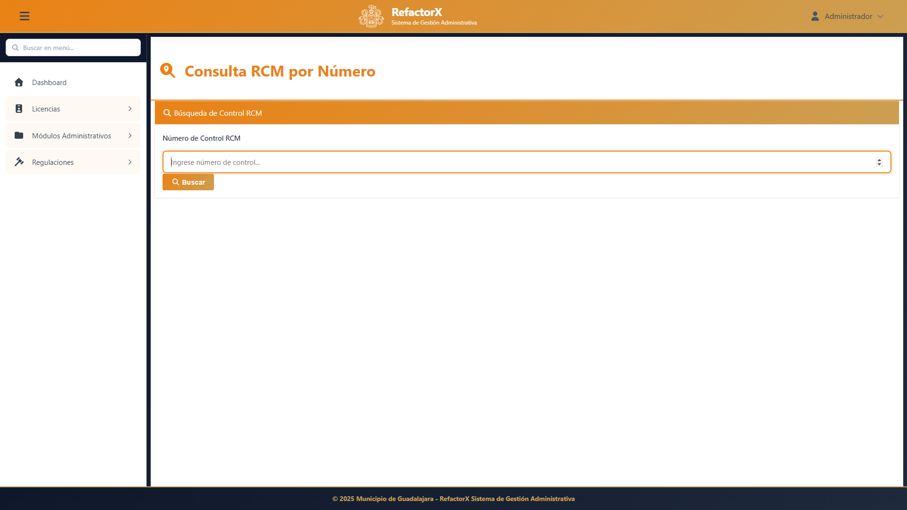

Similar a la consulta por folio, permite localizar espacios usando el número RCM.

### 5.3 Consulta por Nombre

Búsqueda de espacios por nombre del propietario.

**Opciones de Búsqueda:**

1. Ingrese el nombre completo o parcial
2. El sistema mostrará coincidencias
3. Puede filtrar por:
   - Apellido paterno
   - Apellido materno
   - Nombre(s)

**Resultados Múltiples:**

Si hay varias coincidencias:
- Se muestra una lista con todos los resultados
- Puede ordenar por nombre, folio o cementerio
- Seleccione el registro deseado para ver detalles

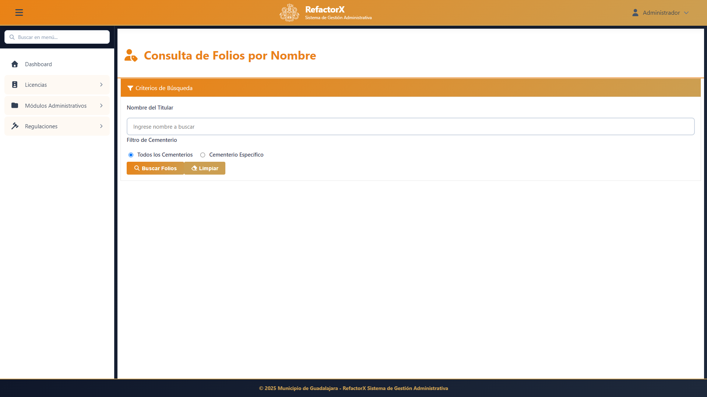

### 5.4 Consulta por Cementerio

Acceso directo a la información de cada cementerio municipal.

#### Cementerio Guadalajara

Consulta específica para el cementerio principal de Guadalajara.

#### Cementerio Jardín

Consulta especializada para el Cementerio Jardín.

#### Cementerio Mezquitán

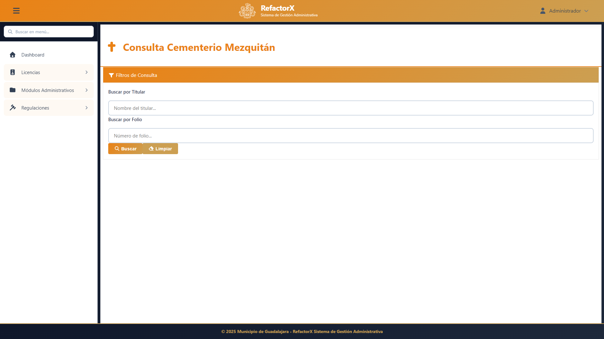

Acceso a información del cementerio histórico de Mezquitán.

#### Cementerio San Andrés

Consulta para el Cementerio San Andrés.

**Funcionalidades por Cementerio:**

- Listado de todas las fosas
- Filtros por sección y ubicación
- Estado de ocupación
- Disponibilidad de espacios
- Resumen de ingresos

### 5.5 Consultas Múltiples

#### Por Fecha

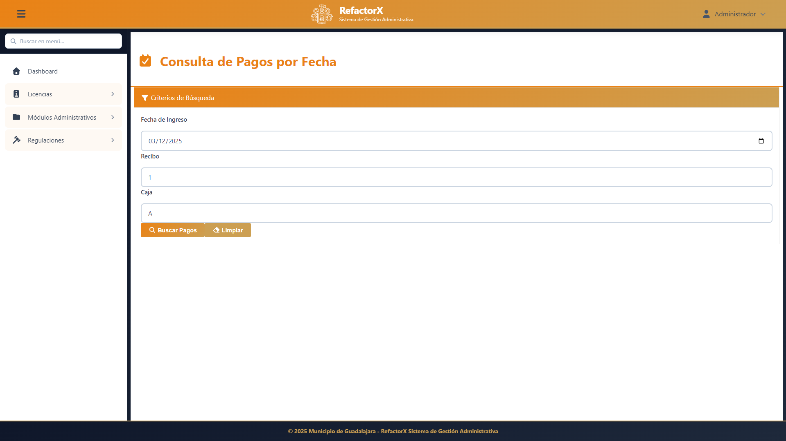

Búsqueda de movimientos en un rango de fechas:
- Pagos realizados
- Títulos emitidos
- Traslados efectuados

#### Por RCM Múltiple

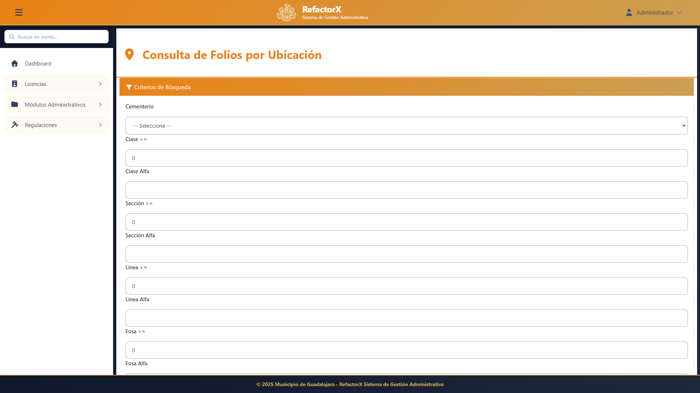

Consulta de varios folios simultáneamente:
1. Ingrese los números RCM separados por comas
2. El sistema mostrará la información de todos
3. Útil para procesos masivos

### 5.6 Consulta Individual

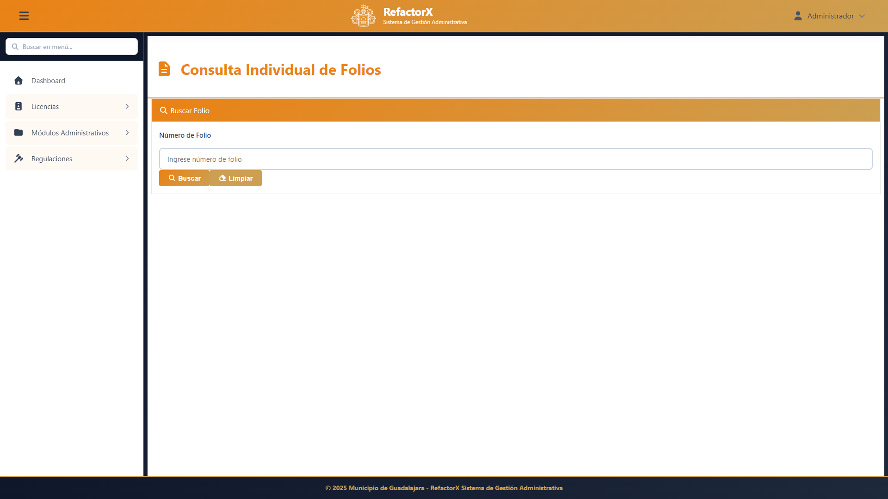

Vista detallada y completa de un folio específico con:
- Datos completos del propietario
- Historial completo de movimientos
- Gráficos de estado de cuenta
- Documentos asociados

### 5.7 Consulta 400

Consulta especial para revisión de expedientes y casos especiales que requieren atención administrativa.

---

## 6. Títulos y Perpetuidad

La gestión de títulos es fundamental para acreditar la propiedad de los espacios en cementerios.

### 6.1 Títulos de Propiedad

Los títulos son los documentos oficiales que acreditan la propiedad a perpetuidad de una fosa, urna o cripta.

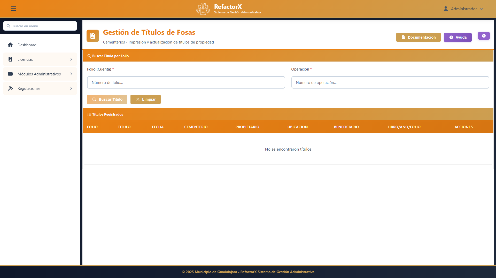

#### Generar un Título

**Requisitos previos:**

1. El folio debe estar registrado en el sistema
2. Debe existir al menos un pago de perpetuidad
3. El espacio debe estar libre de adeudos críticos

**Proceso de Generación:**

1. **Búsqueda del Folio**
   - Ingrese el número de folio (Control RCM)
   - Ingrese el número de operación del pago
   - Haga clic en "Buscar Título"

2. **Verificación de Datos**
   - El sistema muestra los datos del propietario
   - Verifica la ubicación física del espacio
   - Muestra el historial de pagos

3. **Captura de Datos del Beneficiario**
   - **Nombre Completo**: Persona a favor de quien se emite
   - **Domicilio**: Dirección completa
   - **Colonia**: Asentamiento
   - **Teléfono**: Contacto

4. **Datos del Registro**
   - **Libro**: Número de libro de registro
   - **Año**: Año de expedición
   - **Folio**: Número de folio en el libro
   - **Partida**: Número de partida (opcional)

5. **Guardar y Preparar Impresión**
   - Haga clic en "Guardar Datos del Título"
   - Una vez guardado, use "Preparar Impresión"
   - El sistema genera el documento oficial

#### Títulos Sin Registrar

Listado de folios que tienen pago de perpetuidad pero aún no cuentan con título emitido.

**Uso:**

1. Acceda al módulo "Generar Títulos"
2. El sistema muestra folios pendientes
3. Seleccione el folio a procesar
4. Complete el proceso de generación

### 6.2 Reporte de Títulos

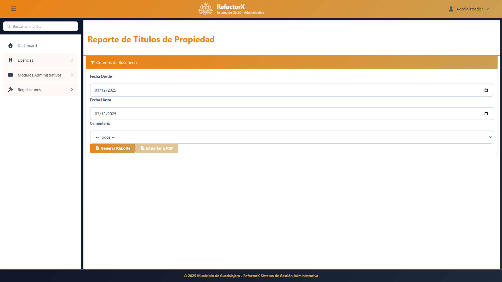

Genera reportes oficiales de títulos emitidos:

- Por rango de fechas
- Por cementerio
- Por beneficiario
- Estadísticas de emisión

---

## 7. Traslados

Los traslados permiten mover registros o restos entre diferentes ubicaciones dentro de los cementerios.

### 7.1 Traslados por Folio

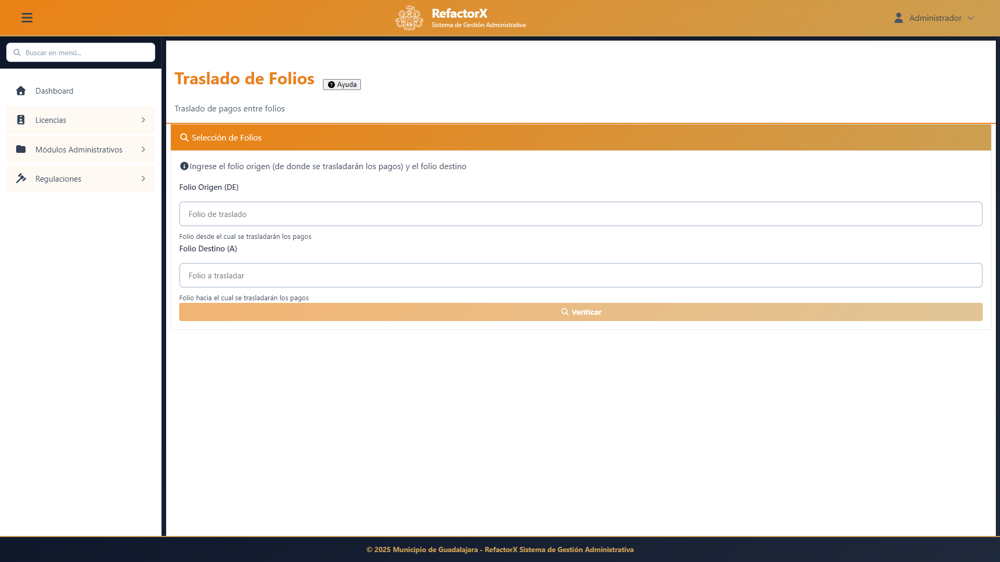

**Tipos de Traslado:**

1. **Traslado de Restos**: Movimiento físico de restos entre espacios
2. **Traslado de Folio**: Cambio de ubicación administrativa

#### Proceso de Traslado

**Paso 1: Identificación del Origen**

1. Ingrese el folio origen
2. Verifique los datos del propietario
3. Confirme la ubicación actual:
   - Cementerio
   - Clase
   - Sección
   - Línea
   - Fosa

**Paso 2: Especificación del Destino**

1. Seleccione el cementerio destino
2. Indique la nueva ubicación:
   - Clase
   - Sección
   - Línea
   - Fosa
3. Verifique que el espacio destino esté disponible

**Paso 3: Documentación**

1. **Motivo del Traslado**: Justificación
2. **Autorización**: Oficio o documento que autoriza
3. **Fecha de Traslado**: Cuándo se realizará
4. **Observaciones**: Información adicional

**Paso 4: Confirmación**

1. Revise todos los datos capturados
2. Confirme el traslado
3. El sistema genera:
   - Orden de traslado
   - Actualización de registros
   - Notificación al cementerio

### 7.2 Traslados Sin Foliar

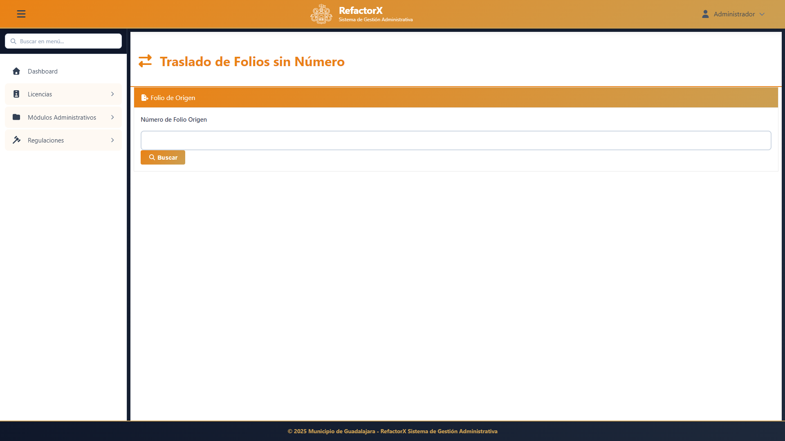

Gestión de traslados de restos que no tienen folio asignado o son casos especiales.

### 7.3 Traslados Generales

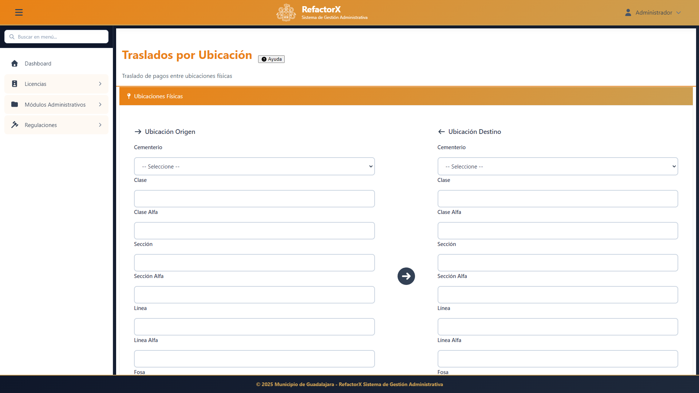

Vista integral de todos los traslados registrados:

- Traslados programados
- Traslados en proceso
- Traslados completados
- Historial de traslados

**Filtros disponibles:**

- Por rango de fechas
- Por cementerio origen
- Por cementerio destino
- Por estado del traslado

---

## 8. Pagos y Liquidaciones

### 8.1 Pagos por Folio

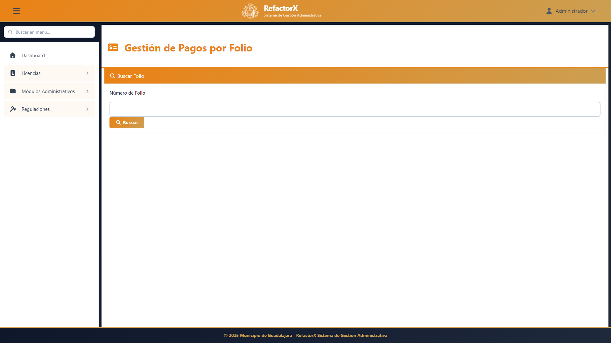

Consulta detallada del historial completo de pagos de un folio específico.

**Información Mostrada:**

- **Fecha de Pago**: Cuándo se realizó
- **Operación**: Número único de operación
- **Concepto**: Qué se pagó (mantenimiento, perpetuidad, etc.)
- **Importe**: Cantidad pagada
- **Recibo**: Número de recibo oficial
- **Usuario**: Quien capturó el pago

### 8.2 Liquidaciones

Las liquidaciones calculan el monto total a pagar considerando:

- Cuota base según tipo de espacio
- Metros del espacio
- Adeudos acumulados
- Recargos por morosidad
- Descuentos aplicables

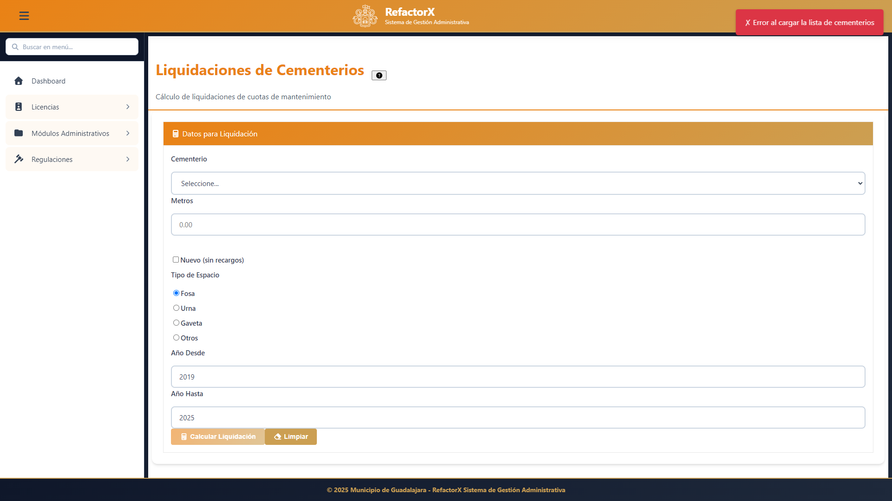

#### Calcular Liquidación

**Paso 1: Datos del Espacio**

1. Seleccione el cementerio
2. Ingrese los metros del espacio
3. Seleccione el tipo:
   - Fosa
   - Urna
   - Cripta

**Paso 2: Configuración**

1. **Nuevo**: Active esta opción si es un pago sin recargos
2. **Período**: Indique si es:
   - Pago anual único
   - Varios años acumulados
   - Perpetuidad

**Paso 3: Cálculo**

1. El sistema calcula automáticamente:
   - Cuota base × metros
   - Recargos por atraso (si aplica)
   - Actualización por inflación
   - Total a pagar

2. Se muestra el desglose completo:
   - Subtotal
   - Recargos
   - Actualizaciones
   - Descuentos (si aplica)
   - Total

**Paso 4: Aplicar Pago**

1. Verifique el cálculo
2. Ingrese el número de recibo oficial
3. Confirme la forma de pago:
   - Efectivo
   - Tarjeta
   - Transferencia
4. Guarde el registro

#### Reimprimir Liquidación

Si necesita reimprimir una liquidación:

1. Busque el folio
2. Seleccione la operación
3. Haga clic en "Reimprimir"
4. El sistema genera una copia

---

## 9. Bonificaciones y Descuentos

### 9.1 Bonificaciones por Oficio

Las bonificaciones son descuentos autorizados mediante oficio oficial.

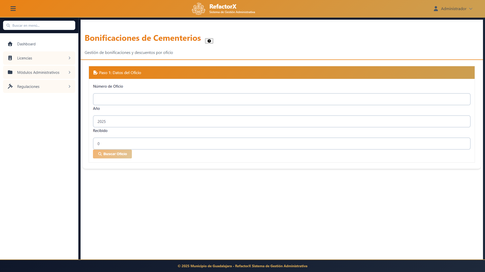

#### Proceso de Bonificación

**Paso 1: Datos del Oficio**

1. **Número de Oficio**: Folio del documento oficial
2. **Año**: Ejercicio fiscal del oficio
3. **Recibido**: Código de recepción (0-9)
4. Haga clic en "Buscar Oficio"

**Casos posibles:**

- **Oficio Nuevo**: Si no existe, se creará el registro
- **Oficio Existente**: Si ya está registrado, se mostrará su información

**Paso 2: Folio a Bonificar**

1. Ingrese el número de folio (Control RCM)
2. Haga clic en "Buscar Folio"
3. El sistema muestra:
   - Datos del propietario
   - Adeudos pendientes
   - Pagos previos

**Paso 3: Configuración de la Bonificación**

1. **Tipo de Bonificación**:
   - Porcentaje de descuento
   - Monto fijo
   - Condonación total

2. **Conceptos a Bonificar**:
   - ☑ Cuota de mantenimiento
   - ☑ Recargos
   - ☑ Actualizaciones
   - ☑ Gastos administrativos

3. **Vigencia**:
   - Años a bonificar (si es mantenimiento)
   - Fecha de aplicación

**Paso 4: Autorización**

1. Verifique que todos los datos sean correctos
2. El sistema valida:
   - Oficio vigente
   - Folios válidos
   - Montos consistentes
3. Confirme la aplicación

**Paso 5: Aplicar Bonificación**

1. Haga clic en "Aplicar Bonificación"
2. El sistema genera:
   - Registro de la bonificación
   - Actualización del estado de cuenta
   - Recibo o comprobante

### 9.2 Bonificación Individual

Aplicación de bonificación a un solo folio de manera específica.

### 9.3 Descuentos Generales

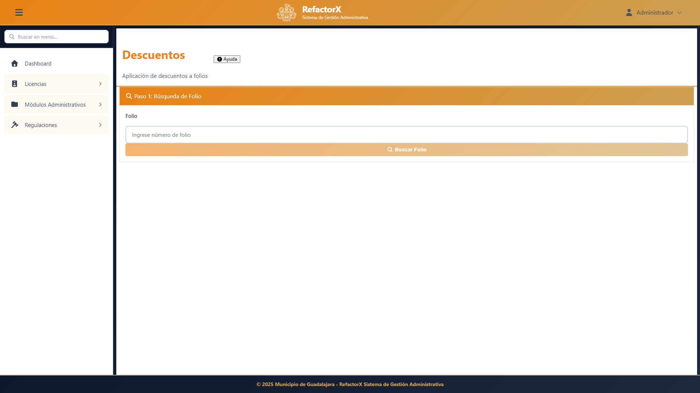

Gestión de descuentos aplicables:

**Tipos de Descuentos:**

1. **Por Pronto Pago**: Descuento si se paga antes del vencimiento
2. **Tercera Edad**: Para propietarios adultos mayores
3. **Discapacidad**: Personas con discapacidad
4. **Campaña**: Descuentos temporales autorizados

**Aplicación de Descuentos:**

Los descuentos se aplican automáticamente al momento del pago si se cumplen los requisitos configurados.

---

## 10. Reportes

### 10.1 Estadísticas de Adeudos

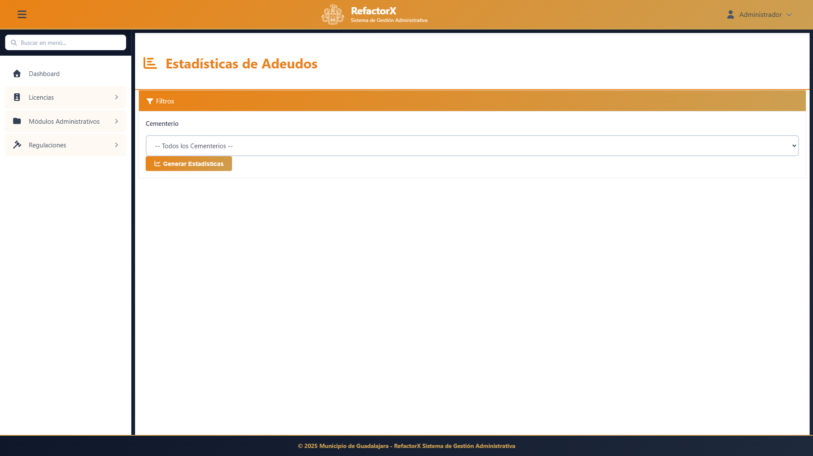

Reporte estadístico que muestra:

- Total de folios con adeudos
- Monto total adeudado
- Distribución por cementerio
- Antigüedad de adeudos
- Tendencias de cobranza

**Uso del Reporte:**

1. Seleccione el rango de fechas
2. Filtre por cementerio (opcional)
3. Elija el tipo de gráfico:
   - Barras
   - Pastel
   - Líneas
4. Genere el reporte

### 10.2 Listado de Movimientos

Reporte cronológico de todas las operaciones realizadas:

- Pagos recibidos
- Títulos emitidos
- Traslados efectuados
- Bonificaciones aplicadas
- Modificaciones realizadas

**Filtros:**

- Rango de fechas
- Tipo de movimiento
- Cementerio
- Usuario que realizó el movimiento

### 10.3 Cuentas por Cobrar

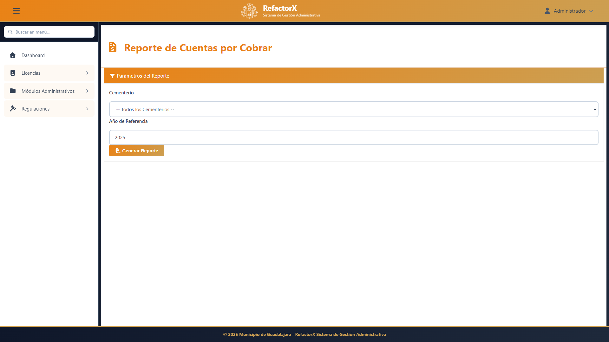

Listado detallado de adeudos pendientes:

**Información incluida:**

- Folio
- Propietario
- Cementerio y ubicación
- Años adeudados
- Importe original
- Recargos acumulados
- Total adeudado
- Antigüedad

**Opciones de Ordenamiento:**

- Por monto (mayor a menor)
- Por antigüedad
- Por cementerio
- Por alfabético

**Exportación:**

- Excel para análisis
- PDF para impresión
- CSV para otros sistemas

### 10.4 Reporte de Bonificaciones

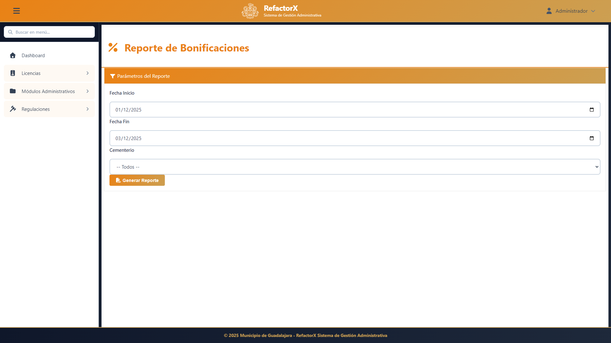

Listado de todas las bonificaciones aplicadas:

- Número de oficio
- Fecha de autorización
- Folio beneficiado
- Propietario
- Concepto bonificado
- Monto descontado
- Usuario que aplicó

**Totales:**

- Suma de bonificaciones por período
- Por tipo de descuento
- Por cementerio

### 10.5 Duplicados

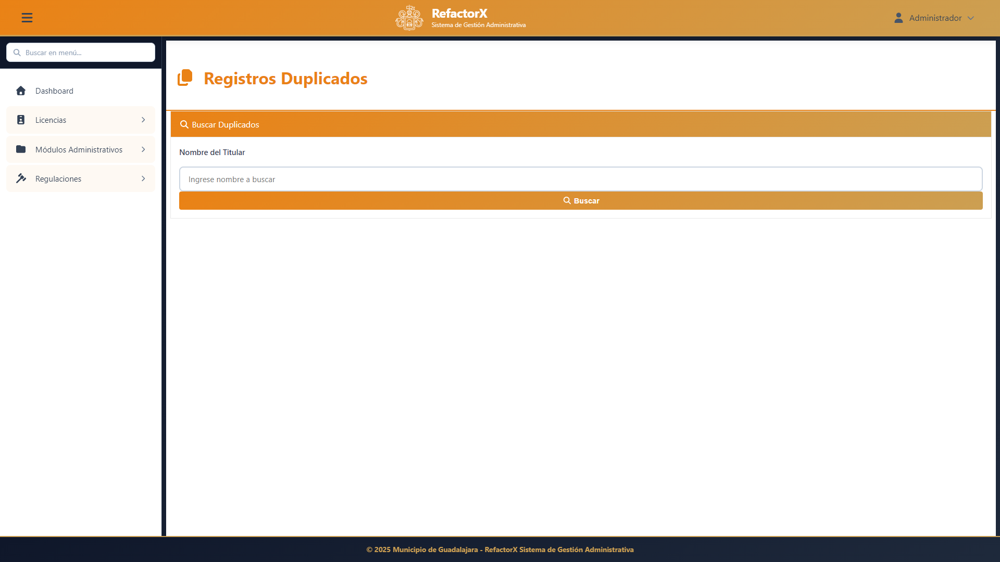

Reporte de posibles duplicados en el sistema:

- Folios con información repetida
- Propietarios con múltiples registros
- Ubicaciones físicas duplicadas

**Acciones:**

- Revisar cada caso
- Unificar registros
- Corregir información

---

## 11. Glosario de Términos

### Términos Generales

**Cementerio Municipal**
: Instalación pública destinada a la inhumación de restos humanos, administrada por el Municipio de Guadalajara.

**Folio de Perpetuidad**
: Número de control único asignado a cada espacio en el cementerio que otorga derecho de uso a perpetuidad.

**Control RCM**
: Registro de Control Municipal. Número único que identifica cada espacio en el sistema.

**Título de Propiedad**
: Documento oficial que acredita el derecho de uso a perpetuidad de un espacio en el cementerio.

**Perpetuidad**
: Derecho de uso permanente e indefinido de un espacio en el cementerio.

### Términos Técnicos

**Clase**
: Primer nivel de división física en un cementerio. Agrupa varias secciones.

**Sección**
: Subdivisión de una clase. Contiene varias líneas.

**Línea**
: Fila o hilera de fosas dentro de una sección.

**Fosa**
: Espacio individual destinado a la inhumación. Unidad básica del sistema.

**Urna**
: Espacio reducido destinado a la inhumación de restos cremados.

**Cripta**
: Espacio construido sobre el nivel del suelo, generalmente con estructura de concreto.

**Clase Alfa / Sección Alfa / Línea Alfa / Fosa Alfa**
: Nomenclatura alternativa alfabética para identificar ubicaciones físicas (ej: A, B, AA, etc.)

### Términos Financieros

**Cuota de Mantenimiento**
: Pago anual obligatorio por el mantenimiento y conservación del cementerio.

**Liquidación**
: Cálculo del monto total a pagar considerando cuotas, adeudos y recargos.

**Recargo**
: Cantidad adicional que se cobra por pago extemporáneo de cuotas.

**Bonificación**
: Descuento autorizado mediante oficio oficial por diversas causas.

**Descuento**
: Reducción en el monto a pagar por cumplir ciertos requisitos (pronto pago, tercera edad, etc.)

**Operación**
: Número único que identifica cada transacción o pago en el sistema.

**Adeudo**
: Cantidad pendiente de pago por concepto de cuotas vencidas.

**Actualización**
: Ajuste del monto adeudado por inflación o cambios en las tarifas oficiales.

### Términos Administrativos

**Oficio**
: Documento oficial mediante el cual se autoriza una bonificación, traslado u operación especial.

**Partida**
: Número de registro en los libros oficiales del municipio.

**Libro**
: Registro físico o digital donde se asientan los títulos de propiedad.

**Beneficiario**
: Persona a cuyo favor se expide el título de propiedad.

**Traslado**
: Movimiento de restos o cambio de ubicación de un folio entre espacios del cementerio.

**Exhumación**
: Proceso de extraer restos de un espacio para traslado o disposición final.

**Inhumación**
: Proceso de depositar restos en un espacio del cementerio.

### Términos del Sistema

**ABC**
: Alta, Baja y Cambio. Se refiere a los módulos de gestión de catálogos.

**Usuario**
: Persona autorizada para acceder y operar el sistema.

**Sesión**
: Período de tiempo en que un usuario está activo en el sistema.

**Permisos**
: Autorizaciones específicas para realizar ciertas operaciones en el sistema.

**Bitácora**
: Registro histórico de todas las operaciones realizadas en el sistema.

**Validación**
: Proceso automático de verificación de datos antes de guardar información.

---

## Información de Contacto

**Dirección de Panteones Municipales**
Municipio de Guadalajara

Para soporte técnico o dudas sobre el sistema:
- Contacte al administrador del sistema RefactorX
- Consulte el manual técnico (personal autorizado)
- Solicite capacitación adicional a su supervisor

---

**Versión del Manual:** 1.0
**Fecha de Última Actualización:** Diciembre 2025
**Sistema:** RefactorX - Módulo de Cementerios
**Municipio de Guadalajara, Jalisco**

---

*Este manual es propiedad del Municipio de Guadalajara. Su uso está restringido al personal autorizado.*
