# Manual de Usuario - Módulo Estacionamiento Exclusivo

## Sistema RefactorX - Municipio de Guadalajara

---

## Tabla de Contenidos

1. [Introducción](#1-introducción)
2. [Acceso al Sistema](#2-acceso-al-sistema)
3. [Menú Principal](#3-menú-principal)
4. [Consultas y Búsquedas](#4-consultas-y-búsquedas)
5. [Modificaciones y Actualizaciones](#5-modificaciones-y-actualizaciones)
6. [Gestión de Ejecutores](#6-gestión-de-ejecutores)
7. [Sistema de Apremios](#7-sistema-de-apremios)
8. [Notificaciones y Requerimientos](#8-notificaciones-y-requerimientos)
9. [Facturación y Pagos](#9-facturación-y-pagos)
10. [Reportes y Listados](#10-reportes-y-listados)
11. [Glosario de Términos](#11-glosario-de-términos)

---

## 1. Introducción

### 1.1 ¿Qué es el Módulo de Estacionamiento Exclusivo?

El módulo de **Estacionamiento Exclusivo** es un sistema integral diseñado para la gestión y control de los estacionamientos exclusivos en vía pública del Municipio de Guadalajara. Permite administrar:

- Registro de folios de estacionamiento exclusivo
- Control de adeudos y pagos
- Gestión de ejecutores de cobranza
- Sistema completo de apremios y procedimientos administrativos
- Notificaciones y requerimientos
- Emisión de reportes y facturación

### 1.2 Usuarios del Sistema

Este módulo está diseñado para ser utilizado por:

- **Personal de Administración**: Consultas, modificaciones y gestión de folios
- **Departamento de Cobranza**: Control de adeudos, recuperación y ejecutores
- **Área de Apremios**: Gestión de procedimientos administrativos
- **Coordinadores**: Supervisión de procesos y generación de reportes

---

## 2. Acceso al Sistema

### 2.1 Inicio de Sesión

Para acceder al módulo de Estacionamiento Exclusivo:

1. Ingrese al sistema RefactorX con sus credenciales
2. Seleccione el módulo **"Estacionamiento Exclusivo"** desde el menú principal
3. Se mostrará la pantalla de acceso específica del módulo

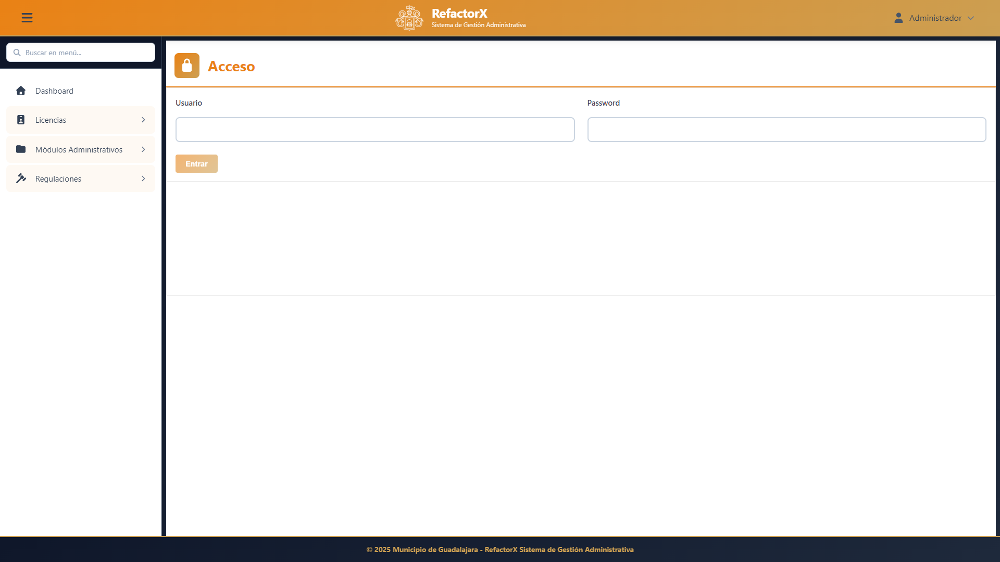

**Nota**: Las credenciales de acceso son proporcionadas por el Departamento de Sistemas del Municipio.

### 2.2 Cambio de Contraseña

Para cambiar su contraseña de acceso:

1. Haga clic en su nombre de usuario en la esquina superior derecha
2. Seleccione la opción **"Cambiar Contraseña"**
3. Ingrese su contraseña actual
4. Escriba la nueva contraseña dos veces para confirmar
5. Haga clic en **"Guardar"**

**Recomendaciones de seguridad**:
- Utilice al menos 8 caracteres
- Combine letras mayúsculas, minúsculas y números
- Cambie su contraseña periódicamente
- No comparta su contraseña con otros usuarios

---

## 3. Menú Principal

### 3.1 Estructura del Menú

Al acceder al módulo, se presenta el menú principal organizado en las siguientes secciones:

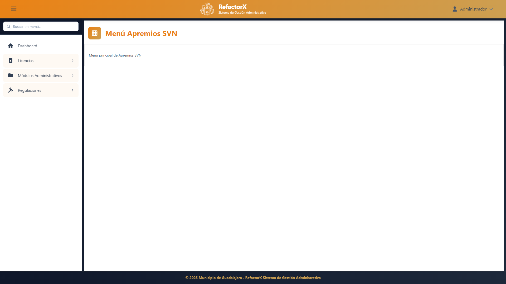

#### Secciones Principales:

1. **Consultas**
   - Consulta Individual
   - Consulta por Folio
   - Consulta por Registro
   - Consulta Histórica

2. **Modificaciones**
   - Modificar Registro
   - Modificar Bienes
   - Modificación Masiva

3. **Listados y Reportes**
   - Listados Generales
   - Listados de Adeudos
   - Estado por Folio
   - Reportes Especializados

4. **Cobranza**
   - Requerimientos
   - Recuperación
   - Notificaciones
   - Prenómina de Ejecutores

5. **Ejecutores**
   - Catálogo de Ejecutores
   - Reasignación de Cuentas
   - Autorización de Descuentos

6. **Apremios**
   - Expedientes
   - Fases de Apremio
   - Actuaciones
   - Notificaciones de Apremio
   - Pagos de Apremio
   - Reportes de Apremio

7. **Herramientas**
   - Facturación
   - Carta Invitación
   - Firma Electrónica
   - Exportar a Excel

### 3.2 Navegación

Para navegar por el sistema:

- **Menú lateral**: Haga clic en las secciones para desplegar las opciones
- **Breadcrumbs**: Use la ruta de navegación en la parte superior para regresar
- **Botones de acción**: Cada pantalla presenta botones específicos según la función
- **Teclas rápidas**: Use Tab para moverse entre campos, Enter para confirmar

---

## 4. Consultas y Búsquedas

### 4.1 Consulta Individual

La consulta individual permite buscar información detallada de un registro específico.

#### Procedimiento:

1. Acceda a **Consultas > Consulta Individual**
2. Seleccione el criterio de búsqueda:
   - Por Número de Cuenta
   - Por Nombre del Propietario
   - Por Dirección
   - Por RFC
3. Ingrese el dato a buscar
4. Haga clic en **"Buscar"**
5. El sistema mostrará los resultados coincidentes

#### Información Desplegada:

- **Datos Generales**: Cuenta, folio, propietario, domicilio
- **Características**: Tipo de estacionamiento, medidas, ubicación
- **Estado Actual**: Situación del registro, fecha de alta
- **Adeudos**: Montos pendientes de pago, períodos vencidos
- **Historial de Pagos**: Últimos movimientos registrados

### 4.2 Consulta por Folio

Búsqueda específica utilizando el número de folio asignado.

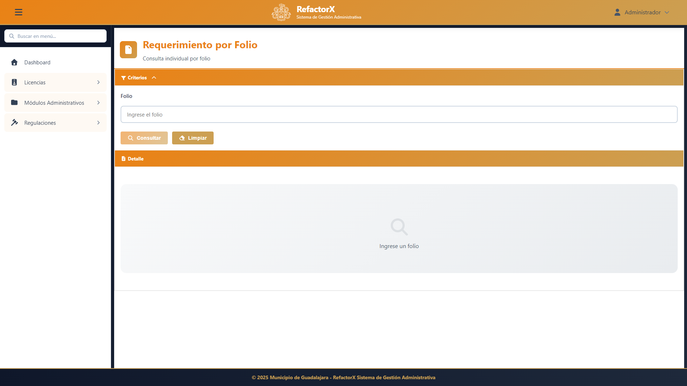

#### Procedimiento:

1. Acceda a **Consultas > Consulta por Folio**
2. Ingrese el número de folio (puede usar * como comodín)
3. Presione Enter o haga clic en **"Consultar"**
4. Se mostrará la información completa del folio

**Ejemplo**:
- Folio exacto: `12345`
- Búsqueda con comodín: `123*` (muestra todos los folios que inician con 123)

### 4.3 Consulta por Registro

Búsqueda avanzada por diferentes campos del registro.

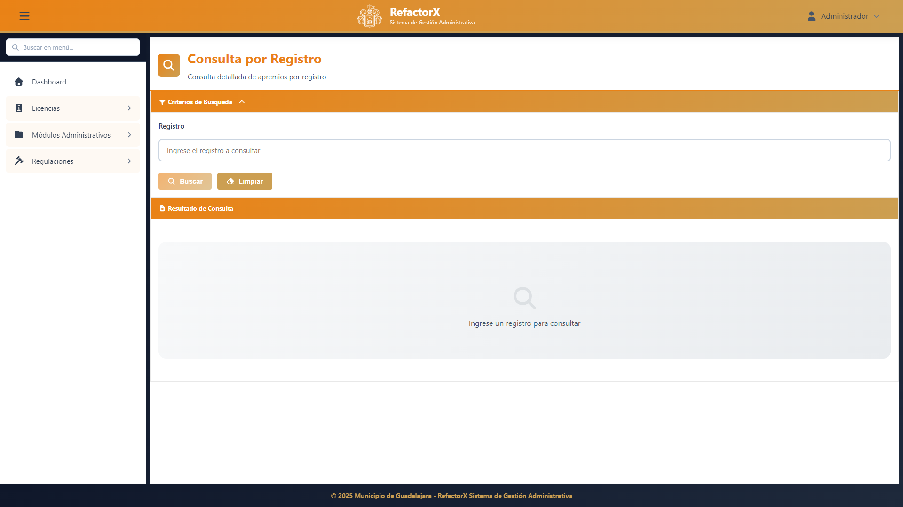

#### Criterios de búsqueda disponibles:

- **Registro**: Número de registro municipal
- **Colonia**: Búsqueda por colonia
- **Calle**: Nombre de la vía pública
- **Número**: Número exterior/interior
- **Zona**: Zona administrativa
- **Estatus**: Activo, suspendido, cancelado

#### Filtros avanzados:

- Rango de fechas
- Tipo de estacionamiento
- Ejecutor asignado
- Con/sin adeudos

### 4.4 Consulta Histórica

Permite consultar el historial completo de movimientos de un registro.

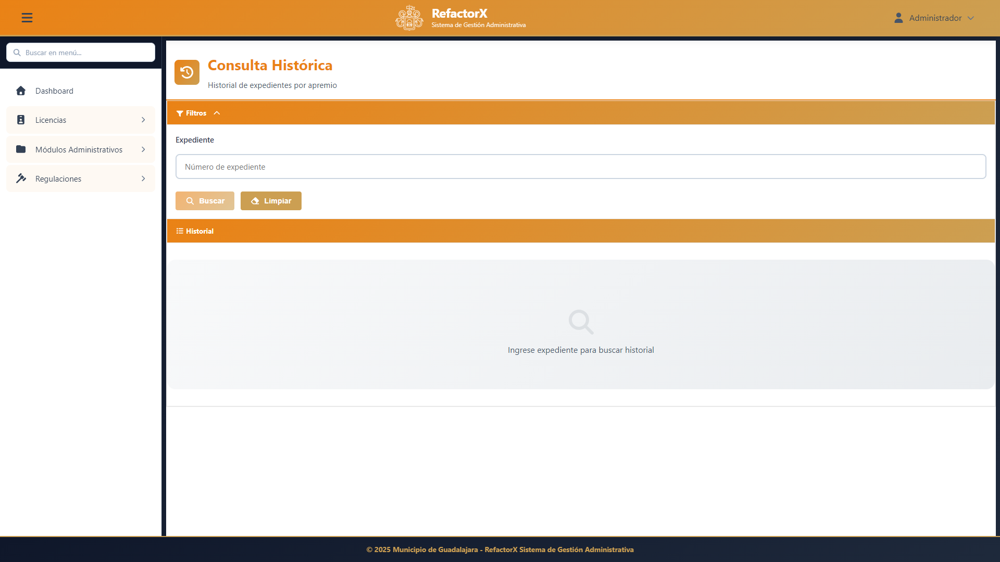

#### Información del historial:

- **Cambios de propietario**
- **Modificaciones de datos**
- **Pagos realizados**
- **Requerimientos emitidos**
- **Notificaciones enviadas**
- **Cambios de estatus**
- **Reasignaciones de ejecutor**

#### Procedimiento:

1. Consulte primero el registro (Individual o por Folio)
2. Haga clic en el botón **"Ver Historial"**
3. El sistema mostrará una línea de tiempo con todos los movimientos
4. Puede filtrar por tipo de movimiento o rango de fechas

---

## 5. Modificaciones y Actualizaciones

### 5.1 Modificar Registro

Permite actualizar la información general de un registro de estacionamiento.

#### Campos Modificables:

**Datos del Propietario:**
- Nombre o razón social
- RFC
- Domicilio fiscal
- Teléfonos de contacto
- Correo electrónico

**Datos del Estacionamiento:**
- Dirección completa
- Referencias de ubicación
- Dimensiones (metros lineales)
- Tipo de estacionamiento

#### Procedimiento:

1. Acceda a **Modificaciones > Modificar Registro**
2. Busque el registro a modificar
3. Modifique los campos necesarios
4. Verifique la información
5. Haga clic en **"Guardar Cambios"**
6. Confirme la operación

**Importante**:
- Los cambios quedan registrados en el historial
- Algunos campos requieren autorización especial
- Se genera una bitácora automática de modificaciones

### 5.2 Modificar Bienes

Actualización específica de las características físicas del estacionamiento.

#### Información que puede modificar:

- **Medidas**: Longitud del cajón exclusivo
- **Ubicación exacta**: Números oficiales
- **Características especiales**: Rampa, acceso especial, etc.
- **Estado físico**: Señalización, mantenimiento requerido

#### Validaciones del sistema:

- No se pueden reducir medidas si hay adeudos pendientes
- Los cambios de ubicación requieren verificación
- Se debe anexar documentación soporte cuando aplique

### 5.3 Modificación Masiva

Herramienta para aplicar cambios a múltiples registros simultáneamente.

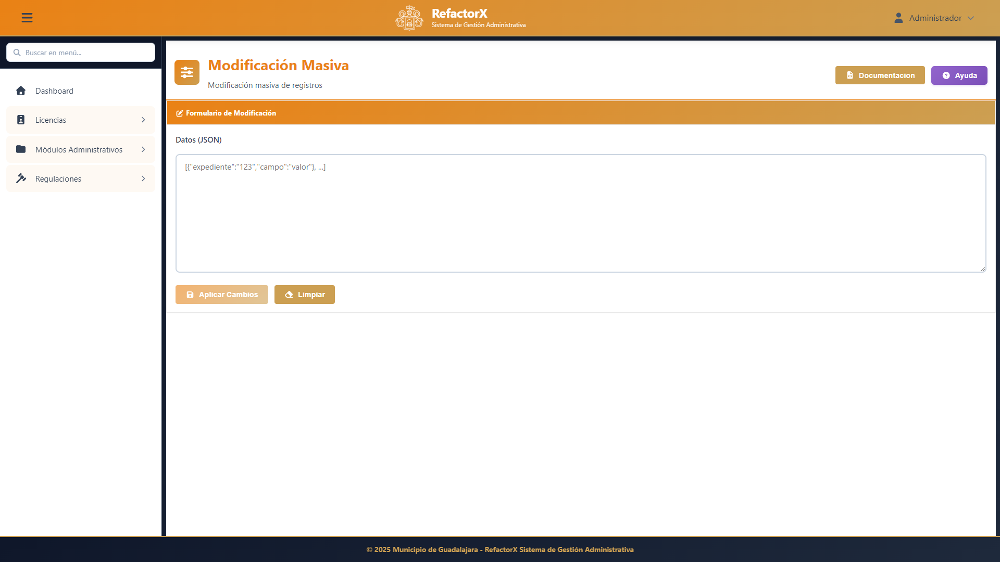

#### Casos de uso:

1. **Actualización de tarifas**: Aplicar nuevas cuotas a un grupo de registros
2. **Cambio de ejecutor**: Reasignar múltiples cuentas
3. **Actualización de datos**: Corrección de colonia, zona, etc.
4. **Cambio de estatus masivo**: Suspensión o reactivación grupal

#### Procedimiento:

1. Acceda a **Modificaciones > Modificación Masiva**
2. Defina los filtros de selección:
   - Por ejecutor
   - Por zona
   - Por colonia
   - Por rango de cuentas
3. Visualice la lista de registros afectados
4. Seleccione el tipo de cambio a aplicar
5. Configure los nuevos valores
6. Revise el resumen de cambios
7. Confirme la operación

**Advertencia**: Esta operación es irreversible. Verifique cuidadosamente antes de confirmar.

---

## 6. Gestión de Ejecutores

### 6.1 Catálogo de Ejecutores

Administración del personal de cobranza asignado a la recuperación de adeudos.

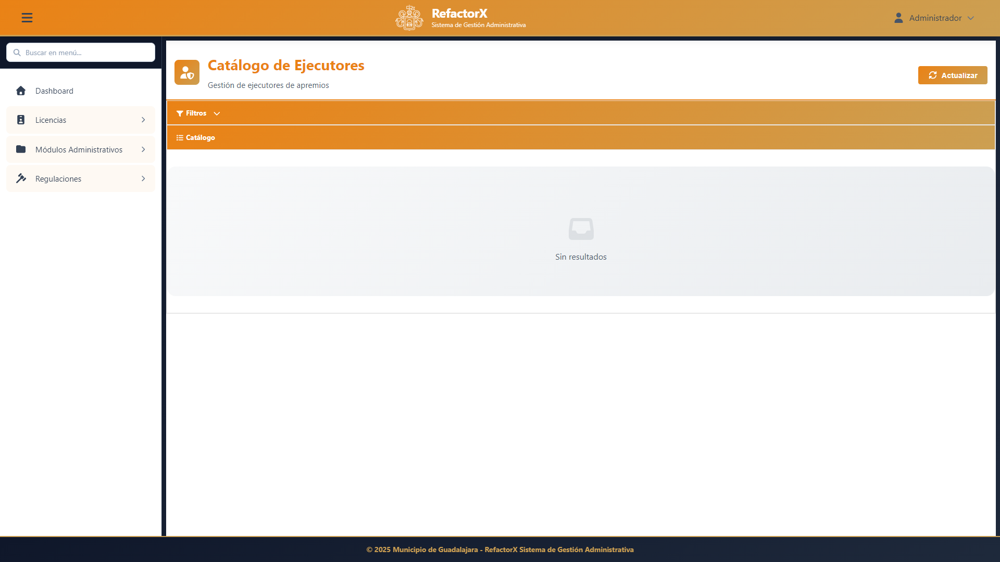

#### Información de cada ejecutor:

- **Datos personales**: Nombre completo, identificación
- **Zona asignada**: Área geográfica de trabajo
- **Cuentas asignadas**: Número de registros bajo su responsabilidad
- **Meta de recuperación**: Objetivo mensual
- **Porcentaje de comisión**: Sobre montos recuperados
- **Estado**: Activo, suspendido, dado de baja

### 6.2 Alta de Ejecutores

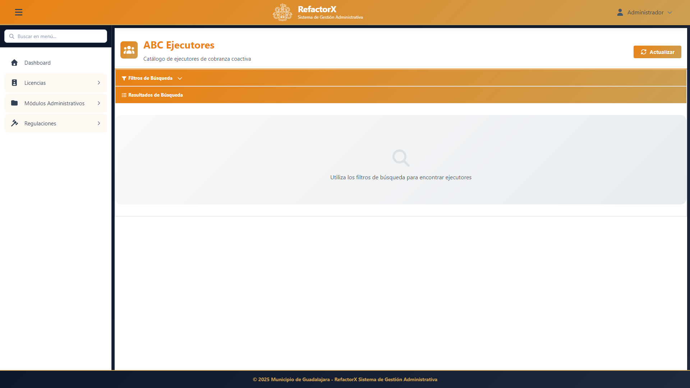

#### Procedimiento para dar de alta un ejecutor:

1. Acceda a **Ejecutores > ABC Ejecutores**
2. Haga clic en **"Nuevo Ejecutor"**
3. Complete el formulario:
   - Nombre completo
   - RFC
   - Domicilio
   - Teléfonos
   - Correo electrónico
   - Número de empleado (opcional)
4. Asigne la zona de trabajo
5. Configure el porcentaje de comisión
6. Establezca la meta mensual
7. Guarde el registro

#### Documentación requerida:

- Identificación oficial
- Comprobante de domicilio
- RFC
- Carta de antecedentes no penales (según políticas internas)

### 6.3 Listado de Ejecutores

Reportes de desempeño y asignaciones de ejecutores.

#### Tipos de reportes:

1. **Listado General**: Todos los ejecutores activos
2. **Por Zona**: Ejecutores agrupados por área
3. **Con Asignaciones**: Solo ejecutores con cuentas asignadas
4. **Desempeño**: Ranking de recuperación
5. **Histórico**: Trayectoria de cada ejecutor

#### Información en los reportes:

- Cuentas asignadas por ejecutor
- Montos en gestión
- Recuperación del período
- Porcentaje de efectividad
- Comisiones generadas

### 6.4 Gastos de Cobranza

Control de gastos operativos de los ejecutores.

#### Tipos de gastos registrables:

- **Transporte**: Viáticos y combustible
- **Papelería**: Formatos, impresiones
- **Notificaciones**: Mensajería, correo certificado
- **Diligencias**: Gestiones especiales

#### Procedimiento de registro:

1. El ejecutor reporta los gastos al coordinador
2. Se ingresa al sistema con la documentación soporte
3. El coordinador revisa y autoriza
4. Los gastos se descuentan de la comisión o se reembolsan

### 6.5 Reasignación de Cuentas

Transferencia de registros entre ejecutores.

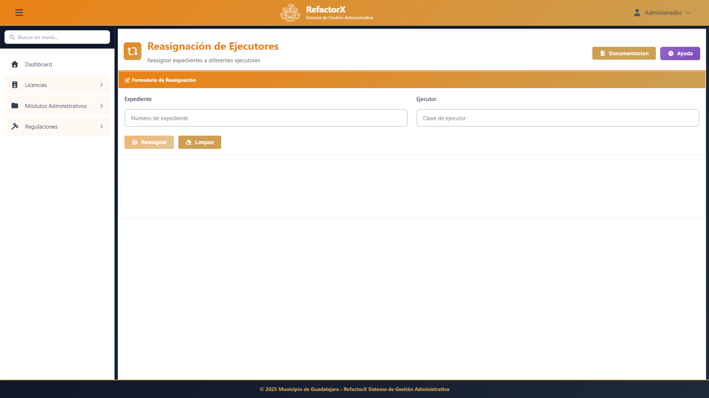

#### Motivos de reasignación:

- Cambio de zona del ejecutor
- Baja del ejecutor
- Redistribución de cartera
- Especialización por tipo de cuenta

#### Procedimiento:

1. Acceda a **Ejecutores > Reasignación**
2. Seleccione el ejecutor origen
3. Seleccione las cuentas a reasignar (individual o masiva)
4. Elija el ejecutor destino
5. Indique el motivo de la reasignación
6. Confirme la operación

**Nota**: El historial de gestión anterior se mantiene para seguimiento.

### 6.6 Prenómina de Ejecutores

Cálculo de comisiones y generación de prenómina.

#### Proceso de generación:

1. Acceda a **Cobranza > Prenómina de Ejecutores**
2. Seleccione el período a calcular
3. El sistema calculará automáticamente:
   - Monto total recuperado por ejecutor
   - Comisión según porcentaje configurado
   - Gastos de cobranza registrados
   - Otros descuentos aplicables
   - Neto a pagar
4. Revise los cálculos
5. Exporte a Excel para procesamiento en nómina
6. Confirme la prenómina

#### Información en la prenómina:

- Nombre del ejecutor
- Monto recuperado
- Porcentaje de comisión
- Comisión bruta
- Gastos operativos
- Otros descuentos
- Neto a pagar

### 6.7 Autorización de Descuentos

Control de descuentos y condonaciones autorizados a ejecutores.

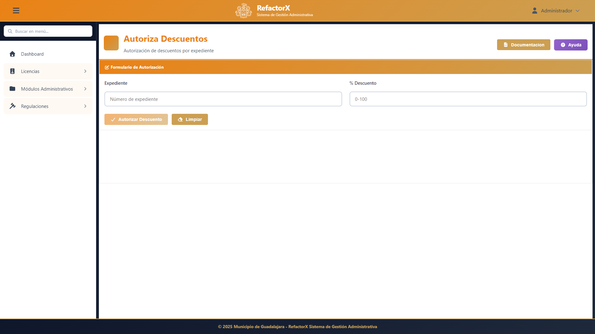

#### Tipos de descuentos:

- **Descuento por pronto pago**: Según políticas municipales
- **Condonación de recargos**: Previa autorización
- **Convenios de pago**: Planes especiales
- **Descuentos especiales**: Casos particulares autorizados

#### Procedimiento:

1. El ejecutor solicita autorización
2. El coordinador revisa el caso
3. Se verifica que cumple con los requisitos
4. Se registra la autorización en el sistema
5. El ejecutor puede aplicar el descuento
6. Queda registro en el historial de la cuenta

---

## 7. Sistema de Apremios

El sistema de apremios es un módulo completo para la gestión de procedimientos administrativos de cobro coactivo.

### 7.1 ¿Qué es un Apremio?

Un **apremio** es el procedimiento administrativo de ejecución forzosa para el cobro de créditos fiscales vencidos y no pagados voluntariamente. Incluye etapas como:

1. Requerimiento de pago
2. Embargo precautorio
3. Remate de bienes
4. Adjudicación

### 7.2 Expedientes de Apremio

Gestión de expedientes del procedimiento administrativo.

#### Información del expediente:

- **Número de expediente**: Folio único
- **Cuenta relacionada**: Registro de estacionamiento
- **Monto adeudado**: Capital + accesorios
- **Fase actual**: Etapa del procedimiento
- **Ejecutor asignado**: Responsable del trámite
- **Fechas**: Inicio, últimas actuaciones
- **Estado**: Activo, suspendido, concluido

#### Procedimiento para crear un expediente:

1. Acceda a **Apremios > Expedientes**
2. Haga clic en **"Nuevo Expediente"**
3. Busque la cuenta con adeudos vencidos
4. Verifique que cumple requisitos para apremio:
   - Adeudo mayor a 3 meses
   - Requerimientos previos enviados
   - Sin convenio de pago vigente
5. El sistema genera el número de expediente
6. Asigne el ejecutor responsable
7. Configure la fase inicial (Requerimiento)
8. Guarde el expediente

### 7.3 Fases de Apremio

Control de las etapas del procedimiento administrativo.

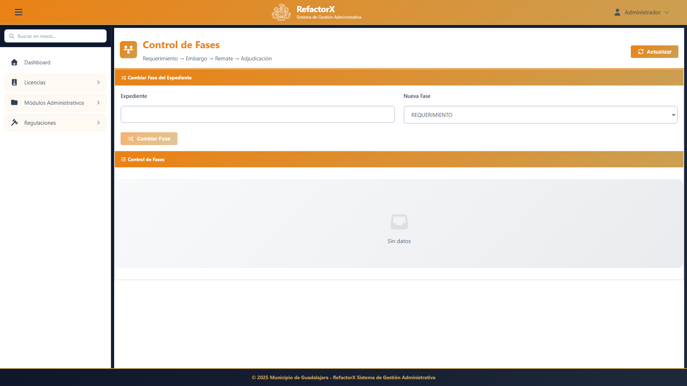

#### Fases del procedimiento:

1. **Requerimiento de Pago**
   - Notificación de adeudo
   - Plazo de 10 días hábiles para pagar
   - Genera gastos de ejecución

2. **Embargo Precautorio**
   - Designación de bienes
   - Avalúo de bienes embargados
   - Inscripción en registro público (si aplica)

3. **Intervención**
   - Administración de bienes embargados
   - Generación de frutos o rentas

4. **Remate**
   - Convocatoria pública
   - Subasta de bienes
   - Adjudicación al mejor postor

5. **Adjudicación**
   - Entrega de bienes al adjudicatario
   - Aplicación del producto a la deuda
   - Cancelación de saldos

#### Cambio de fase:

1. Acceda al expediente
2. Verifique el cumplimiento de requisitos
3. Registre las actuaciones previas
4. Haga clic en **"Avanzar Fase"**
5. El sistema actualiza el estado
6. Se generan documentos de la nueva fase

### 7.4 Actuaciones

Registro de todas las diligencias realizadas en el expediente.

#### Tipos de actuaciones:

- **Notificación**: Entrega de documentos
- **Requerimiento**: Solicitud formal de pago o cumplimiento
- **Embargo**: Aseguramiento de bienes
- **Avalúo**: Valuación de bienes embargados
- **Publicación**: Convocatoria de remate
- **Adjudicación**: Asignación de bienes
- **Pago parcial**: Abono a la deuda
- **Suspensión**: Interrupción temporal del procedimiento
- **Conclusión**: Cierre del expediente

#### Registro de actuación:

1. Abra el expediente correspondiente
2. Haga clic en **"Nueva Actuación"**
3. Seleccione el tipo de actuación
4. Ingrese la fecha y hora
5. Describa los hechos realizados
6. Anexe documentos digitales (si aplica)
7. Indique el personal que intervino
8. Guarde la actuación

**Importante**: Todas las actuaciones quedan en la bitácora del expediente y son consultables en cualquier momento.

### 7.5 Notificaciones de Apremio

Control de notificaciones oficiales emitidas en el procedimiento.

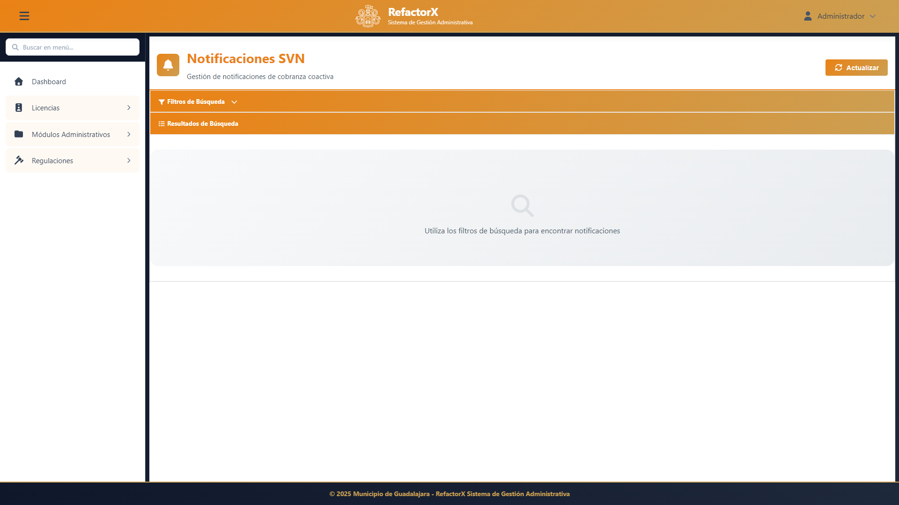

#### Tipos de notificaciones:

1. **Personal**: Entregada directamente al contribuyente
2. **Por estrados**: Publicada en lugares oficiales
3. **Por correo certificado**: Enviada con acuse de recibo
4. **Por edictos**: Publicada en periódicos oficiales
5. **Electrónica**: Enviada a buzón tributario (si aplica)

#### Información de cada notificación:

- Expediente relacionado
- Tipo de notificación
- Documento notificado
- Fecha de emisión
- Fecha de entrega/publicación
- Persona que notificó
- Persona notificada
- Observaciones
- Acuse de recibo (digitalizado)

#### Procedimiento:

1. Genere el documento a notificar desde el expediente
2. Registre la notificación en **Apremios > Notificaciones**
3. Imprima el documento con el sello oficial
4. Realice la diligencia de notificación
5. Registre en el sistema:
   - Fecha efectiva de notificación
   - Tipo de diligencia realizada
   - Persona que recibió
   - Observaciones
6. Digitalice el acuse de recibo
7. Adjunte el archivo al sistema

### 7.6 Pagos de Apremio

Registro de pagos realizados durante el procedimiento de apremio.

#### Tipos de pago en apremio:

- **Pago total**: Liquida completamente la deuda
- **Pago parcial**: Abono a cuenta
- **Pago por convenio**: Según plan autorizado
- **Pago por remate**: Producto de la subasta

#### Información registrada:

- Expediente de apremio
- Monto pagado
- Conceptos cubiertos:
  - Capital
  - Recargos
  - Actualizaciones
  - Gastos de ejecución
  - Multas
- Forma de pago
- Referencia bancaria
- Fecha de pago
- Cajero o ejecutor que recibió

#### Aplicación de pagos:

1. Acceda a **Apremios > Pagos**
2. Busque el expediente
3. Haga clic en **"Registrar Pago"**
4. Ingrese el monto recibido
5. El sistema calcula la distribución:
   - Primero gastos de ejecución
   - Luego accesorios (recargos, actualizaciones)
   - Finalmente capital adeudado
6. Verifique la aplicación
7. Guarde el pago
8. Imprima el recibo oficial

**Nota**: Si el pago es total, el sistema puede cerrar automáticamente el expediente.

### 7.7 Reportes de Apremios

Generación de reportes estadísticos y de seguimiento.

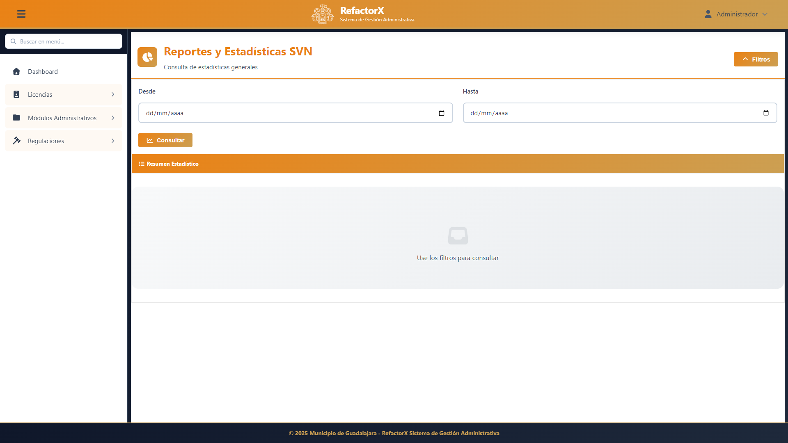

#### Reportes disponibles:

1. **Expedientes por Fase**
   - Cantidad de expedientes en cada etapa
   - Montos involucrados
   - Antigüedad promedio

2. **Productividad de Ejecutores**
   - Expedientes por ejecutor
   - Montos recuperados
   - Efectividad de gestión

3. **Expedientes Vencidos**
   - Con plazos excedidos
   - Requieren atención inmediata

4. **Histórico de Actuaciones**
   - Por período
   - Por tipo de actuación
   - Por ejecutor

5. **Cartera en Apremio**
   - Monto total en procedimiento
   - Distribución por fase
   - Proyección de recuperación

6. **Remates Programados**
   - Calendario de subastas
   - Bienes a rematar
   - Valores estimados

---

## 8. Notificaciones y Requerimientos

### 8.1 Requerimientos

Generación de documentos oficiales de cobro previo al apremio.

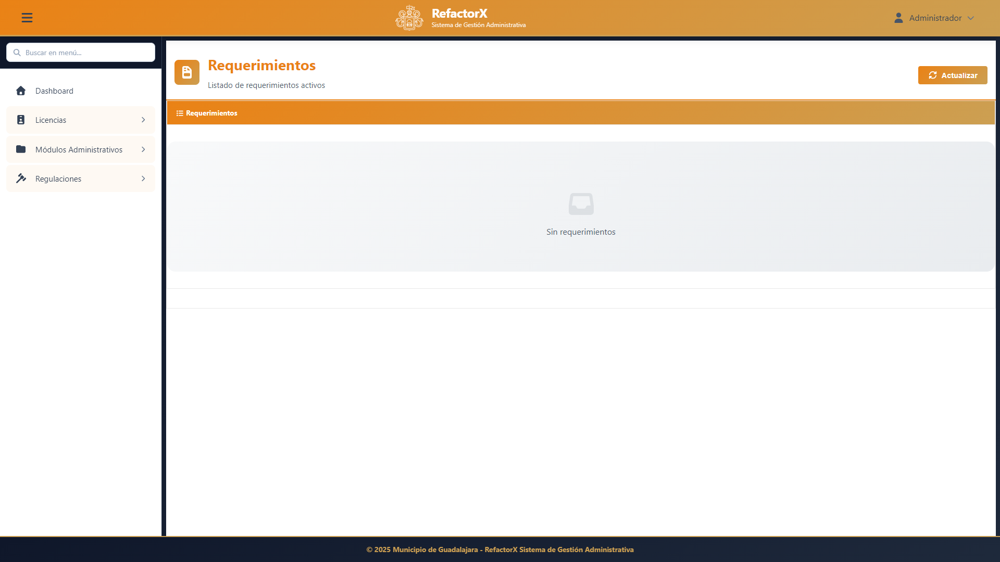

#### ¿Qué es un requerimiento?

Es una notificación formal al contribuyente sobre adeudos pendientes, solicitando su pago en un plazo determinado. Es un paso previo al inicio del procedimiento de apremio.

#### Tipos de requerimientos:

1. **Primer Requerimiento**: Notificación inicial de adeudo
2. **Segundo Requerimiento**: Recordatorio con plazo perentorio
3. **Requerimiento de Pago**: Previo a apremio (último aviso)
4. **Requerimiento de Documentación**: Solicitud de información

#### Procedimiento de generación:

1. Acceda a **Cobranza > Requerimientos**
2. Seleccione los registros:
   - Individual: Por número de cuenta
   - Masivo: Por filtros (ejecutor, zona, antigüedad)
3. Elija el tipo de requerimiento
4. Configure opciones:
   - Plazo para pago (días)
   - Incluir desglose de adeudos
   - Mencionar consecuencias
5. Genere el lote de requerimientos
6. Revise vista previa
7. Imprima o exporte para notificación

#### Información en el requerimiento:

- Datos del contribuyente
- Número de cuenta y folio
- Desglose de adeudos:
  - Períodos vencidos
  - Capital adeudado
  - Recargos y actualizaciones
  - Total a pagar
- Plazo para realizar el pago
- Formas de pago disponibles
- Consecuencias del no pago
- Datos de contacto para aclaraciones

### 8.2 Recuperación

Control de gestiones de cobranza realizadas por ejecutores.

#### Actividades de recuperación:

1. **Visita Domiciliaria**
   - Contacto directo con el contribuyente
   - Entrega de notificaciones
   - Negociación de pago

2. **Llamada Telefónica**
   - Recordatorio de adeudo
   - Confirmación de datos
   - Agendamiento de citas

3. **Convenio de Pago**
   - Propuesta de plan de pagos
   - Negociación de términos
   - Formalización del convenio

4. **Seguimiento**
   - Verificación de compromisos
   - Actualización de información
   - Registro de gestiones

#### Registro de gestión:

1. Acceda a **Cobranza > Recuperación**
2. Busque la cuenta a gestionar
3. Registre la gestión realizada:
   - Tipo de contacto
   - Fecha y hora
   - Resultado obtenido
   - Compromiso del contribuyente
   - Próxima acción a realizar
4. Actualice el estatus de la cuenta
5. Programe seguimiento

#### Estatus de recuperación:

- **Contactado**: Se estableció comunicación
- **No localizado**: No se encontró al contribuyente
- **Compromiso de pago**: Acordó fecha de pago
- **Rechaza pagar**: Se niega a cubrir adeudo
- **Solicita convenio**: Interés en plan de pagos
- **Pagó**: Cubrió el adeudo
- **Domicilio inexistente**: Dirección incorrecta

### 8.3 Notificaciones

Gestión de notificaciones generales (fuera de apremio).

#### Tipos de notificaciones:

1. **Aviso de Adeudo**: Notificación informativa
2. **Carta Invitación**: Invitación a regularizar
3. **Suspensión de Servicio**: Aviso de cancelación
4. **Actualización de Datos**: Solicitud de información
5. **Cambio de Tarifa**: Notificación de ajustes

#### Generación de notificaciones:

1. Acceda a **Cobranza > Notificaciones**
2. Seleccione el tipo de notificación
3. Defina los destinatarios:
   - Individual
   - Por grupo (zona, ejecutor, estatus)
4. Personalice el contenido (si aplica)
5. Genere las notificaciones
6. Exporte para impresión o envío electrónico

### 8.4 Notificaciones por Mes

Reporte de notificaciones emitidas en un período.

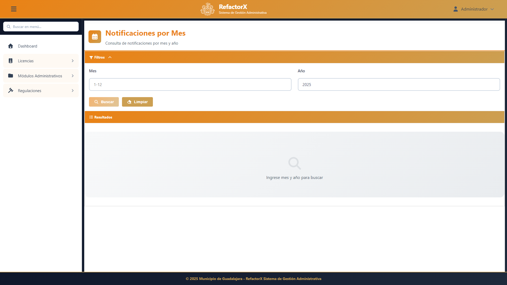

#### Información del reporte:

- Total de notificaciones emitidas
- Desglose por tipo
- Distribución por ejecutor
- Notificaciones pendientes de entrega
- Efectividad (notificaciones que generaron pago)

#### Uso:

1. Seleccione el mes a consultar
2. Elija el tipo de notificación (opcional)
3. Filtre por ejecutor (opcional)
4. Genere el reporte
5. Exporte a Excel para análisis

### 8.5 Carta Invitación

Generación de cartas de invitación a regularización.

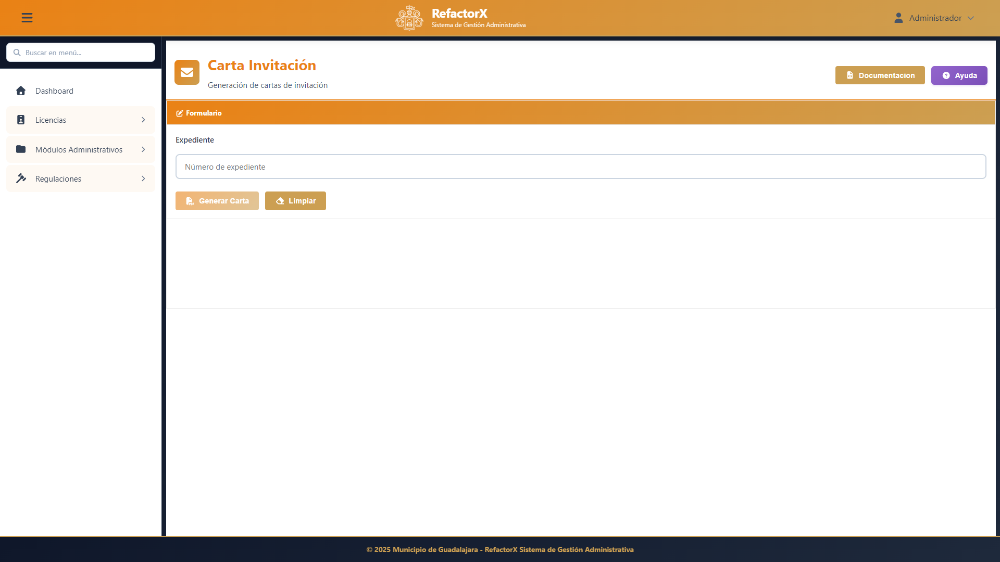

#### Características:

La carta invitación es un documento cordial que invita al contribuyente a acercarse al municipio para:
- Regularizar su situación fiscal
- Actualizar sus datos
- Aclarar dudas sobre su cuenta
- Aprovechar programas de descuento

#### Ventajas:

- Tono amigable y no coercitivo
- Genera mejor respuesta del contribuyente
- Mejora la imagen del municipio
- Aumenta tasa de recuperación voluntaria

#### Proceso:

1. Seleccione las cuentas con adeudos menores
2. Genere las cartas invitación
3. Incluya información de contacto y horarios
4. Mencione beneficios de pago voluntario
5. Imprima en papel membretado
6. Envíe por correo certificado o entrega personal

---

## 9. Facturación y Pagos

### 9.1 Facturación

Generación de documentos fiscales para pagos realizados.

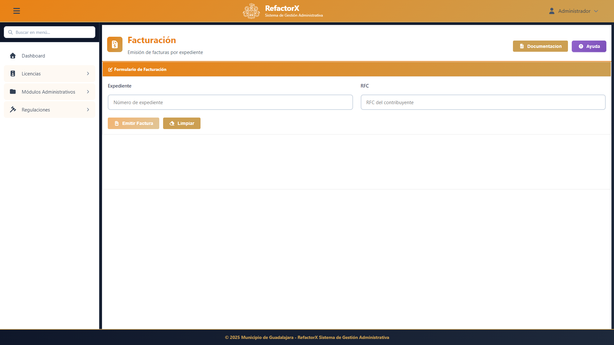

#### Tipos de documentos:

1. **Recibo Oficial**: Comprobante de pago municipal
2. **Factura CFDI**: Comprobante Fiscal Digital
3. **Nota de Crédito**: Por devoluciones o ajustes
4. **Carta de No Adeudo**: Certificación de situación fiscal

#### Procedimiento para facturar:

1. Acceda a **Herramientas > Facturación**
2. Busque el pago a facturar:
   - Por número de recibo
   - Por cuenta
   - Por fecha de pago
3. Verifique los datos:
   - RFC del contribuyente
   - Razón social
   - Domicilio fiscal
   - Uso de CFDI
4. Configure opciones de facturación:
   - Desglose de conceptos
   - Forma de pago
   - Método de pago
5. Genere la factura
6. Envíe por correo electrónico o imprima

#### Requisitos para facturación:

- Pago previamente registrado en el sistema
- RFC válido y activo ante el SAT
- Datos fiscales completos
- Solicitud dentro del período permitido (mes en curso)

### 9.2 Firma Electrónica

Módulo para firma digital de documentos oficiales.

#### Documentos firmables:

- Requerimientos de pago
- Notificaciones oficiales
- Convenios de pago
- Actas de actuación
- Cartas de no adeudo

#### Proceso de firma:

1. Genere el documento en el sistema
2. Acceda a **Herramientas > Firma Electrónica**
3. Seleccione el documento a firmar
4. Verifique el contenido
5. Ingrese su contraseña de firma
6. El sistema aplica la firma digital
7. El documento queda certificado y con validez oficial

**Beneficios**:
- Autenticidad verificable
- No repudio (responsabilidad clara)
- Agiliza procesos administrativos
- Reduce uso de papel

---

## 10. Reportes y Listados

### 10.1 Listados Generales

Reportes de información general del padrón.

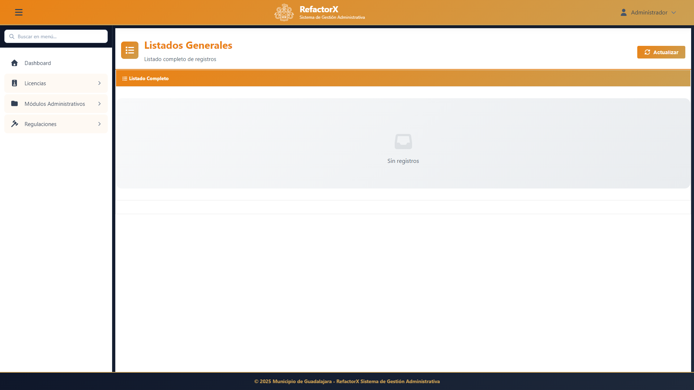

#### Listados disponibles:

1. **Padrón Completo**
   - Todos los registros activos
   - Información básica
   - Exportable a Excel

2. **Por Zona**
   - Agrupado por área geográfica
   - Totales por zona
   - Gráficos de distribución

3. **Por Ejecutor**
   - Cuentas asignadas a cada ejecutor
   - Carga de trabajo
   - Balance de asignaciones

4. **Por Estatus**
   - Activos
   - Suspendidos
   - Cancelados
   - Bajas temporales

5. **Por Tipo de Estacionamiento**
   - Exclusivos permanentes
   - Exclusivos temporales
   - Especiales

#### Opciones de listado:

- Ordenamiento: Alfabético, por cuenta, por zona
- Formato: PDF, Excel, CSV
- Campos a incluir: Personalizable
- Filtros múltiples

### 10.2 Listados de Adeudos

Reportes enfocados en cuentas con saldos pendientes.

#### Reportes de adeudos:

1. **Adeudos Generales**
   - Todas las cuentas con saldo pendiente
   - Antigüedad de adeudos
   - Montos totales

2. **Adeudos por Rango**
   - Por monto (menores de $X, mayores de $Y)
   - Por antigüedad (1-3 meses, 3-6 meses, más de 6)
   - Por riesgo de incobrabilidad

3. **Adeudos por Ejecutor**
   - Cartera de cada ejecutor
   - Índice de morosidad
   - Meta vs recuperado

4. **Adeudos Vencidos**
   - Con más de X días de antigüedad
   - Candidatos a apremio
   - Prioridad de gestión

#### Información en los reportes:

- Número de cuenta
- Nombre del contribuyente
- Períodos vencidos
- Capital adeudado
- Recargos acumulados
- Total del adeudo
- Días de atraso
- Ejecutor asignado
- Últimas gestiones

### 10.3 Listado por Registro

#### Características:

Listado ordenado por número de registro municipal, útil para:
- Auditorías
- Verificación de secuencia
- Control de folios
- Conciliaciones

#### Filtros:

- Rango de registros
- Zona específica
- Fecha de alta
- Estatus actual

### 10.4 Listado por Fecha

#### Características:

Reportes basados en rangos de fechas:

1. **Altas del Período**
   - Nuevos registros en el período
   - Análisis de crecimiento
   - Proyecciones

2. **Bajas del Período**
   - Registros dados de baja
   - Motivos de baja
   - Impacto en recaudación

3. **Modificaciones del Período**
   - Cambios realizados
   - Tipo de modificaciones
   - Usuario que modificó

4. **Pagos del Período**
   - Recaudación del período
   - Distribución por concepto
   - Comparativo con períodos anteriores

### 10.5 Estado por Folio

Reporte detallado del estado actual de un folio específico.

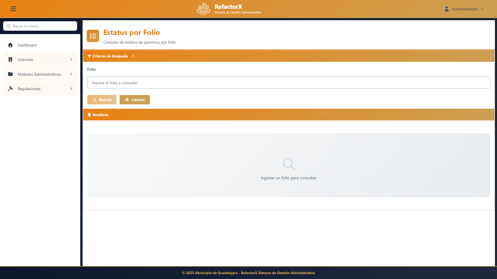

#### Información incluida:

**Datos Generales:**
- Folio y número de cuenta
- Propietario actual
- Domicilio del estacionamiento
- Características físicas

**Estado Financiero:**
- Cuota vigente
- Fecha de último pago
- Períodos al corriente
- Adeudos pendientes
- Saldo total

**Estado Administrativo:**
- Estatus actual (activo, suspendido, etc.)
- Ejecutor asignado
- Requerimientos emitidos
- Notificaciones enviadas
- Expediente de apremio (si existe)

**Historial Resumido:**
- Fecha de alta
- Cambios de propietario
- Modificaciones relevantes
- Últimas actuaciones

#### Uso:

Ideal para:
- Atención a contribuyentes
- Revisión de casos específicos
- Preparación de documentos legales
- Auditorías individuales

### 10.6 Reportes Especializados

#### Catálogo de Ejecutores (RprtCATAL_EJE)

Reporte completo del catálogo de ejecutores con:
- Datos personales
- Zonas asignadas
- Estadísticas de desempeño
- Historial de asignaciones

#### Reporte de Facturación por Mercados (RptFact_Merc)

Facturación relacionada con mercados municipales:
- Estacionamientos en zonas de mercados
- Recaudación por mercado
- Comparativos mensuales

#### Reporte de Listados Aseo (RptListado_Aseo)

Cuentas relacionadas con aseo público:
- Estacionamientos de empresas de aseo
- Adeudos específicos
- Control especial

#### Reporte de Requerimientos (RptReq_pba, RptReq_Aseo, RptReq_Merc)

Reportes de requerimientos emitidos por tipo:
- Requerimientos generales
- Requerimientos a empresas de aseo
- Requerimientos zona mercados
- Efectividad por tipo

#### Reporte de Recuperación (RptRecup_Aseo, RptRecup_Merc)

Análisis de recuperación de cartera por segmento:
- Montos recuperados
- Estrategias aplicadas
- Efectividad de gestión

### 10.7 Exportación a Excel

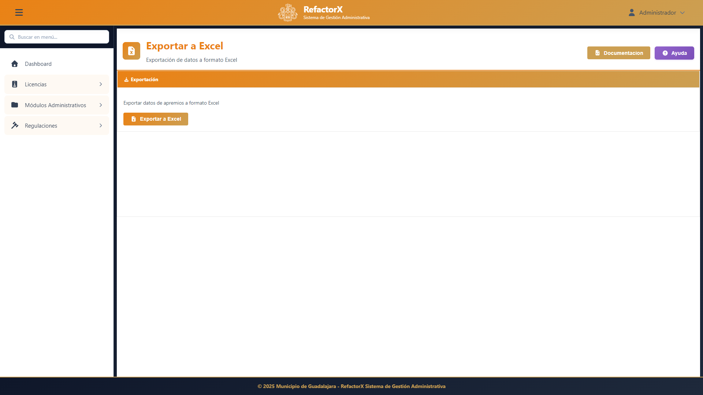

#### Funcionalidad:

Herramienta para exportar cualquier listado o reporte a formato Excel.

#### Ventajas:

- Análisis detallado en Excel
- Creación de tablas dinámicas
- Gráficos personalizados
- Integración con otros sistemas
- Respaldo de información

#### Procedimiento:

1. Genere el reporte deseado en pantalla
2. Haga clic en el botón **"Exportar a Excel"**
3. El sistema genera el archivo .xlsx
4. Descargue el archivo a su computadora
5. Abra en Excel para análisis adicional

#### Opciones de exportación:

- **Con formato**: Incluye estilos, colores, encabezados
- **Solo datos**: Información sin formato para procesamiento
- **Resumen ejecutivo**: Datos agregados y totales
- **Detalle completo**: Todos los campos disponibles

---

## 11. Glosario de Términos

### Términos Generales

**Cuenta**: Número único asignado a cada registro de estacionamiento exclusivo en el padrón municipal.

**Folio**: Número secuencial de control interno del registro.

**Contribuyente**: Persona física o moral titular del permiso de estacionamiento exclusivo.

**Registro**: Inscripción en el padrón municipal de estacionamientos.

**Padrón**: Base de datos oficial de todos los estacionamientos exclusivos del municipio.

### Términos Administrativos

**Estacionamiento Exclusivo**: Espacio en vía pública autorizado para uso exclusivo de estacionamiento por parte de un particular o empresa.

**Cajón**: Espacio físico delimitado en la vía pública para estacionamiento de un vehículo.

**Metro Lineal**: Unidad de medida para calcular la cuota de estacionamiento exclusivo.

**Cuota**: Monto mensual que debe pagar el titular del permiso.

**Tarifa**: Costo por metro lineal vigente según las disposiciones municipales.

**Alta**: Registro de un nuevo estacionamiento en el padrón.

**Baja**: Cancelación definitiva de un registro del padrón.

**Suspensión**: Interrupción temporal del permiso sin causar baja definitiva.

**Reactivación**: Restablecimiento de un registro previamente suspendido.

### Términos Financieros

**Adeudo**: Monto pendiente de pago por cuotas vencidas.

**Capital**: Monto original de la deuda sin incluir accesorios.

**Recargos**: Porcentaje adicional aplicado por pago fuera de plazo.

**Actualización**: Ajuste del monto por inflación según índices oficiales.

**Accesorios**: Conceptos adicionales al capital (recargos, actualizaciones, gastos).

**Gastos de Ejecución**: Costos generados por el procedimiento de cobranza coactiva.

**Saldo**: Total adeudado incluyendo capital y accesorios.

**Abono**: Pago parcial aplicado a una cuenta con adeudo.

**Condonación**: Perdón o reducción de adeudo otorgado por autoridad competente.

**Prescripción**: Extinción de la obligación por transcurso del tiempo establecido en ley.

### Términos de Cobranza

**Ejecutor**: Personal del municipio encargado de la gestión de cobranza.

**Cartera**: Conjunto de cuentas asignadas a un ejecutor para su gestión.

**Gestión**: Actividad realizada por el ejecutor para recuperar adeudos.

**Comisión**: Porcentaje del monto recuperado que se paga al ejecutor.

**Prenómina**: Cálculo preliminar de comisiones de ejecutores.

**Zona**: Área geográfica asignada a un ejecutor.

**Recuperación**: Cobro efectivo de adeudos pendientes.

**Requerimiento**: Notificación formal de cobro al contribuyente.

**Notificación**: Comunicación oficial del municipio al contribuyente.

**Seguimiento**: Proceso de verificación de compromisos de pago.

### Términos de Apremios

**Apremio**: Procedimiento administrativo de ejecución forzosa para cobro de créditos fiscales.

**Expediente**: Conjunto de documentos que integran el procedimiento de apremio.

**Fase**: Etapa específica del procedimiento administrativo de apremio.

**Actuación**: Diligencia o acción realizada en el procedimiento de apremio.

**Embargo**: Aseguramiento de bienes del deudor para garantizar el pago.

**Avalúo**: Valuación de bienes embargados por perito autorizado.

**Remate**: Subasta pública de bienes embargados.

**Adjudicación**: Asignación de bienes al mejor postor o al municipio.

**Acta**: Documento oficial donde se hace constar una actuación.

**Notificador**: Personal autorizado para realizar notificaciones oficiales.

**Acuse de Recibo**: Constancia de que el contribuyente recibió una notificación.

**Edictos**: Publicaciones oficiales en lugares públicos o periódicos.

**Estrados**: Lugares oficiales donde se publican notificaciones por disposición legal.

### Términos Legales

**Crédito Fiscal**: Cantidad que tiene derecho a percibir el municipio por concepto de contribuciones.

**Procedimiento Administrativo**: Conjunto de actos y formalidades para ejecutar el cobro coactivo.

**Debido Proceso**: Garantías legales que deben respetarse en cualquier procedimiento.

**Recurso de Revocación**: Medio de defensa del contribuyente contra actos administrativos.

**Juicio Contencioso**: Proceso legal para impugnar resoluciones administrativas.

**Cosa Juzgada**: Resolución definitiva que no admite más recursos.

**Término**: Plazo establecido en ley para realizar un acto o presentar defensa.

### Términos Tecnológicos del Sistema

**Vista**: Pantalla o interfaz del sistema.

**Consulta**: Búsqueda de información en la base de datos.

**Filtro**: Criterio para delimitar resultados de búsqueda.

**Paginación**: División de resultados en múltiples páginas.

**Exportar**: Generar archivo en formato externo (Excel, PDF).

**Bitácora**: Registro automático de operaciones realizadas en el sistema.

**Usuario**: Persona autorizada para acceder al sistema.

**Perfil**: Conjunto de permisos asignados a un usuario.

**Sesión**: Período de conexión activa al sistema.

**Backup**: Respaldo de información del sistema.

---

## Información de Contacto

### Soporte Técnico

Para soporte técnico del sistema RefactorX:

- **Departamento de Sistemas**
- Horario: Lunes a Viernes de 8:00 a 16:00 hrs
- Ubicación: [Dirección de oficinas de sistemas]

### Información de Cobranza

Para dudas sobre cobranza y adeudos:

- **Coordinación de Cobranza**
- Horario: Lunes a Viernes de 8:00 a 15:00 hrs

### Asistencia al Contribuyente

Para atención a contribuyentes:

- **Ventanilla de Estacionamiento Exclusivo**
- Horario: Lunes a Viernes de 9:00 a 14:00 hrs

---

## Anexos

### Anexo A: Atajos de Teclado

| Tecla | Función |
|-------|---------|
| F1 | Ayuda contextual |
| F5 | Actualizar pantalla |
| Ctrl + B | Buscar registro |
| Ctrl + G | Guardar cambios |
| Ctrl + P | Imprimir |
| Ctrl + E | Exportar a Excel |
| Esc | Cancelar operación |
| Tab | Siguiente campo |
| Shift + Tab | Campo anterior |
| Enter | Confirmar/Buscar |

### Anexo B: Códigos de Estado

| Código | Descripción |
|--------|-------------|
| ACT | Activo |
| SUS | Suspendido |
| CAN | Cancelado |
| BAJ | Baja definitiva |
| APR | En apremio |
| CON | Con convenio de pago |
| PAG | Pagado/al corriente |

### Anexo C: Tipos de Documento

| Tipo | Descripción |
|------|-------------|
| REQ | Requerimiento de pago |
| NOT | Notificación general |
| REC | Recibo oficial de pago |
| FAC | Factura CFDI |
| CNO | Carta de no adeudo |
| CON | Convenio de pago |
| ACT | Acta de actuación |
| EMB | Acta de embargo |

---

## Control de Versiones

| Versión | Fecha | Descripción |
|---------|-------|-------------|
| 1.0 | Diciembre 2025 | Versión inicial del manual |

---

## Notas Finales

Este manual es un documento vivo que se actualizará conforme se realicen mejoras al sistema. Para sugerencias o reportes de errores en el manual, contacte al Departamento de Sistemas.

**Última actualización**: Diciembre 2025

---

*Sistema RefactorX - Municipio de Guadalajara*
*Modernización y Eficiencia en la Administración Pública*
