# Manual de Usuario - Módulo Estacionamiento Público

## Sistema RefactorX - Municipio de Guadalajara

**Versión:** 1.0
**Fecha:** Diciembre 2025
**Módulo:** Estacionamiento Público

---

## Tabla de Contenidos

1. [Introducción](#1-introducción)
2. [Acceso al Sistema](#2-acceso-al-sistema)
3. [Consultas](#3-consultas)
4. [Altas y Bajas](#4-altas-y-bajas)
5. [Pagos y Adeudos](#5-pagos-y-adeudos)
6. [Transferencias y Folios](#6-transferencias-y-folios)
7. [Inspectores y Parquímetros](#7-inspectores-y-parquímetros)
8. [Generación de Archivos](#8-generación-de-archivos)
9. [Reportes](#9-reportes)
10. [Administración](#10-administración)
11. [Glosario](#11-glosario)

---

## 1. Introducción

### 1.1 ¿Qué es el Módulo de Estacionamiento Público?

El Módulo de Estacionamiento Público es una herramienta integral del sistema RefactorX diseñada para gestionar todos los aspectos relacionados con los estacionamientos públicos, parquímetros y zonas de estacionamiento regulado en el Municipio de Guadalajara.

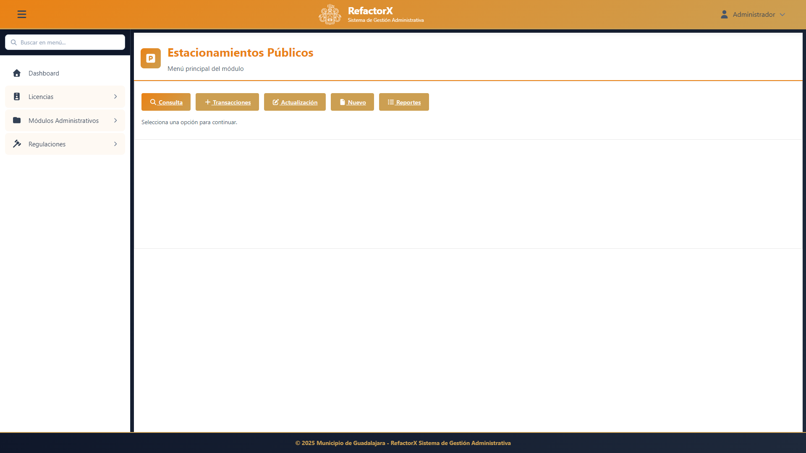

### 1.2 Funcionalidades Principales

Este módulo le permite:

- **Consultar** información de estacionamientos públicos y sus folios
- **Registrar** nuevos estacionamientos y actualizar información existente
- **Gestionar** pagos, adeudos y estados de cuenta
- **Controlar** transferencias de folios entre contribuyentes
- **Supervisar** inspectores y parquímetros
- **Generar** archivos para entidades bancarias (Banorte)
- **Emitir** reportes de recaudación, estadísticas y listados
- **Administrar** catálogos, permisos y configuraciones

### 1.3 Usuarios del Sistema

Este manual está dirigido a:

- Personal de Recaudación
- Personal de Atención al Contribuyente
- Supervisores de Estacionamientos
- Personal Administrativo
- Coordinadores de Zona

---

## 2. Acceso al Sistema

### 2.1 Ingreso al Módulo

Para acceder al módulo de Estacionamiento Público:

1. Ingrese al sistema RefactorX con sus credenciales
2. En el menú lateral, seleccione **"Estacionamiento Público"**
3. El sistema mostrará el menú principal del módulo

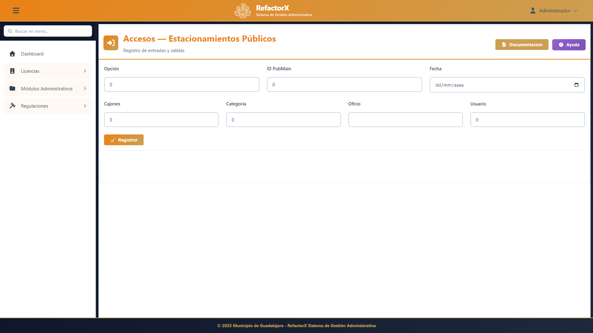

### 2.2 Seguridad y Permisos

El sistema cuenta con diferentes niveles de acceso según el rol del usuario:

- **Consulta:** Visualización de información
- **Captura:** Registro de pagos y transacciones
- **Modificación:** Actualización de datos
- **Administración:** Gestión de catálogos y configuraciones
- **Autorización:** Aprobación de descuentos y cancelaciones

**Importante:** Solo tendrá acceso a las opciones autorizadas para su perfil de usuario.

---

## 3. Consultas

### 3.1 Consulta de Estacionamientos

Esta opción le permite buscar y visualizar información de los estacionamientos públicos registrados.

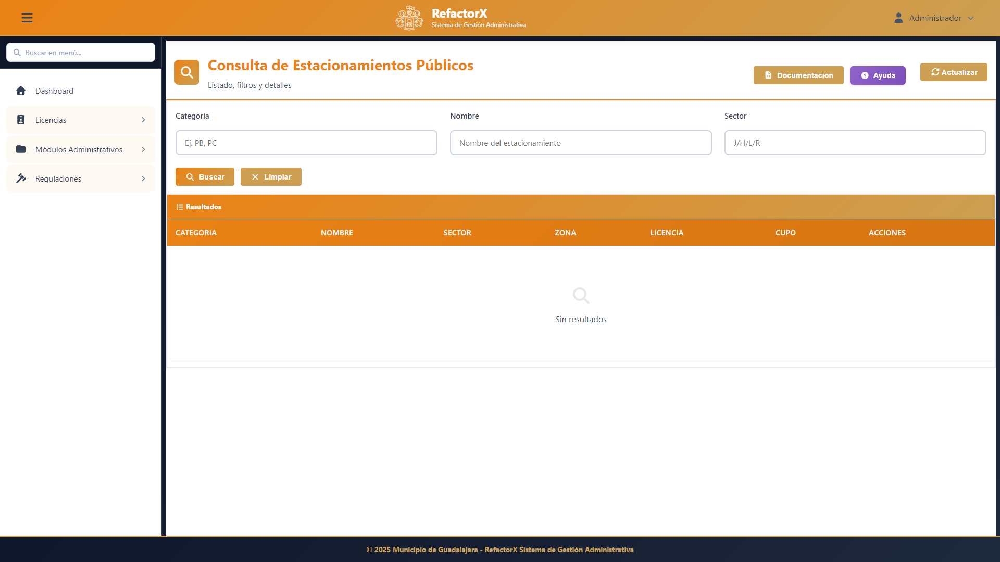

#### Pasos para Consultar:

1. Acceda a **"Consulta de Estacionamientos Públicos"**
2. Ingrese los criterios de búsqueda:
   - **Categoría:** Tipo de estacionamiento (PB, PC, etc.)
   - **Nombre:** Nombre del establecimiento
   - **Sector:** Zona geográfica (J/H/L/R)
3. Haga clic en **"Buscar"**
4. El sistema mostrará los resultados en una tabla con:
   - Categoría
   - Nombre del estacionamiento
   - Sector y Zona
   - Número de licencia
   - Cupo de vehículos
5. Use el botón de **"Ver detalles"** (ícono de ojo) para ver información completa

#### Funciones Adicionales:

- **Actualizar:** Recarga los datos más recientes
- **Limpiar:** Borra los filtros de búsqueda
- **Exportar:** Descarga los resultados en formato Excel (si está disponible)

### 3.2 Consulta General

Para realizar búsquedas más amplias:

1. Acceda a **"Consulta General"**
2. Seleccione el período de consulta
3. Elija los criterios de filtrado
4. El sistema generará un listado completo con totales y subtotales

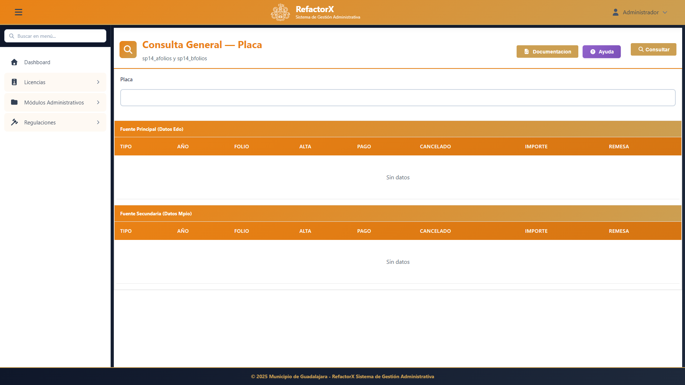

### 3.3 Consulta de Información

Visualice datos detallados y estadísticas:

1. Acceda a **"Información"**
2. Seleccione el folio o licencia a consultar
3. El sistema mostrará:
   - Datos del contribuyente
   - Histórico de pagos
   - Adeudos pendientes
   - Movimientos registrados

### 3.4 Consulta de Remesas

Para verificar las remesas bancarias:

1. Acceda a **"Consulta de Remesas"**
2. Seleccione el período
3. Visualice los pagos agrupados por remesa
4. Puede descargar el detalle de cada remesa

### 3.5 Estado de Cuenta

Genere el estado de cuenta de un contribuyente:

1. Acceda a **"Estado de Cuenta"**
2. Ingrese el número de licencia o folio
3. Seleccione el período
4. El sistema mostrará:
   - Saldo anterior
   - Cargos del período
   - Pagos realizados
   - Saldo actual

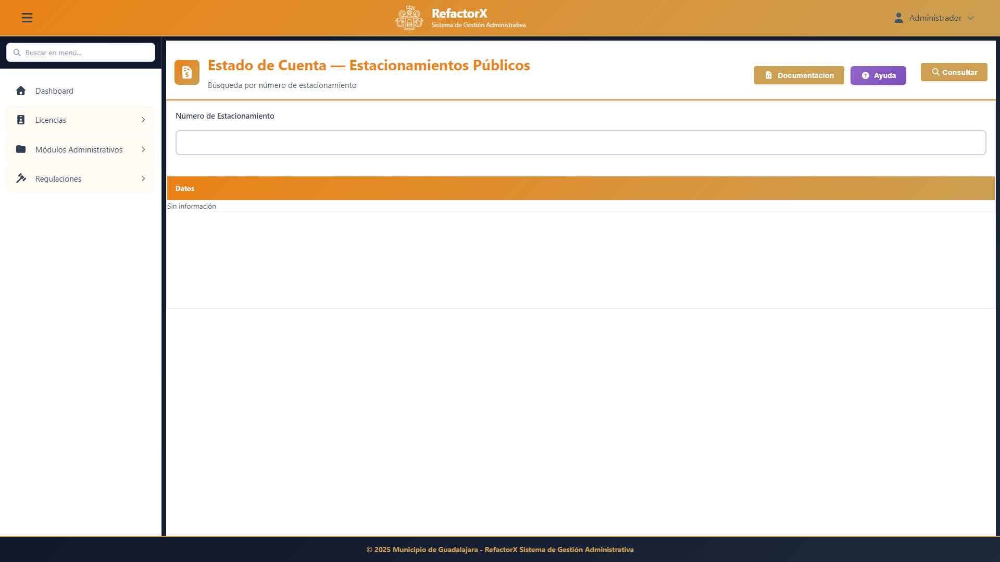

---

## 4. Altas y Bajas

### 4.1 Alta de Nuevo Estacionamiento

Para registrar un nuevo estacionamiento público:

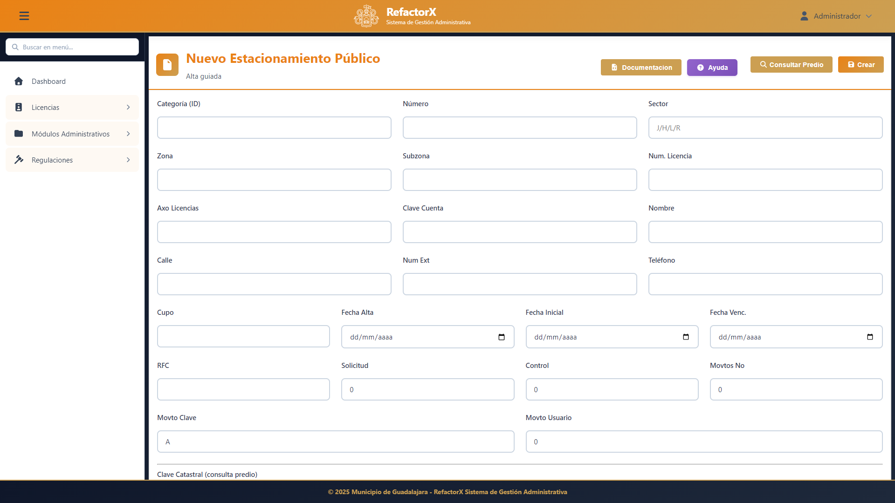

#### Pasos para el Alta:

1. Acceda a **"Nuevo Estacionamiento Público"**
2. Complete los datos requeridos:

   **Información General:**
   - Categoría (ID de categoría)
   - Número de establecimiento
   - Sector (J/H/L/R)
   - Zona y Subzona

   **Datos de Ubicación:**
   - Nombre del establecimiento
   - Calle
   - Número exterior
   - Teléfono

   **Información Fiscal:**
   - Número de licencia
   - RFC
   - Clave catastral

   **Capacidad y Fechas:**
   - Cupo (capacidad de vehículos)
   - Fecha de alta
   - Fecha inicial de operación
   - Fecha de vencimiento

3. Use **"Consultar Predio"** para validar la clave catastral
4. Verifique que todos los datos sean correctos
5. Haga clic en **"Crear"**
6. El sistema confirmará el registro exitoso

**Importante:** Todos los campos marcados con asterisco (*) son obligatorios.

### 4.2 Actualización de Datos

Para modificar información de un estacionamiento existente:

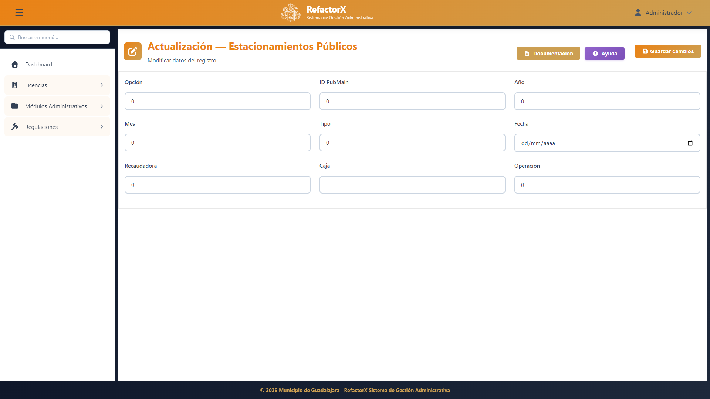

#### Pasos para Actualizar:

1. Acceda a **"Actualización de Públicos"**
2. Busque el estacionamiento por:
   - Número de licencia
   - Nombre
   - Categoría
3. Seleccione el registro a modificar
4. Edite los campos necesarios
5. Haga clic en **"Guardar Cambios"**
6. Confirme la operación

**Nota:** Algunos campos pueden estar protegidos y requerir autorización especial para su modificación.

### 4.3 Baja de Estacionamiento

Para dar de baja un estacionamiento:

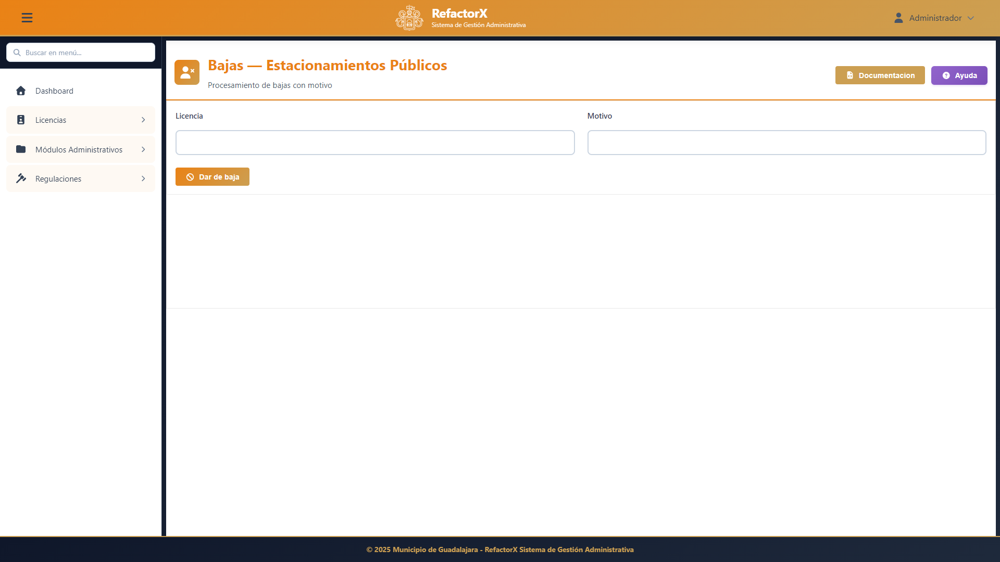

#### Proceso de Baja:

1. Acceda a **"Bajas de Públicos"**
2. Busque el estacionamiento a dar de baja
3. Verifique que no existan adeudos pendientes
4. Ingrese el motivo de la baja
5. Seleccione la fecha efectiva de baja
6. Haga clic en **"Procesar Baja"**
7. Confirme la operación (es irreversible)

**Advertencia:** Antes de procesar una baja, asegúrese de que:
- No hay pagos pendientes de aplicar
- Los adeudos están liquidados o condonados
- Se cuenta con la documentación de respaldo

### 4.4 Baja Múltiple

Para procesar varias bajas simultáneamente:

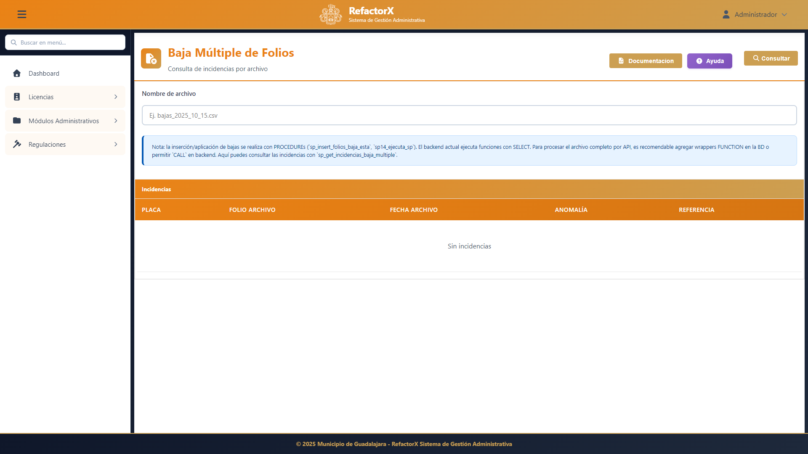

1. Acceda a **"Baja Múltiple"**
2. Cargue un archivo con los folios o licencias
3. El sistema validará cada registro
4. Revise las validaciones
5. Confirme el procesamiento masivo
6. Descargue el reporte de resultados

---

## 5. Pagos y Adeudos

### 5.1 Registro de Pagos

Para registrar un pago realizado:

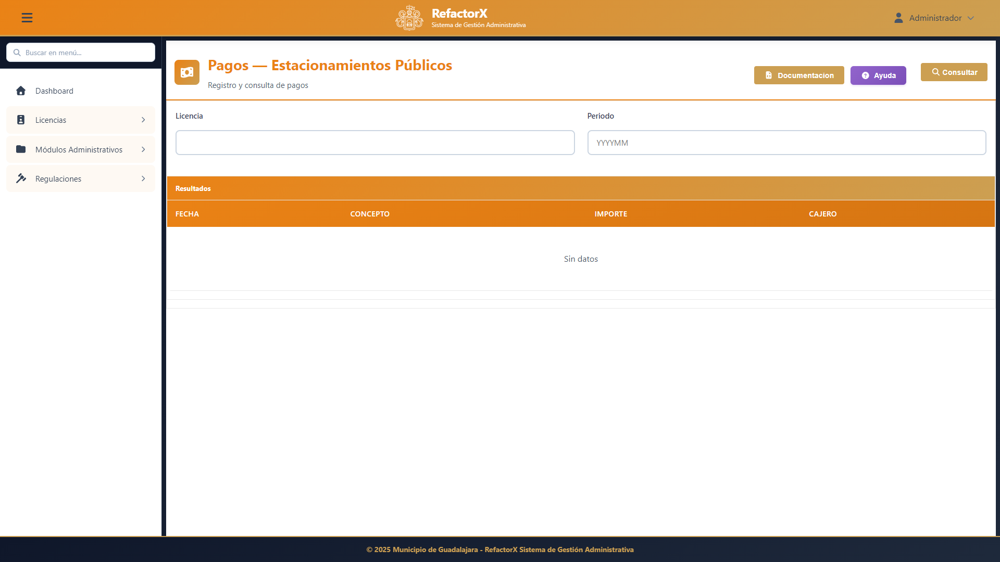

#### Pasos para Registrar un Pago:

1. Acceda a **"Pagos"**
2. Ingrese el número de licencia o folio
3. El sistema mostrará los adeudos pendientes
4. Seleccione los conceptos a pagar
5. Ingrese los datos del pago:
   - Forma de pago (efectivo, tarjeta, cheque)
   - Número de referencia (si aplica)
   - Monto recibido
6. El sistema calculará automáticamente:
   - Recargos
   - Descuentos autorizados
   - Total a pagar
7. Verifique los importes
8. Haga clic en **"Procesar Pago"**
9. Imprima el recibo de pago

**Importante:** El recibo de pago es el comprobante oficial. Asegúrese de entregarlo al contribuyente.

### 5.2 Aplicación de Pagos División Administrativa

Para aplicar pagos de otras áreas:

1. Acceda a **"Aplicación Pago División Admin"**
2. Ingrese el folio de referencia
3. Seleccione la división correspondiente
4. Verifique los datos del pago
5. Aplique el pago al estacionamiento correspondiente

### 5.3 Actualización de Pagos

Para corregir o actualizar pagos ya registrados:

1. Acceda a **"Actualización de Pagos"**
2. Busque el pago por:
   - Número de recibo
   - Fecha
   - Licencia
3. Verifique que tenga permisos de modificación
4. Realice las correcciones necesarias
5. Registre el motivo del cambio
6. Guarde los cambios

**Nota:** Todas las modificaciones quedan registradas en la auditoría del sistema.

### 5.4 Descuentos y Condonaciones

Para aplicar descuentos autorizados:

1. Acceda a **"Autorización de Descuentos"**
2. Ingrese el número de autorización
3. Verifique la validez del descuento
4. Aplique el descuento al folio correspondiente
5. El sistema ajustará automáticamente el adeudo

**Importante:** Los descuentos requieren autorización previa de la autoridad competente.

---

## 6. Transferencias y Folios

### 6.1 Transferencia de Estacionamientos

Para realizar una transferencia de titularidad:

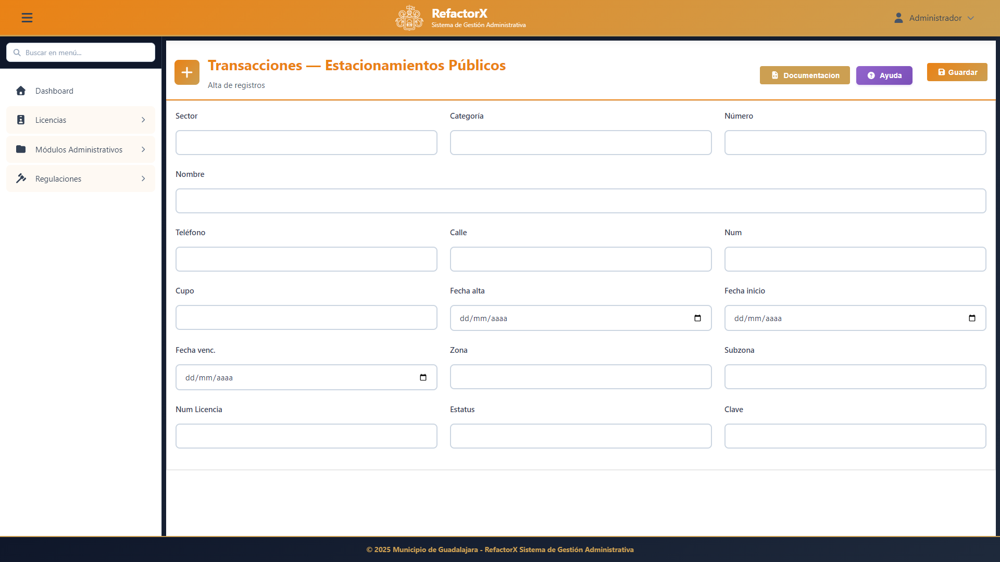

#### Proceso de Transferencia:

1. Acceda a **"Transferencias"**
2. Busque el estacionamiento a transferir
3. Verifique el estado del adeudo
4. Ingrese los datos del nuevo titular:
   - Nombre completo
   - RFC
   - Domicilio
   - Teléfono
5. Adjunte la documentación requerida
6. Seleccione la fecha efectiva de transferencia
7. El sistema generará un nuevo folio (si aplica)
8. Confirme la transferencia
9. Imprima la constancia de transferencia

**Documentación Requerida:**
- Escrituras o contrato de compraventa
- Identificación oficial del nuevo titular
- Comprobante de domicilio
- Pago de derechos (si aplica)

### 6.2 Transferencia de Folios

Para transferir folios específicos:

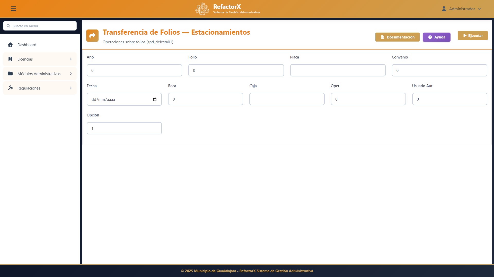

1. Acceda a **"Transferencia de Folios"**
2. Ingrese el folio origen
3. Ingrese el folio destino
4. Especifique el período a transferir
5. El sistema validará la operación
6. Confirme la transferencia
7. Imprima el comprobante

### 6.3 Relación de Folios

Para visualizar la relación de folios:

1. Acceda a **"Relación de Folios"**
2. Seleccione los criterios de búsqueda
3. El sistema mostrará todos los folios relacionados
4. Puede exportar el listado

### 6.4 Reactivación de Folios

Para reactivar folios dados de baja:

1. Acceda a **"Reactivación de Folios"**
2. Busque el folio inactivo
3. Verifique el motivo de la baja
4. Ingrese la justificación de reactivación
5. Adjunte la documentación de soporte
6. Confirme la reactivación
7. El folio quedará activo nuevamente

**Nota:** La reactivación de folios requiere autorización especial.

---

## 7. Inspectores y Parquímetros

### 7.1 Gestión de Inspectores

Para administrar el personal de inspección:

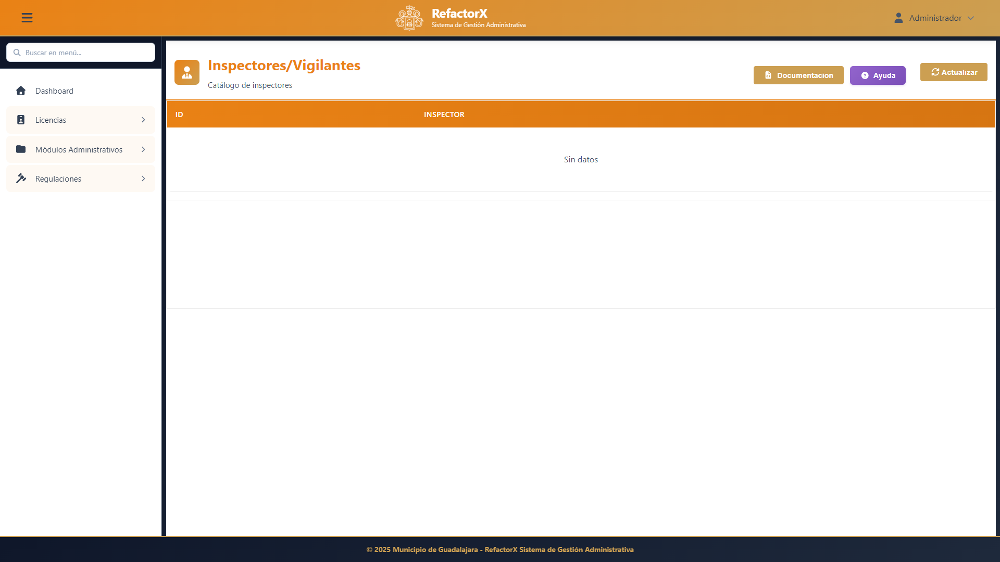

#### Registro de Inspectores:

1. Acceda a **"Inspectores"**
2. Haga clic en **"Nuevo Inspector"**
3. Ingrese los datos:
   - Número de empleado
   - Nombre completo
   - Zona asignada
   - Fecha de alta
   - Estatus (activo/inactivo)
4. Guarde el registro

#### Consulta de Inspectores:

- Visualice todos los inspectores registrados
- Filtre por zona o estatus
- Consulte el historial de actividades
- Descargue reportes de productividad

### 7.2 Control de Parquímetros

Para gestionar los parquímetros:

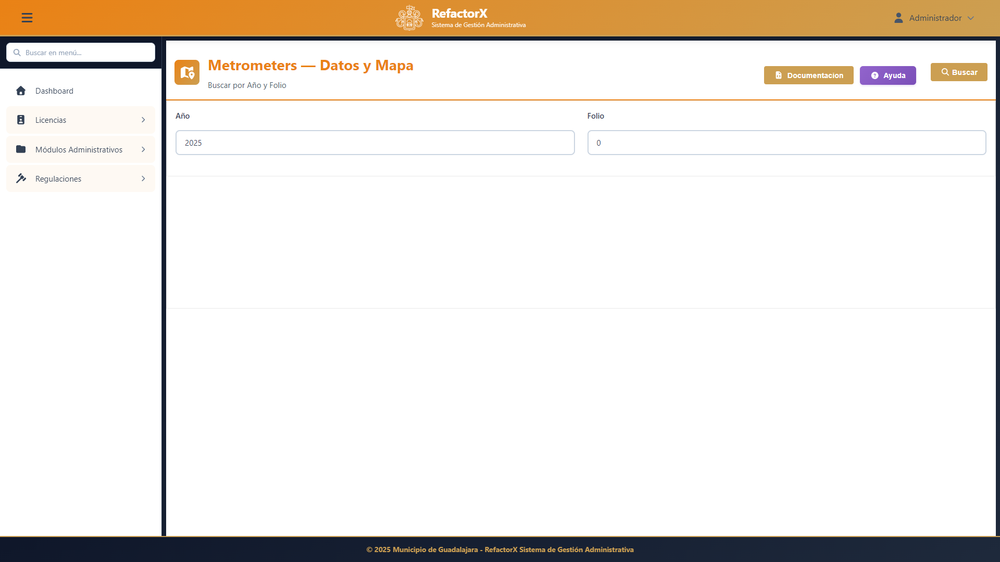

#### Registro de Parquímetros:

1. Acceda a **"Parquímetros"**
2. Seleccione **"Nuevo Parquímetro"**
3. Complete la información:
   - Número de parquímetro
   - Ubicación (calle y número)
   - Zona
   - Fecha de instalación
   - Tipo de parquímetro
   - Estatus operativo
4. Guarde el registro

#### Mantenimiento y Control:

- Registre lecturas de parquímetros
- Reporte fallas o averías
- Consulte el historial de mantenimiento
- Genere reportes de recaudación por parquímetro

### 7.3 Asignación de Zonas

Para asignar zonas a inspectores:

1. Seleccione al inspector
2. Asigne una o más zonas
3. Establezca el período de asignación
4. Confirme la asignación
5. El sistema notificará al inspector

### 7.4 Reportes de Inspector

Genere reportes de actividad:

1. Seleccione el inspector
2. Elija el período
3. El sistema mostrará:
   - Número de boletas levantadas
   - Recaudación generada
   - Zonas supervisadas
   - Incidencias reportadas

---

## 8. Generación de Archivos

### 8.1 Generación de Archivos de Altas

Para generar archivos de nuevos registros:

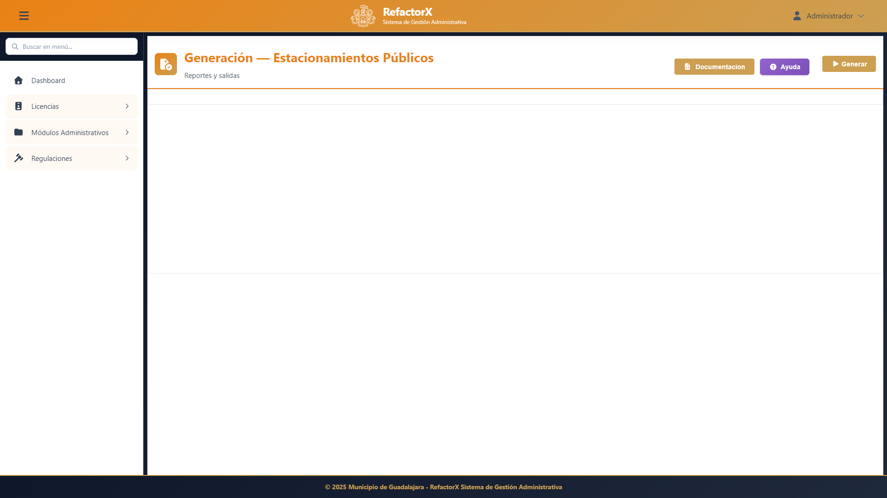

1. Acceda a **"Generación de Archivos de Altas"**
2. Seleccione el período
3. Elija el formato (TXT, Excel, XML)
4. Haga clic en **"Generar"**
5. Descargue el archivo generado
6. Verifique el contenido antes de enviar

### 8.2 Generación de Archivo Diario

Para generar el archivo de recaudación diaria:

1. Acceda a **"Generación de Archivo Diario"**
2. Seleccione la fecha
3. El sistema calculará:
   - Total de pagos del día
   - Número de transacciones
   - Formas de pago utilizadas
4. Genere el archivo en el formato requerido
5. Descargue y envíe a la institución correspondiente

### 8.3 Generación Individual

Para generar archivos de casos específicos:

1. Acceda a **"Generación Individual"**
2. Ingrese el folio o licencia
3. Seleccione el tipo de archivo
4. Genere el documento
5. Descargue o imprima según sea necesario

### 8.4 Generación de Pagos Banorte

Para generar archivos para Banorte:

1. Acceda a **"Generación de Pagos Banorte"**
2. Seleccione el período
3. El sistema agrupará los pagos realizados en Banorte
4. Verifique los totales
5. Genere el archivo en formato Banorte
6. Descargue y envíe al banco

**Importante:** Verifique siempre que los totales coincidan antes de enviar archivos a entidades bancarias.

---

## 9. Reportes

### 9.1 Reportes Generales

El módulo ofrece diversos reportes para análisis y auditoría:

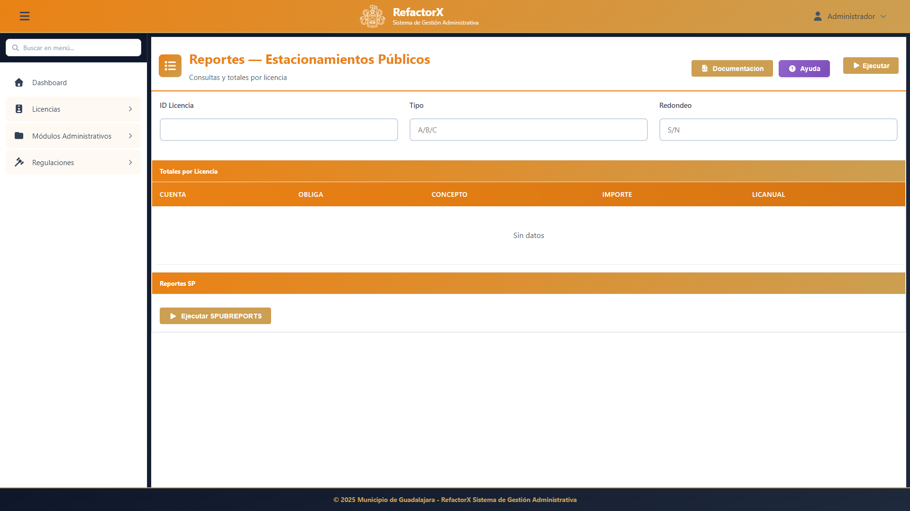

#### Tipos de Reportes:

**Reportes Operativos:**
- Recaudación diaria, semanal, mensual
- Pagos por forma de pago
- Adeudos vigentes
- Histórico de transacciones

**Reportes Administrativos:**
- Padrón de estacionamientos
- Listados por zona o sector
- Estados de cuenta masivos
- Vencimientos próximos

**Reportes Estadísticos:**
- Tendencias de recaudación
- Comparativos por período
- Índices de morosidad
- Productividad por zona

### 9.2 Listados

Para generar listados personalizados:

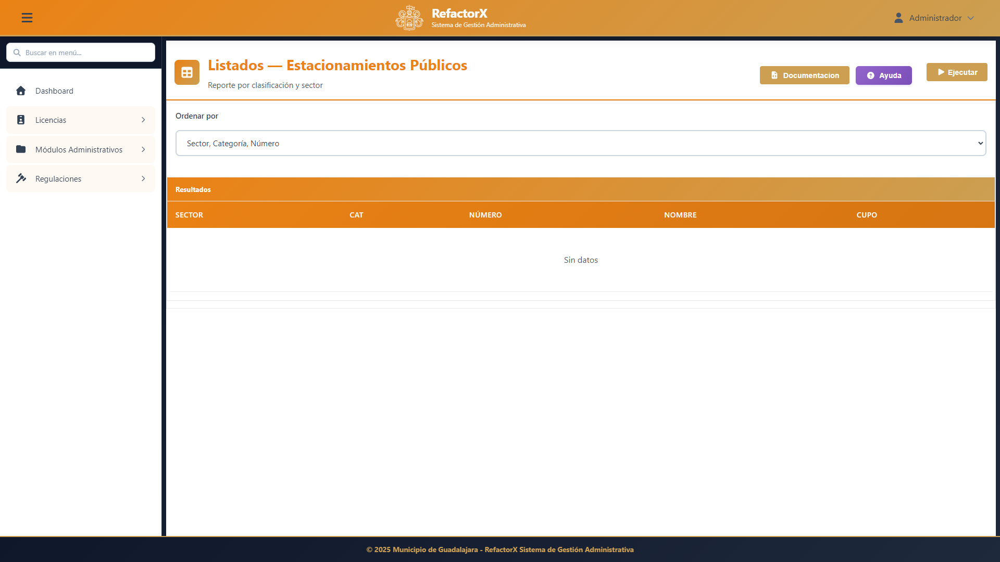

1. Acceda a **"Listados"**
2. Seleccione el tipo de listado
3. Configure los parámetros:
   - Período
   - Zona o sector
   - Estatus
   - Orden
4. Genere el listado
5. Exporte a Excel o PDF

### 9.3 Estadísticas

Visualice estadísticas del módulo:

#### Gráficas Disponibles:

- Recaudación mensual
- Distribución por zona
- Tipos de estacionamiento
- Tendencias de pago

**Funciones:**
- Seleccione diferentes períodos para comparar
- Descargue las gráficas en formato imagen
- Exporte los datos a Excel para análisis adicional

### 9.4 Reporte de Lista

Para generar listas específicas:

1. Acceda a **"Reporte de Lista"**
2. Seleccione el tipo de lista:
   - Activos
   - Inactivos
   - Con adeudos
   - Al corriente
3. Configure los filtros
4. Genere el reporte
5. Descargue o imprima

### 9.5 Reporte de Pagos

Para consultar pagos realizados:

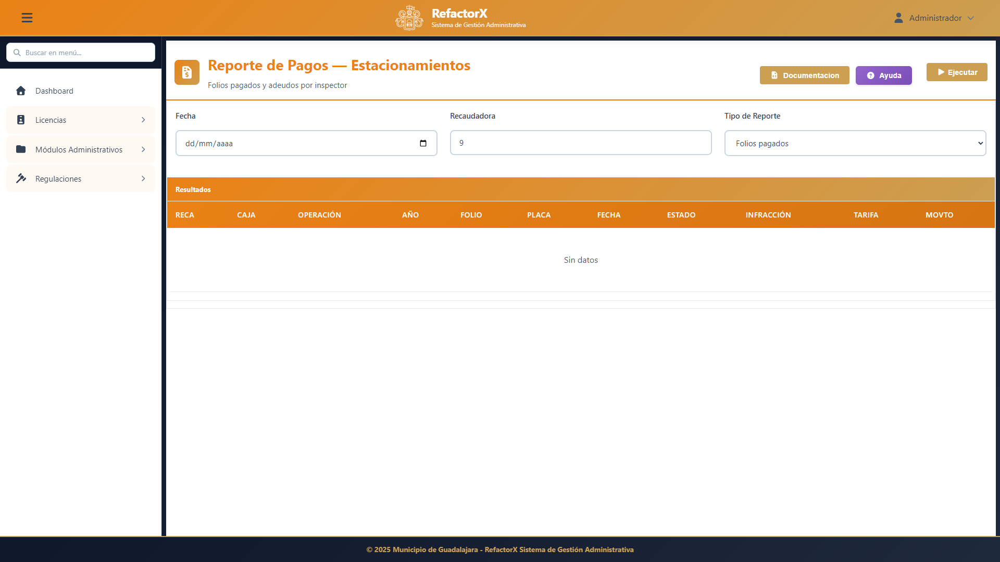

1. Acceda a **"Reporte de Pagos"**
2. Defina el período de consulta
3. Seleccione filtros adicionales:
   - Forma de pago
   - Cajero
   - Zona
   - Monto mínimo/máximo
4. Genere el reporte
5. El sistema mostrará:
   - Detalle de cada pago
   - Subtotales por categoría
   - Total general

### 9.6 Reporte de Folios

Para consultar información de folios:

1. Acceda a **"Reporte de Folios"**
2. Ingrese los criterios de búsqueda
3. Genere el reporte con:
   - Información del folio
   - Titular actual
   - Historial de transferencias
   - Estado actual

### 9.7 Estado Municipio

Para consultar el estado general municipal:

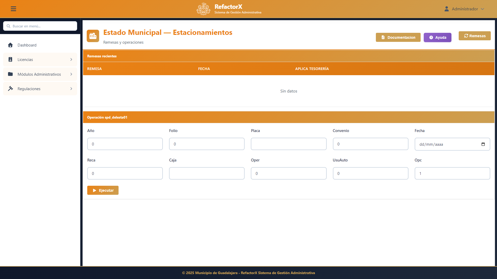

Este reporte muestra:
- Total de estacionamientos activos
- Recaudación total del período
- Adeudos totales
- Distribución por zona
- Indicadores de gestión

---

## 10. Administración

### 10.1 Conciliación Bancaria

Para realizar la conciliación con Banorte:

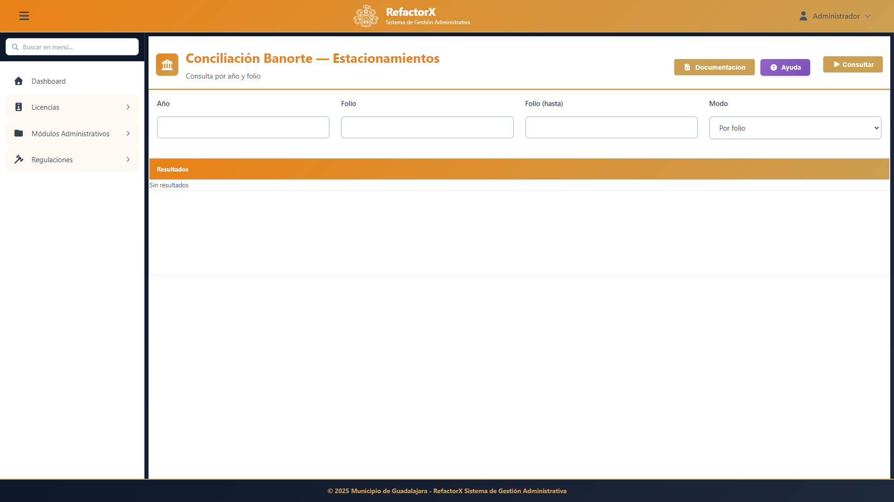

#### Proceso de Conciliación:

1. Acceda a **"Conciliación Banorte"**
2. Cargue el archivo del banco
3. El sistema comparará:
   - Pagos registrados en el sistema
   - Pagos reportados por el banco
4. Identifique diferencias:
   - Pagos no identificados
   - Pagos duplicados
   - Montos diferentes
5. Realice los ajustes necesarios
6. Genere el reporte de conciliación
7. Marque como conciliado

**Importante:** Realice la conciliación bancaria al menos una vez por semana para mantener los registros actualizados.

### 10.2 Gestión de Contraseñas

Para administrar accesos:

1. Acceda a **"Gestión de Contraseñas"**
2. Seleccione el usuario
3. Opciones disponibles:
   - Restablecer contraseña
   - Bloquear/Desbloquear usuario
   - Modificar permisos
   - Consultar historial de accesos

### 10.3 Catálogo de Aspectos

Configure los aspectos del sistema:

1. Acceda a **"Aspectos"**
2. Administre:
   - Categorías de estacionamiento
   - Tipos de movimiento
   - Conceptos de cobro
   - Formas de pago
3. Para agregar un nuevo aspecto:
   - Haga clic en **"Nuevo"**
   - Complete los datos
   - Guarde el registro

### 10.4 Administración General

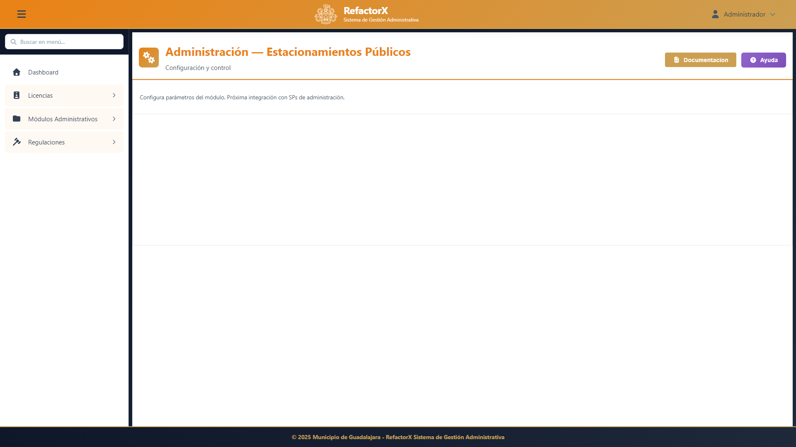

Opciones administrativas:

- **Parámetros del Sistema:** Configure valores generales
- **Períodos Fiscales:** Administre ejercicios fiscales
- **Tasas y Tarifas:** Actualice costos y recargos
- **Usuarios y Permisos:** Gestione accesos al módulo
- **Respaldos:** Genere copias de seguridad
- **Auditoría:** Consulte el registro de operaciones

### 10.5 Carga de Estados Externos

Para cargar información de fuentes externas:

1. Acceda a **"Carga de Estados Externos"**
2. Seleccione el tipo de archivo
3. Cargue el archivo (formato Excel o CSV)
4. El sistema validará la información
5. Revise las validaciones
6. Confirme la carga
7. Descargue el reporte de resultados

---

## 11. Glosario

### Términos Comunes

**Adeudo:** Cantidad de dinero que un contribuyente debe al municipio por concepto de estacionamiento público.

**Categoría:** Clasificación del tipo de estacionamiento (público, comercial, particular).

**Conciliación:** Proceso de comparación entre los registros del sistema y los reportes bancarios.

**Condonación:** Perdón parcial o total de una deuda autorizado por la autoridad competente.

**Descuento:** Reducción en el monto a pagar autorizada bajo ciertas condiciones o campañas.

**Estacionamiento Público:** Establecimiento dedicado al resguardo temporal de vehículos a cambio de una contraprestación económica.

**Folio:** Número único que identifica un registro de estacionamiento o transacción en el sistema.

**Inspector:** Personal encargado de supervisar el cumplimiento de las regulaciones de estacionamiento.

**Licencia:** Permiso municipal para operar un estacionamiento público.

**Parquímetro:** Dispositivo medidor de tiempo de estacionamiento instalado en vía pública.

**Período Fiscal:** Tiempo definido para el cálculo de obligaciones fiscales (generalmente mensual o bimestral).

**Predio:** Inmueble o terreno donde se ubica el estacionamiento.

**Recargo:** Cantidad adicional que se cobra por pago extemporáneo.

**Recaudación:** Total de ingresos cobrados en un período determinado.

**Remesa:** Conjunto de pagos agrupados para envío a entidades bancarias o contables.

**RFC:** Registro Federal de Contribuyentes, clave fiscal única.

**Sector:** División territorial para fines administrativos (J/H/L/R).

**Transferencia:** Cambio de titularidad de un estacionamiento o folio.

**Valet Parking:** Servicio de estacionamiento con acomodador.

**Zona:** Área geográfica específica dentro de un sector.

---

## Contacto y Soporte

### Soporte Técnico

Para asistencia técnica con el sistema:

- **Correo:** soporte.refactorx@guadalajara.gob.mx
- **Teléfono:** 33-XXXX-XXXX
- **Horario:** Lunes a Viernes de 8:00 a 16:00 hrs

### Capacitación

Si requiere capacitación adicional:

- Solicite sesiones de capacitación con su supervisor
- Consulte los videos tutoriales en el sistema
- Revise el botón de "Ayuda" disponible en cada pantalla

### Reportes de Problemas

Para reportar problemas o errores:

1. Tome una captura de pantalla del error
2. Anote los pasos que realizó antes del problema
3. Contacte al soporte técnico con la información
4. Recibirá un número de ticket para seguimiento

---

## Notas Importantes

### Recomendaciones Generales

1. **Guarde su trabajo frecuentemente:** El sistema tiene tiempo de inactividad limitado por seguridad.

2. **Verifique antes de confirmar:** Las operaciones como bajas y transferencias son irreversibles.

3. **Imprima comprobantes:** Siempre entregue comprobantes al contribuyente.

4. **Mantenga confidencialidad:** La información del sistema es confidencial.

5. **Reporte anomalías:** Si detecta información incorrecta, repórtela inmediatamente.

6. **Actualice datos:** Mantenga actualizada la información de contacto de los contribuyentes.

7. **Respalde información:** Descargue reportes importantes regularmente.

8. **Cierre sesión:** Siempre cierre su sesión al terminar de trabajar.

### Buenas Prácticas

- Realice conciliaciones bancarias semanalmente
- Verifique adeudos antes de procesar transferencias
- Documente todas las operaciones especiales
- Mantenga organizada la documentación de soporte
- Consulte con su supervisor en caso de dudas

---

## Control de Versiones

| Versión | Fecha | Descripción |
|---------|-------|-------------|
| 1.0 | Diciembre 2025 | Versión inicial del manual |

---

**Este manual es propiedad del Municipio de Guadalajara y está sujeto a actualizaciones periódicas.**

**Última actualización:** Diciembre 2025
