# Manual de Usuario - Módulo de Mercados
## Sistema RefactorX - Municipio de Guadalajara

---

## 1. Introducción

### 1.1 Objetivo del Manual
Este manual tiene como propósito guiar a los usuarios en la operación del módulo de Mercados del sistema RefactorX, facilitando la gestión integral de los mercados municipales de Guadalajara.

### 1.2 Alcance del Módulo
El módulo de Mercados permite administrar de manera eficiente:
- Catálogo de mercados municipales
- Padrón de locatarios y locales
- Gestión de energía eléctrica
- Control de adeudos y pagos
- Emisión de recibos
- Condonaciones y prescripciones
- Reportes estadísticos y administrativos

### 1.3 Usuarios del Sistema
Este módulo está diseñado para ser utilizado por:
- Personal administrativo de mercados
- Cajeros y cobradores
- Supervisores y coordinadores
- Personal de reportes y estadísticas

---

## 2. Menú Principal

### 2.1 Acceso al Sistema
Al ingresar al módulo de Mercados, se presenta el menú principal con todas las opciones disponibles organizadas por categorías.

### 2.2 Estructura del Menú
El menú está organizado en las siguientes secciones:
- **Catálogos**: Configuración de mercados, categorías y secciones
- **Padrones**: Gestión de locales y energía eléctrica
- **Adeudos**: Consulta y emisión de adeudos
- **Pagos**: Registro y consulta de pagos
- **Mantenimiento**: Cuotas, recargos y tarifas
- **Reportes**: Consultas y reportes estadísticos
- **Utilidades**: Condonaciones y prescripciones

### 2.3 Página de Inicio
La página de inicio muestra un resumen de las funcionalidades principales del módulo.

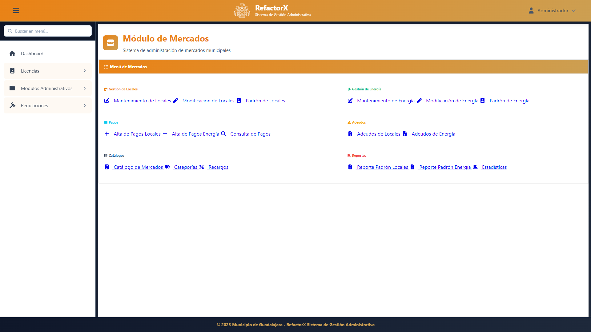

---

## 3. Catálogos

### 3.1 Catálogo de Mercados

#### 3.1.1 Descripción
Permite dar de alta, modificar y consultar los mercados municipales del sistema.

#### 3.1.2 Información Requerida
- Clave del mercado
- Nombre del mercado
- Domicilio
- Zona o distrito
- Estatus (Activo/Inactivo)

#### 3.1.3 Operaciones
- **Alta**: Registrar un nuevo mercado
- **Modificación**: Actualizar datos de mercados existentes
- **Consulta**: Visualizar información de mercados
- **Baja**: Desactivar mercados (mantiene histórico)

### 3.2 Categorías

#### 3.2.1 Descripción
Define las categorías de locales según el tipo de comercio o giro.

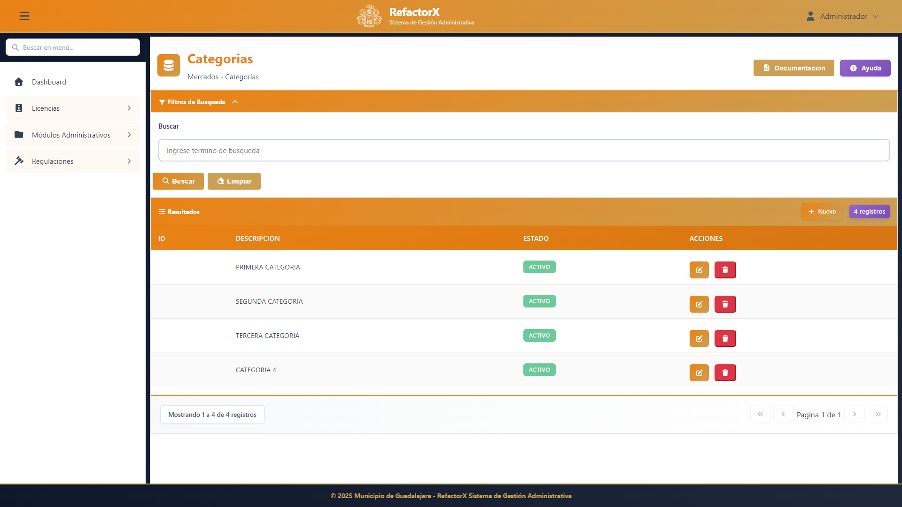

#### 3.2.2 Tipos de Categorías
- Abarrotes
- Carnicería
- Pescadería
- Frutas y verduras
- Comida preparada
- Ropa y calzado
- Otros giros

#### 3.2.3 Mantenimiento de Categorías
Permite agregar, modificar o desactivar categorías según las necesidades del municipio.

### 3.3 Secciones

#### 3.3.1 Descripción
Organiza los locales por secciones o áreas dentro de cada mercado.

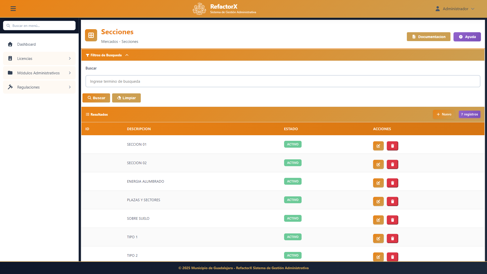

#### 3.3.2 Funcionalidad
- Definir secciones por mercado
- Asignar nomenclatura
- Establecer ubicación física
- Relacionar con planos del mercado

#### 3.3.3 Mantenimiento de Secciones
Administración de las secciones de cada mercado.

### 3.4 Cuotas de Mercados

#### 3.4.1 Descripción
Define las cuotas aplicables a los locales según categoría, tamaño y ubicación.

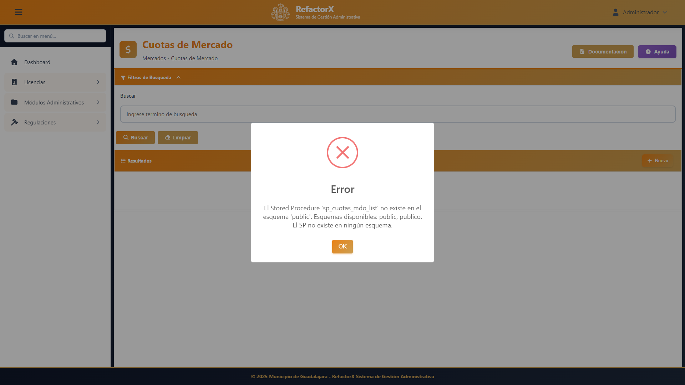

#### 3.4.2 Tipos de Cuotas
- Cuota mensual por local
- Cuota por superficie (metros cuadrados)
- Cuotas especiales por temporada
- Cuotas diferenciadas por categoría

#### 3.4.3 Mantenimiento de Cuotas
Actualización y configuración de tarifas vigentes.

### 3.5 Cuotas de Energía

#### 3.5.1 Descripción
Administra las tarifas de energía eléctrica aplicables a los locales.

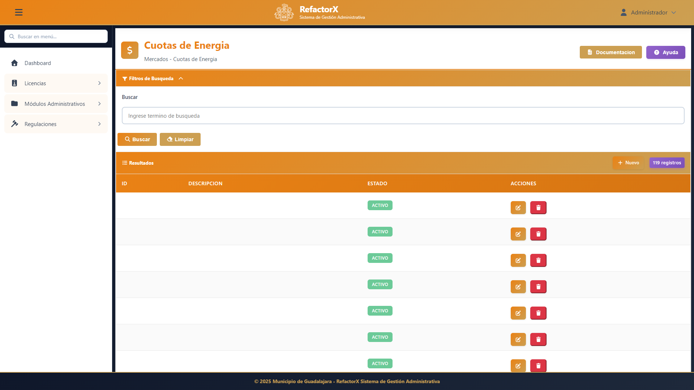

#### 3.5.2 Configuración
- Tarifa por kilovatio hora (kWh)
- Cuota fija mensual
- Rangos de consumo
- Tarifas diferenciadas

#### 3.5.3 Mantenimiento de Cuotas de Energía

### 3.6 Claves de Diferencias y Cuotas

#### 3.6.1 Claves de Diferencias
Define conceptos adicionales o descuentos aplicables.

#### 3.6.2 Mantenimiento
Administración de claves especiales.

#### 3.6.3 Claves de Cuotas
Catálogo de conceptos de cobro.

---

## 4. Gestión de Locales

### 4.1 Padrón de Locales

#### 4.1.1 Descripción
Administra el padrón completo de locales en los mercados municipales.

#### 4.1.2 Información del Padrón
- Clave del local
- Mercado al que pertenece
- Sección y ubicación
- Categoría del giro
- Datos del locatario
- Superficie del local
- Cuota aplicable
- Estatus (Activo/Inactivo/Suspendido)

#### 4.1.3 Padrón Global
Vista consolidada de todos los locales.

### 4.2 Mantenimiento de Locales

#### 4.2.1 Descripción
Permite dar de alta, modificar y gestionar los locales.

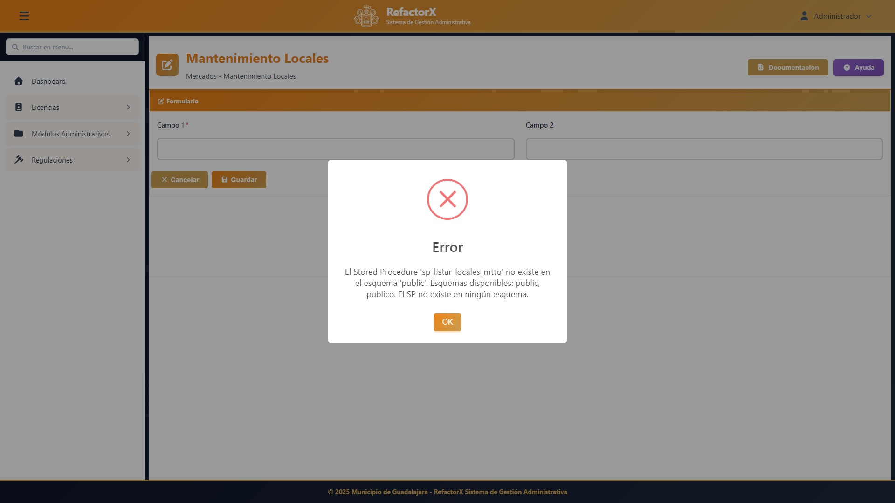

#### 4.2.2 Alta de Locales
Proceso para registrar un nuevo local:
1. Seleccionar mercado
2. Asignar sección
3. Definir número de local
4. Registrar datos del locatario
5. Establecer categoría y giro
6. Definir superficie
7. Asignar cuota
8. Guardar registro

#### 4.2.3 Modificación de Locales
Actualización de datos existentes:
- Cambio de locatario
- Actualización de domicilio
- Modificación de categoría
- Ajuste de superficie
- Cambio de cuota

#### 4.2.4 Modificación Individual de Locales

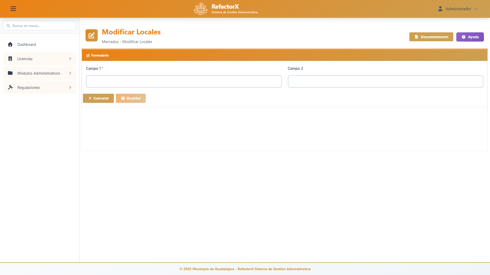

### 4.3 Consulta de Datos de Locales

#### 4.3.1 Consulta General
Búsqueda de locales por diferentes criterios.

#### 4.3.2 Consulta de Datos Individuales
Información detallada de cada local.

#### 4.3.3 Datos Individuales Completos
Vista detallada de toda la información del local y locatario.

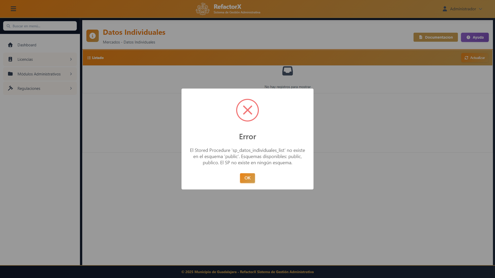

### 4.4 Adeudos de Locales

#### 4.4.1 Descripción
Consulta y gestión de adeudos por concepto de renta de locales.

#### 4.4.2 Información de Adeudos
- Periodos pendientes de pago
- Monto adeudado por periodo
- Recargos aplicados
- Total del adeudo
- Antigüedad del adeudo

#### 4.4.3 Adeudos Generales de Locales
Vista consolidada de adeudos.

#### 4.4.4 Adeudo Global de Locales
Resumen total de adeudos del sistema.

### 4.5 Emisión de Recibos de Locales

#### 4.5.1 Descripción
Generación de recibos de pago para locatarios.

#### 4.5.2 Proceso de Emisión
1. Buscar local por clave o nombre
2. Seleccionar periodos a cobrar
3. Aplicar descuentos si corresponde
4. Generar recibo
5. Imprimir o entregar

#### 4.5.3 Emisión Especial (Libertad)
Emisión de recibos con configuraciones especiales.

---

## 5. Gestión de Energía

### 5.1 Padrón de Energía

#### 5.1.1 Descripción
Administra los contratos de energía eléctrica de los locales.

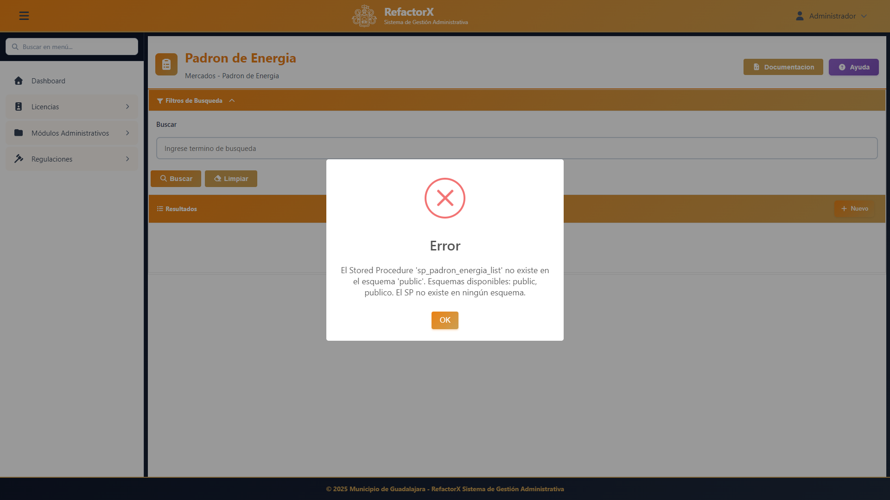

#### 5.1.2 Información del Padrón de Energía
- Número de contrato
- Local asociado
- Tipo de tarifa
- Consumo promedio
- Cuota aplicable
- Estatus del servicio

### 5.2 Mantenimiento de Energía

#### 5.2.1 Descripción
Gestión de contratos y consumos de energía eléctrica.

#### 5.2.2 Operaciones
- Alta de contratos
- Modificación de datos
- Actualización de tarifas
- Suspensión/Reactivación de servicio

#### 5.2.3 Modificación de Energía
Actualización de información de contratos.

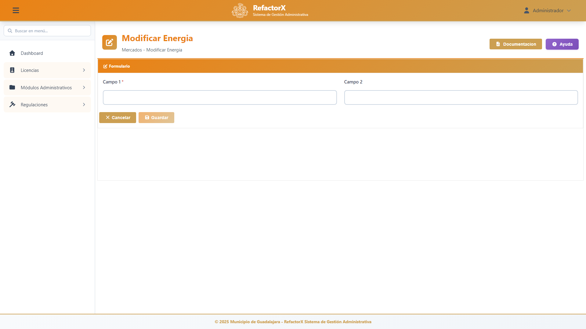

### 5.3 Adeudos de Energía

#### 5.3.1 Descripción
Control de adeudos por consumo de energía eléctrica.

#### 5.3.2 Detalles de Adeudos
- Periodos de consumo pendientes
- Lecturas registradas
- Consumo en kWh
- Monto adeudado
- Recargos por mora

#### 5.3.3 Adeudos Generales de Energía
Consolidado de adeudos de energía.

### 5.4 Emisión de Recibos de Energía

#### 5.4.1 Descripción
Generación de recibos por consumo de energía eléctrica.

#### 5.4.2 Proceso
1. Seleccionar contrato
2. Verificar consumo del periodo
3. Calcular monto a pagar
4. Generar recibo
5. Imprimir

### 5.5 Consulta de Datos de Energía

#### 5.5.1 Descripción
Información detallada de contratos de energía.

#### 5.5.2 Información Disponible
- Histórico de consumos
- Pagos realizados
- Adeudos vigentes
- Estadísticas de consumo

---

## 6. Adeudos y Pagos

### 6.1 Alta de Pagos

#### 6.1.1 Descripción
Registro de pagos realizados por los locatarios.

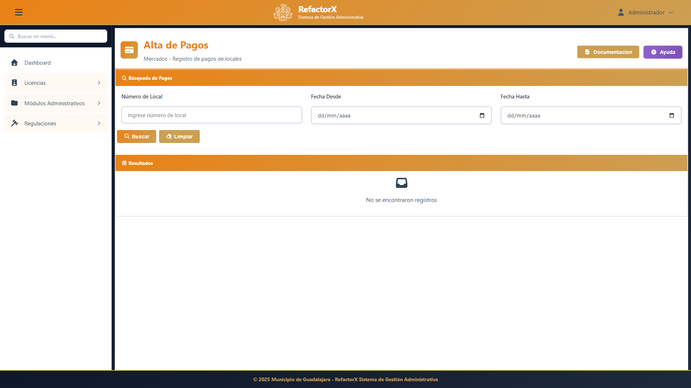

#### 6.1.2 Proceso de Registro
1. Buscar local o contrato
2. Seleccionar concepto (local/energía)
3. Ingresar monto pagado
4. Registrar forma de pago
5. Generar comprobante

#### 6.1.3 Alta de Pagos de Energía
Registro específico para pagos de energía eléctrica.

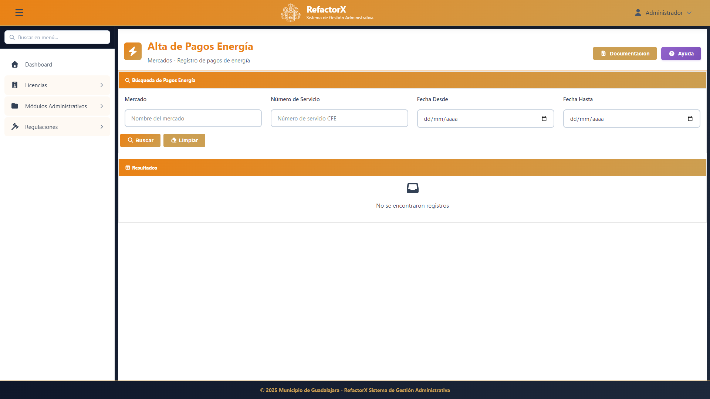

### 6.2 Consulta de Pagos

#### 6.2.1 Consulta de Pagos de Locales
Historial de pagos realizados por concepto de locales.

#### 6.2.2 Consulta de Pagos de Energía
Registro de pagos de energía eléctrica.

#### 6.2.3 Consulta General de Pagos
Vista consolidada de todos los pagos.

#### 6.2.4 Pagos Generales de Locales
Resumen de pagos por locales.

#### 6.2.5 Pagos Individuales
Detalle de pagos por local específico.

#### 6.2.6 Consulta de Pagos por Energía
Consulta específica de pagos de energía por contrato.

### 6.3 Carga de Pagos

#### 6.3.1 Carga de Pagos de Locales
Importación masiva de pagos realizados en ventanilla.

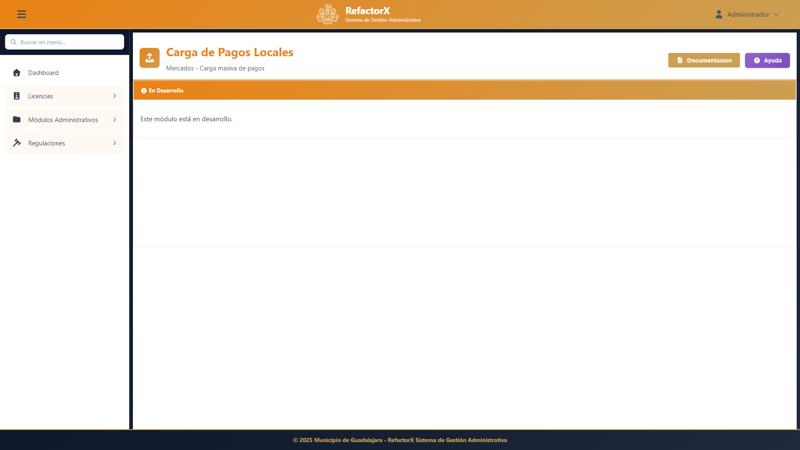

#### 6.3.2 Carga de Pagos de Energía
Carga de pagos de energía eléctrica.

#### 6.3.3 Carga Electrónica de Pagos de Energía
Importación de archivos bancarios de energía.

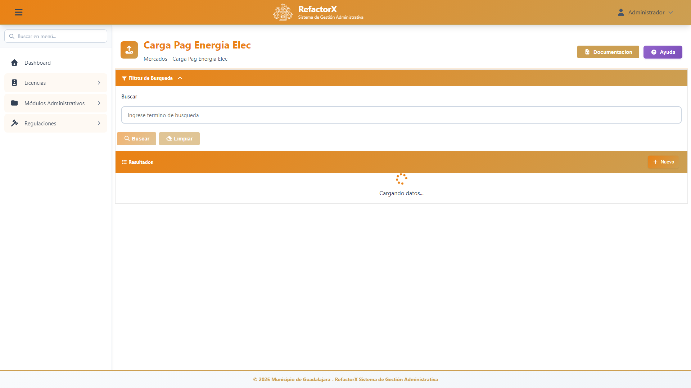

#### 6.3.4 Otras Opciones de Carga
- Carga por mercado
- Carga especial
- Carga desde archivo de texto

### 6.4 Autorización de Cargas

#### 6.4.1 Autorización de Pagos
Validación y autorización de pagos cargados.

#### 6.4.2 Autorización de Pagos de Mantenimiento
Autorización de pagos especiales.

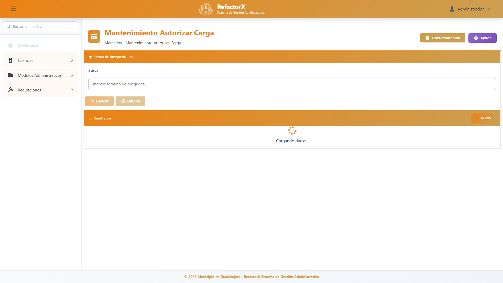

### 6.5 Paso de Adeudos

#### 6.5.1 Descripción
Actualización de periodos de adeudos.

#### 6.5.2 Paso de Adeudos de Locales
Generación de nuevos periodos de cobro para locales.

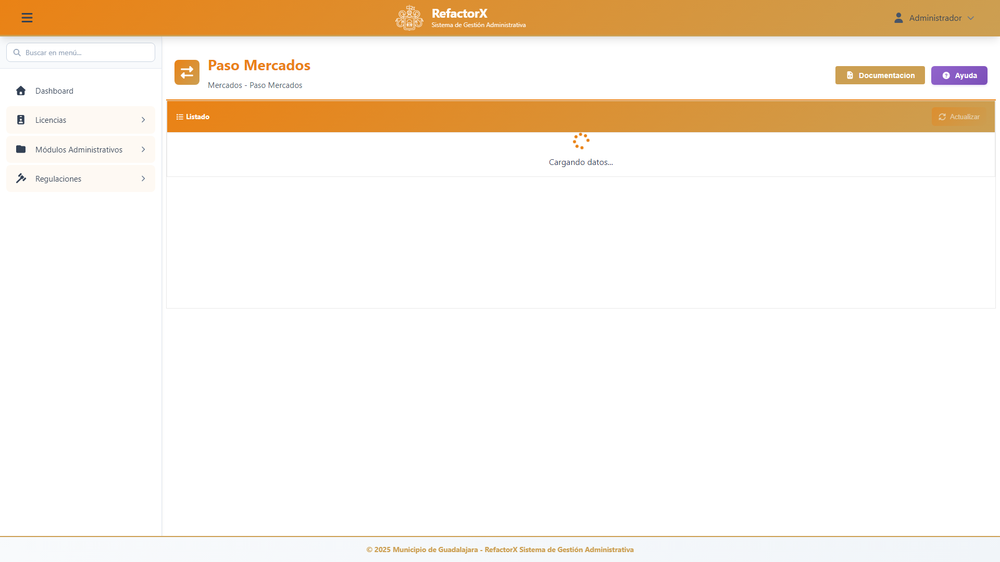

#### 6.5.3 Paso de Adeudos de Energía
Actualización de periodos de energía eléctrica.

---

## 7. Condonaciones y Prescripción

### 7.1 Recargos

#### 7.1.1 Descripción
Administración de recargos por mora en el pago.

#### 7.1.2 Configuración de Recargos
- Porcentaje de recargo mensual
- Recargos especiales
- Tope de recargos
- Vigencia de tasas

#### 7.1.3 Mantenimiento de Recargos
Actualización de parámetros de recargos.

### 7.2 Fechas de Descuento

#### 7.2.1 Descripción
Configuración de periodos con descuentos promocionales.

#### 7.2.2 Configuración
- Periodo de vigencia
- Porcentaje de descuento
- Conceptos aplicables
- Requisitos

#### 7.2.3 Mantenimiento de Fechas de Descuento

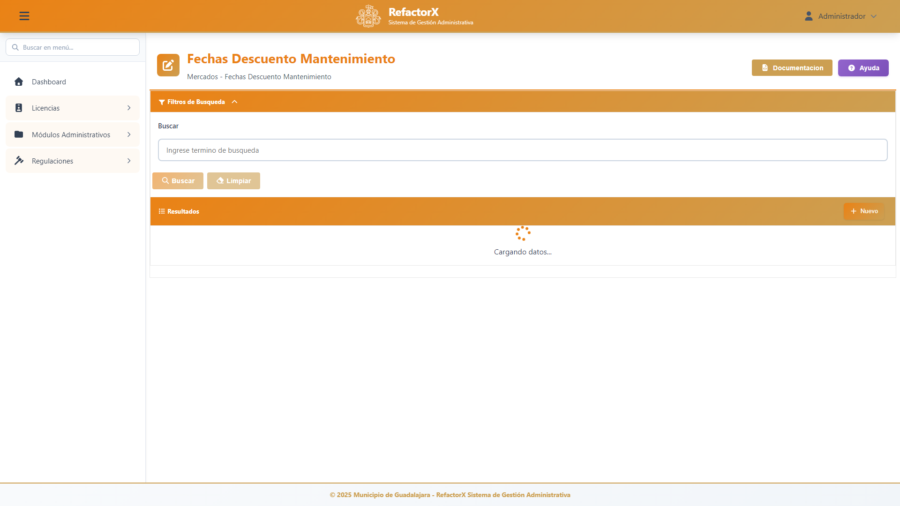

### 7.3 Condonación

#### 7.3.1 Descripción
Gestión de condonaciones autorizadas para locatarios.

#### 7.3.2 Proceso de Condonación
1. Solicitud del locatario
2. Análisis del caso
3. Autorización administrativa
4. Registro en sistema
5. Aplicación del beneficio

#### 7.3.3 Tipos de Condonación
- Condonación de recargos
- Condonación de capital
- Condonación parcial
- Condonación total

#### 7.3.4 Consulta de Condonaciones
Historial de condonaciones otorgadas.

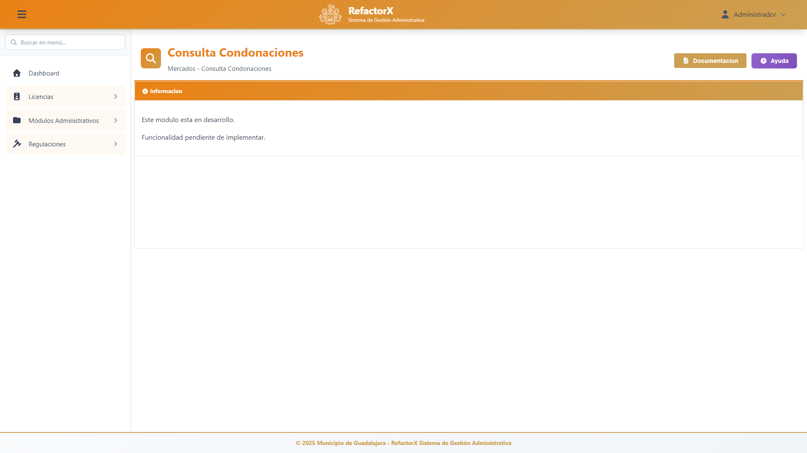

### 7.4 Prescripción

#### 7.4.1 Descripción
Gestión de adeudos prescritos según la normatividad aplicable.

#### 7.4.2 Criterios de Prescripción
- Antigüedad del adeudo
- Falta de gestión de cobro
- Normatividad fiscal municipal
- Autorización administrativa

#### 7.4.3 Proceso
1. Identificación de adeudos prescriptibles
2. Análisis jurídico
3. Autorización
4. Registro en sistema
5. Baja del adeudo

---

## 8. Reportes

### 8.1 Reportes de Adeudos

#### 8.1.1 Reporte de Adeudos de Locales
Listado de adeudos vigentes por concepto de locales.

#### 8.1.2 Reporte de Adeudos de Energía
Relación de adeudos de energía eléctrica.

#### 8.1.3 Reporte General de Adeudos de Energía
Consolidado de adeudos de energía.

#### 8.1.4 Reporte de Adeudos Anteriores
Histórico de adeudos de periodos pasados.

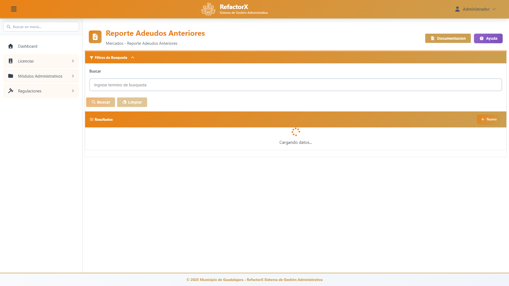

#### 8.1.5 Reporte de Adeudos de Abastos
Adeudos específicos del mercado de abastos.

### 8.2 Reportes de Padrón

#### 8.2.1 Reporte de Padrón de Locales
Listado completo del padrón de locales.

#### 8.2.2 Reporte de Padrón de Energía
Catálogo de contratos de energía.

#### 8.2.3 Reporte de Padrón Global
Vista consolidada de todos los padrones.

### 8.3 Reportes de Catálogos

#### 8.3.1 Reporte de Catálogo de Mercados
Listado de mercados municipales.

### 8.4 Reportes de Emisión

#### 8.4.1 Reporte de Emisión de Locales
Detalle de recibos emitidos para locales.

#### 8.4.2 Reporte de Emisión de Energía
Relación de recibos de energía emitidos.

#### 8.4.3 Reporte de Emisión Láser
Formato especial de emisión para impresión láser.

#### 8.4.4 Reporte de Emisión de Recibos de Abastos
Emisión específica para el mercado de abastos.

### 8.5 Reportes de Facturación

#### 8.5.1 Reporte de Factura de Emisión
Facturación de emisiones realizadas.

#### 8.5.2 Reporte de Factura de Energía
Facturación de energía eléctrica.

### 8.6 Reportes de Pagos

#### 8.6.1 Reporte de Pagos de Locales
Relación de pagos recibidos por locales.

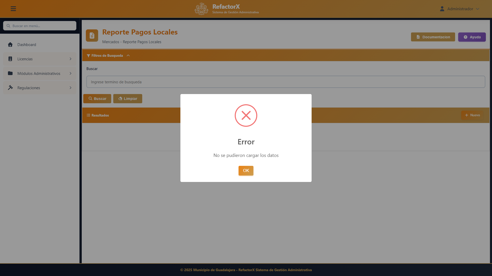

### 8.7 Reportes Administrativos

#### 8.7.1 Reporte de Carátula de Datos
Información general de locales y locatarios.

#### 8.7.2 Reporte de Carátula de Energía
Datos generales de contratos de energía.

#### 8.7.3 Reporte de Movimientos
Histórico de movimientos registrados en el sistema.

#### 8.7.4 Reporte de Datos de Movimientos
Detalle de movimientos por periodo.

### 8.8 Reportes Estadísticos

#### 8.8.1 Reporte de Estadísticas
Estadísticas generales del módulo.

#### 8.8.2 Reporte Estadístico de Pagos y Adeudos
Análisis de comportamiento de pagos.

#### 8.8.3 Reporte Estadístico de Adeudos
Análisis de concentración de adeudos.

#### 8.8.4 Reporte de Desglose de Adeudos por Importe
Clasificación de adeudos por rangos de monto.

### 8.9 Reportes Especiales

#### 8.9.1 Reporte de Ingreso Zonificado
Ingresos clasificados por zona geográfica.

#### 8.9.2 Reporte de Cuenta Pública
Información para la cuenta pública municipal.

#### 8.9.3 Reporte de Cuentas Salvadas
Adeudos recuperados después de gestión de cobro.

---

## 9. Utilidades

### 9.1 Captura de Ingresos

#### 9.1.1 Ingreso de Captura
Registro manual de ingresos extraordinarios.

#### 9.1.2 Ingreso Libertad
Registro de ingresos especiales.

### 9.2 Consultas de Captura

#### 9.2.1 Consulta de Captura por Mercado
Verificación de capturas por mercado específico.

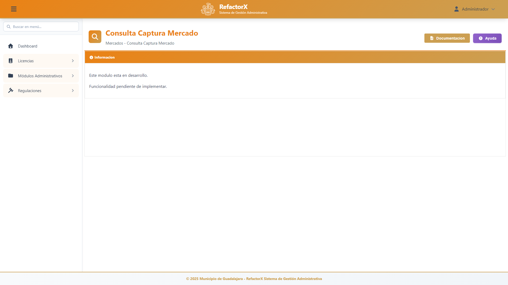

#### 9.2.2 Consulta de Captura de Energía
Revisión de capturas de energía.

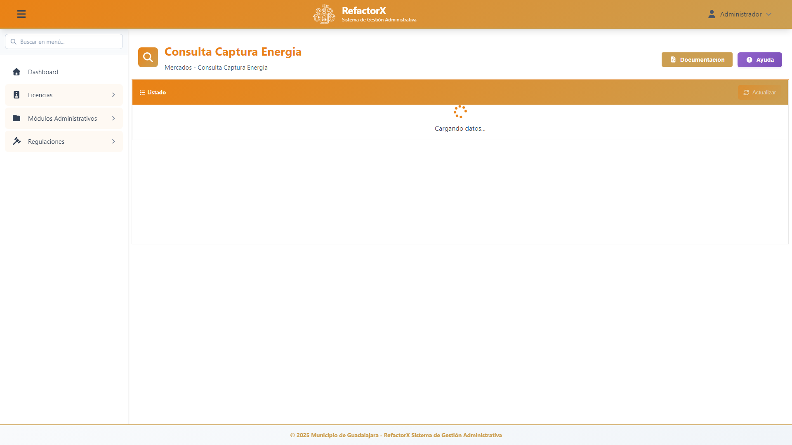

#### 9.2.3 Consulta de Captura por Fecha
Búsqueda de capturas por rango de fechas.

### 9.3 Carga de Diversos

#### 9.3.1 Carga de Diversos Especiales
Importación de conceptos especiales de cobro.

#### 9.3.2 Carga de Tributos Culturales
Registro de contribuciones culturales.

#### 9.3.3 Carga de Requerimientos Pagados
Importación de requerimientos liquidados.

### 9.4 Convenios

#### 9.4.1 Datos de Convenio
Registro de convenios de pago.

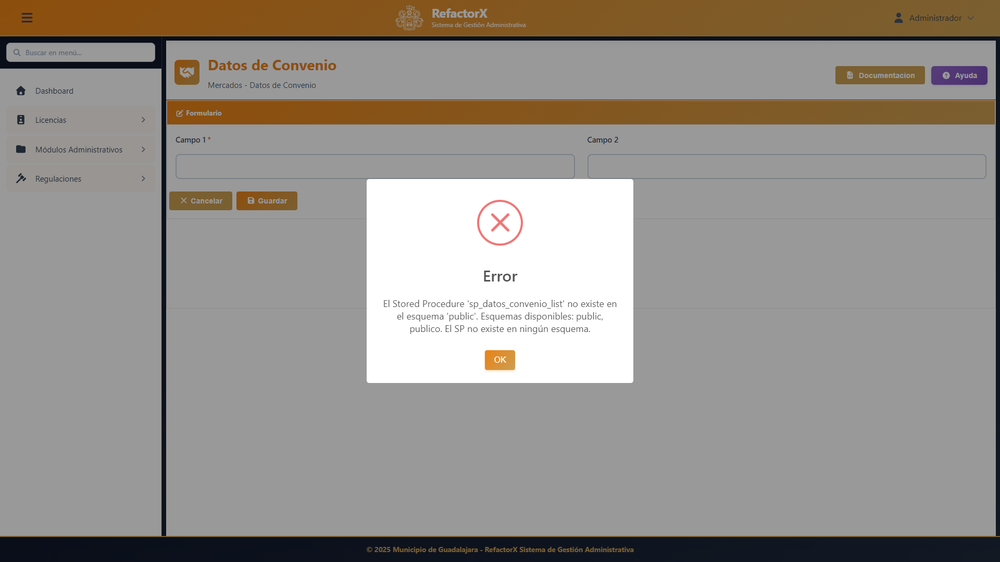

### 9.5 Listados Especiales

#### 9.5.1 Listados de Locales
Diversos listados de locales según criterios específicos.

#### 9.5.2 Consulta de Requerimientos
Revisión de requerimientos emitidos.

### 9.6 Transferencia de Documentos

#### 9.6.1 Descripción
Transferencia de documentos entre cuentas o locales.

### 9.7 Diferencias de Pagos

#### 9.7.1 Pagos con Diferencias en Ingresos
Conciliación de pagos con diferencias.

---

## 10. Glosario

### Términos Comunes

**Adeudo**: Cantidad pendiente de pago por concepto de renta de local o consumo de energía.

**Categoría**: Clasificación del giro comercial del local (abarrotes, carnicería, etc.).

**Condonación**: Perdón total o parcial de un adeudo mediante autorización administrativa.

**Cuota**: Tarifa aplicable por el uso del local o consumo de energía eléctrica.

**Emisión**: Generación de recibos de pago para los locatarios.

**Locatario**: Persona física o moral que ocupa un local en el mercado municipal.

**Local**: Espacio comercial dentro de un mercado municipal.

**Mercado**: Inmueble municipal destinado al comercio de productos y servicios.

**Padrón**: Registro oficial de locales, locatarios o contratos de energía.

**Periodo**: Mes o intervalo de tiempo para el cual se genera un cobro.

**Prescripción**: Extinción del derecho de cobro por el paso del tiempo según la ley.

**Recargo**: Cantidad adicional que se cobra por mora en el pago.

**Sección**: División física o administrativa dentro de un mercado.

**Tarifa**: Precio oficial establecido para un servicio o concepto.

### Abreviaturas

**kWh**: Kilovatio hora (unidad de medida de consumo eléctrico)

**Mtto**: Mantenimiento

**Rpt**: Reporte

**ABC**: Alta, Baja, Cambio (operaciones básicas de catálogo)

**Cons**: Consulta

**Ene**: Energía

**Mdo**: Mercado

---

## 11. Soporte y Contacto

### 11.1 Ayuda en Línea
El sistema cuenta con ayuda contextual en cada módulo. Presione F1 o haga clic en el botón de ayuda para obtener información específica de la pantalla actual.

### 11.2 Mesa de Ayuda
Para soporte técnico o dudas sobre el uso del sistema, contacte a la mesa de ayuda del área de sistemas del municipio.

### 11.3 Capacitación
Se recomienda tomar el curso de capacitación oficial del módulo de Mercados para aprovechar todas las funcionalidades del sistema.

---

## 12. Notas Importantes

### 12.1 Respaldo de Información
- Todos los movimientos quedan registrados en el sistema
- Se recomienda imprimir comprobantes de operaciones críticas
- Consulte con su supervisor sobre políticas de respaldo

### 12.2 Seguridad
- No comparta su usuario y contraseña
- Cierre sesión al terminar de trabajar
- Reporte cualquier anomalía inmediatamente

### 12.3 Actualizaciones
- El sistema se actualiza periódicamente
- Las nuevas funcionalidades serán notificadas oportunamente
- Este manual se actualiza conforme evoluciona el sistema

---

**Fin del Manual de Usuario - Módulo de Mercados**

*Sistema RefactorX - Municipio de Guadalajara*

*Versión del Manual: 1.0*

*Fecha de Elaboración: Diciembre 2025*
