# Manual de Usuario - Módulo Multas y Reglamentos

**Sistema RefactorX - Municipio de Guadalajara**

---

## Tabla de Contenido

1. [Introducción](#1-introducción)
2. [Acceso al Sistema](#2-acceso-al-sistema)
3. [Consulta de Multas](#3-consulta-de-multas)
4. [Gestión de Requerimientos](#4-gestión-de-requerimientos)
5. [Saldos a Favor](#5-saldos-a-favor)
6. [Descuentos Autorizados](#6-descuentos-autorizados)
7. [Bloqueos de Cuenta](#7-bloqueos-de-cuenta)
8. [Derechos Especiales](#8-derechos-especiales)
9. [Catálogo de Ejecutores](#9-catálogo-de-ejecutores)
10. [Empresas Recaudadoras](#10-empresas-recaudadoras)
11. [Reportes](#11-reportes)
12. [Glosario](#12-glosario)

---

## 1. Introducción

### 1.1 Objetivo del Módulo

El módulo **Multas y Reglamentos** de RefactorX permite gestionar integralmente el proceso de emisión, seguimiento y cobro de multas municipales, requerimientos de pago, descuentos autorizados y saldos a favor de los contribuyentes del Municipio de Guadalajara.

### 1.2 Funcionalidades Principales

- Consulta y búsqueda de multas por diversos criterios
- Generación y seguimiento de requerimientos de pago
- Administración de saldos a favor de contribuyentes
- Autorización y aplicación de descuentos
- Bloqueo temporal de cuentas
- Gestión de derechos especiales (fosas, transmisiones, mercados)
- Catálogo de ejecutores fiscales
- Administración de empresas recaudadoras
- Generación de reportes y documentos oficiales

### 1.3 Usuarios del Sistema

Este módulo está diseñado para ser utilizado por:

- Personal de Recaudación Municipal
- Ejecutores Fiscales
- Supervisores y Jefes de Departamento
- Personal Administrativo de Tesorería

---

## 2. Acceso al Sistema

### 2.1 Pantalla de Inicio

Al acceder al módulo de Multas y Reglamentos, verá el menú principal con todas las opciones disponibles según su nivel de permisos.

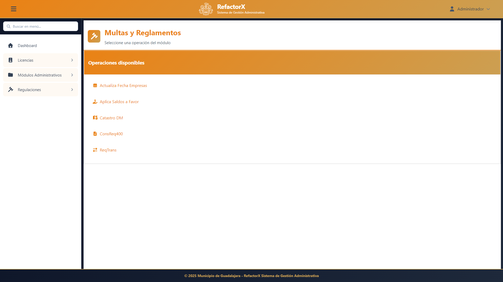

### 2.2 Navegación

El sistema cuenta con un menú lateral organizado por categorías:

- **Consultas**: Búsqueda de multas, folios y requerimientos
- **Requerimientos**: Gestión de requerimientos de pago
- **Saldos a Favor**: Administración de saldos a favor
- **Descuentos**: Autorización y consulta de descuentos
- **Bloqueos**: Control de bloqueos de cuenta
- **Derechos**: Gestión de derechos especiales
- **Catálogos**: Ejecutores y empresas recaudadoras
- **Reportes**: Generación de documentos y listados

---

## 3. Consulta de Multas

### 3.1 Búsqueda de Multas

La función de búsqueda permite localizar multas utilizando diferentes criterios.

#### Opciones de Búsqueda

**Por Folio de Multa:**
1. Ingrese el número de folio en el campo correspondiente
2. Haga clic en "Buscar"
3. El sistema mostrará el detalle de la multa encontrada

**Por Cuenta Catastral:**
1. Ingrese la cuenta catastral completa
2. Seleccione el ejercicio fiscal (opcional)
3. Haga clic en "Buscar"
4. Se mostrarán todas las multas asociadas a esa cuenta

**Por Contribuyente:**
1. Ingrese el nombre o RFC del contribuyente
2. El sistema realizará una búsqueda parcial
3. Seleccione el contribuyente de la lista de resultados

### 3.2 Detalle de Multas

Cuando seleccione una multa, el sistema muestra:

- **Datos Generales**: Folio, fecha de emisión, tipo de multa
- **Contribuyente**: Nombre, RFC, domicilio
- **Concepto**: Motivo de la multa, artículo aplicado
- **Importes**: Monto original, recargos, descuentos, total a pagar
- **Estado**: Vigente, pagada, cancelada, prescrita
- **Historial**: Movimientos y modificaciones realizadas

#### Acciones Disponibles

- **Imprimir**: Genera el documento oficial de la multa
- **Estado de Cuenta**: Muestra el historial de movimientos
- **Aplicar Pago**: Registra un pago (si tiene permisos)
- **Cancelar**: Cancela la multa (requiere autorización)

### 3.3 Consulta MultasDM

El módulo MultasDM permite consultar multas específicas del sistema de gestión municipal:

1. Seleccione los criterios de búsqueda:
   - Cuenta catastral
   - Ejercicio fiscal
   - Estado de la multa
2. Haga clic en "Consultar"
3. Revise los resultados en la tabla
4. Haga doble clic sobre una multa para ver el detalle completo

### 3.4 Cancelación de Multas

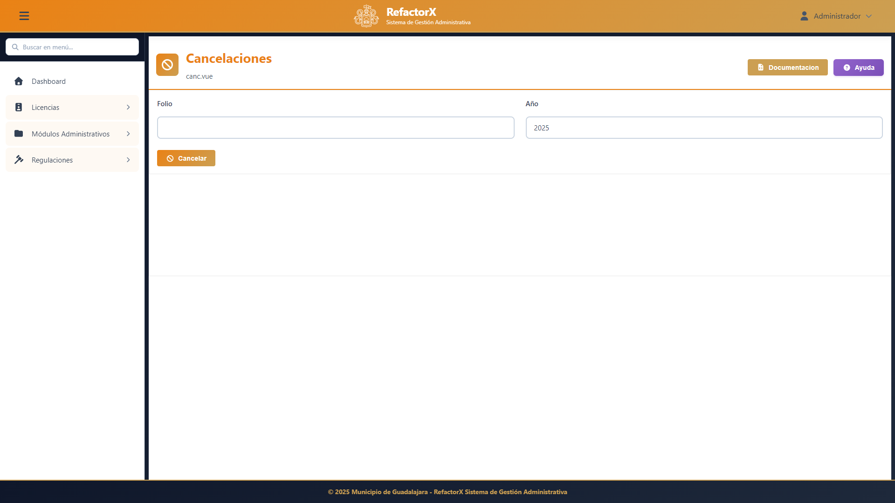

Para cancelar una multa:

1. Localice la multa mediante búsqueda
2. Haga clic en el botón "Cancelar"
3. Ingrese el motivo de la cancelación
4. Proporcione el número de oficio de autorización
5. Confirme la operación

**Importante**: La cancelación de multas requiere autorización del supervisor y es irreversible.

---

## 4. Gestión de Requerimientos

### 4.1 ¿Qué es un Requerimiento?

Un requerimiento de pago es una notificación oficial al contribuyente para que regularice su situación fiscal dentro de un plazo determinado.

### 4.2 Catálogo de Ejecutores

Antes de generar requerimientos, asegúrese de tener ejecutores fiscales registrados:

1. Acceda a **Catálogos > Ejecutores**
2. Consulte la lista de ejecutores activos
3. Para agregar un nuevo ejecutor:
   - Haga clic en "Nuevo"
   - Complete los datos: nombre, clave, RFC
   - Asigne el área de adscripción
   - Guarde los cambios

### 4.3 Generación de Requerimientos

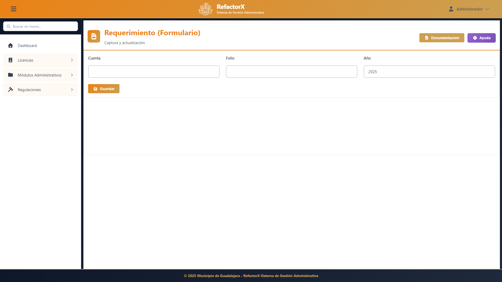

Para generar un nuevo requerimiento:

1. Acceda a **Requerimientos > Nuevo Requerimiento**
2. Complete los datos:
   - **Tipo de Requerimiento**: Predial, Licencias, Transmisiones, etc.
   - **Contribuyente**: Búsquelo por nombre, RFC o cuenta
   - **Adeudo**: El sistema calculará automáticamente el total
   - **Ejecutor Asignado**: Seleccione de la lista
   - **Fecha de Notificación**: Programada o inmediata
3. Verifique los datos
4. Haga clic en "Generar Requerimiento"
5. El sistema asignará un folio automáticamente

### 4.4 Consulta de Requerimientos

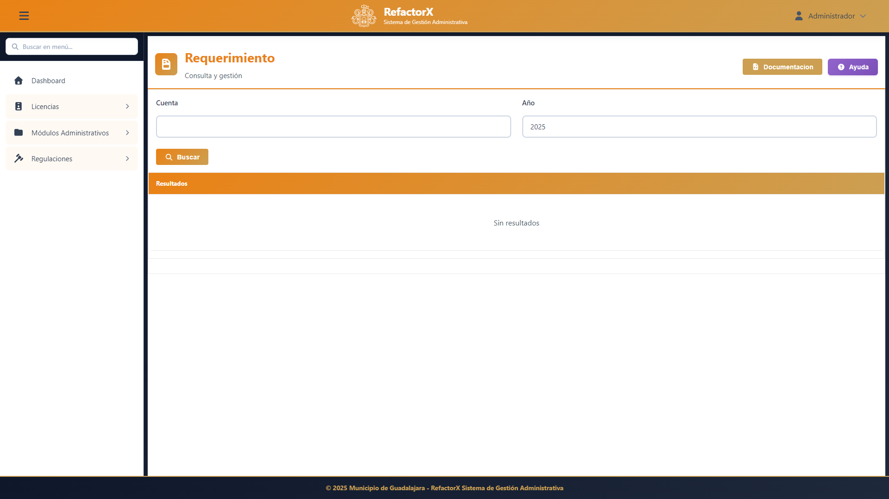

Para consultar requerimientos existentes:

1. Acceda a **Requerimientos > Consultar**
2. Utilice los filtros disponibles:
   - Por folio
   - Por ejecutor
   - Por fecha de emisión
   - Por estado (pendiente, notificado, cumplido)
3. Haga clic en "Buscar"
4. Seleccione un requerimiento para ver el detalle

### 4.5 Requerimientos de Transmisiones

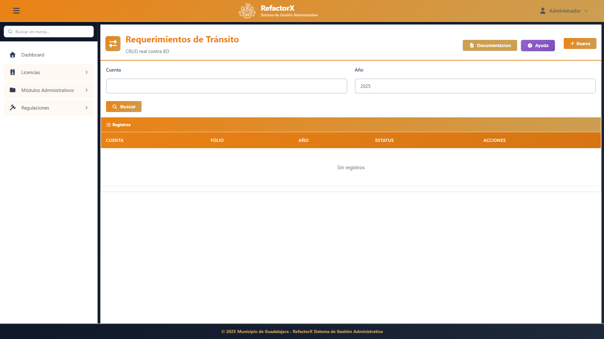

Los requerimientos de transmisiones patrimoniales tienen un flujo especial:

1. Ingrese el número de escritura o RPP
2. El sistema validará si existen adeudos de transmisión
3. Complete los datos del notario público
4. Asigne el ejecutor responsable
5. Genere el requerimiento

### 4.6 Requerimientos por Promoción

Permite generar requerimientos masivos para campañas de regularización:

1. Seleccione el tipo de promoción:
   - Descuento temporal
   - Condonación de recargos
   - Facilidades de pago
2. Defina los criterios de selección:
   - Ejercicios adeudados
   - Rango de montos
   - Zona geográfica
3. Genere los requerimientos masivamente
4. El sistema asignará ejecutores automáticamente

### 4.7 Consulta de Requerimientos AS-400

Para consultar requerimientos históricos del sistema AS-400:

1. Acceda a **Requerimientos > Consulta AS-400**
2. Ingrese el número de folio antiguo
3. El sistema mostrará el historial completo
4. Puede exportar la información a PDF o Excel

### 4.8 Consulta RequerimientosDM

Módulo especializado para requerimientos del sistema DM:

1. Busque por cuenta, ejercicio o tipo
2. Revise el estado de cada requerimiento
3. Consulte la fecha de notificación
4. Verifique el ejecutor asignado

### 4.9 Requerimientos por Clave Catastral

Permite consultar todos los requerimientos asociados a una clave catastral:

1. Ingrese la clave catastral completa
2. El sistema mostrará todos los requerimientos históricos
3. Identifique el estado de cada uno
4. Genere reportes consolidados

---

## 5. Saldos a Favor

### 5.1 ¿Qué es un Saldo a Favor?

Un saldo a favor se genera cuando un contribuyente realiza un pago mayor al adeudo real, por cancelación de multa después de pagada, o por resolución judicial favorable.

### 5.2 Consulta de Saldos a Favor

Para consultar saldos a favor:

1. Acceda a **Saldos a Favor > Consultar**
2. Busque por:
   - RFC del contribuyente
   - Número de cuenta
   - Folio de pago
3. El sistema mostrará:
   - Fecha de generación del saldo
   - Monto original
   - Saldo disponible
   - Estado (pendiente, aplicado, reembolsado)

### 5.3 Registro de Pagos de Saldos

Para registrar un pago que genera saldo a favor:

1. Localice el pago realizado
2. Haga clic en "Generar Saldo a Favor"
3. El sistema calculará automáticamente el excedente
4. Verifique los datos
5. Confirme la operación
6. Se generará un folio de saldo a favor

### 5.4 Control de Expedientes

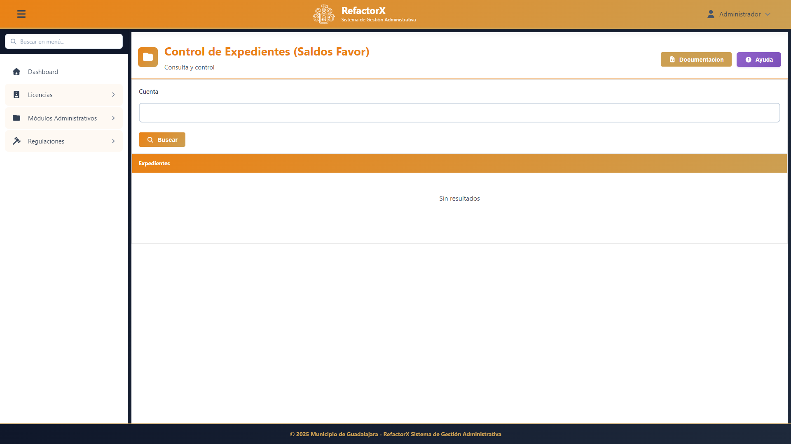

Para dar seguimiento a expedientes de saldos a favor:

1. Acceda a **Saldos a Favor > Control de Expedientes**
2. Consulte el estatus del trámite:
   - En revisión
   - Autorizado
   - En proceso de reembolso
   - Reembolsado
3. Adjunte documentación soporte
4. Registre observaciones
5. Actualice el estado

### 5.5 Aplicación de Saldos a Favor

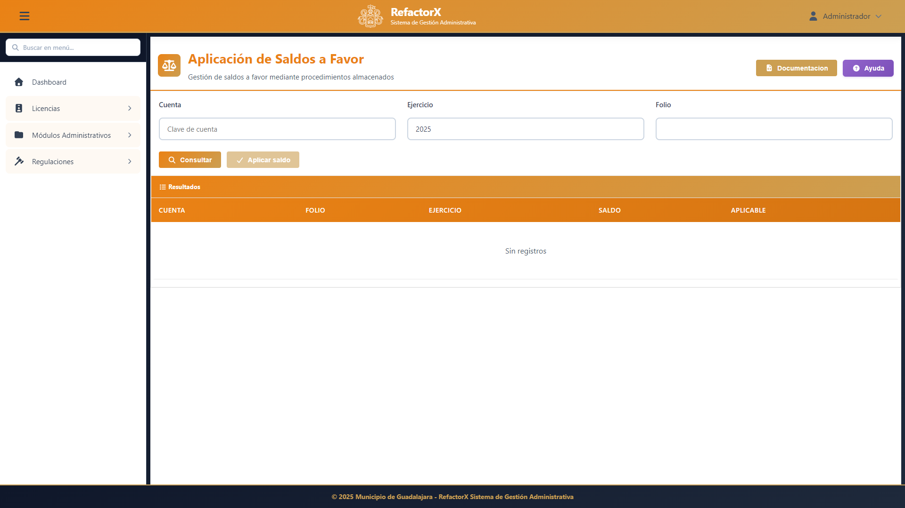

Para aplicar un saldo a favor contra un adeudo:

1. Acceda a **Saldos a Favor > Aplicar Saldo**
2. Ingrese el folio del saldo a favor
3. El sistema mostrará:
   - Monto disponible
   - Contribuyente
   - Fecha de generación
4. Seleccione el adeudo a liquidar:
   - Tipo de adeudo
   - Ejercicio
   - Monto a aplicar
5. Confirme la aplicación
6. El sistema generará el recibo correspondiente

**Nota**: El saldo se puede aplicar parcialmente si el adeudo es menor al saldo disponible.

### 5.6 Solicitud de Devolución

Para solicitar la devolución de un saldo a favor:

1. Acceda a **Saldos a Favor > Solicitud de Devolución**
2. Ingrese el folio del saldo a favor
3. Complete la solicitud:
   - Nombre del contribuyente
   - Datos bancarios para transferencia
   - Documentación soporte
4. Adjunte los documentos requeridos:
   - Identificación oficial
   - Comprobante de domicilio
   - Estado de cuenta bancario
5. Envíe la solicitud
6. El sistema asignará un número de trámite

**Importante**: Las devoluciones requieren autorización de Tesorería y pueden tardar de 30 a 60 días hábiles.

---

## 6. Descuentos Autorizados

### 6.1 Tipos de Descuentos

El sistema permite autorizar diferentes tipos de descuentos:

- **Descuentos en Multas**: Reducción del monto de la multa principal
- **Descuentos en Recargos**: Condonación parcial o total de recargos
- **Descuentos Promocionales**: Por campañas de regularización
- **Descuentos por Pronto Pago**: Incentivos por pago anticipado

### 6.2 Autorización de Descuentos

Para autorizar un descuento:

1. Acceda a **Descuentos > Autorizar Descuento**
2. Busque la multa o adeudo
3. Complete la información:
   - **Tipo de Descuento**: Seleccione de la lista
   - **Porcentaje o Monto**: Ingrese el valor del descuento
   - **Motivo**: Describa la justificación
   - **Fundamento Legal**: Artículo o reglamento aplicable
4. El sistema calculará automáticamente:
   - Monto original
   - Descuento aplicado
   - Total a pagar
5. Ingrese los datos del autorizador:
   - Nombre del funcionario
   - Número de oficio
   - Fecha de autorización
6. Confirme la operación

**Importante**: Los descuentos superiores al 50% requieren autorización especial de Tesorería.

### 6.3 Consulta de Descuentos

Para consultar descuentos otorgados:

1. Acceda a **Descuentos > Consultar**
2. Utilice los filtros:
   - Por folio de descuento
   - Por contribuyente
   - Por rango de fechas
   - Por funcionario autorizador
   - Por estado (vigente, aplicado, cancelado)
3. Haga clic en "Buscar"
4. Revise los resultados en la tabla
5. Seleccione un registro para ver el detalle completo

### 6.4 Otorgamiento de Descuentos

Proceso para otorgar descuentos especiales:

1. Verifique que el contribuyente cumpla con los requisitos
2. Calcule el porcentaje de descuento aplicable
3. Registre el descuento en el sistema
4. Genere el documento de autorización
5. Notifique al contribuyente

### 6.5 Impresión de Descuentos

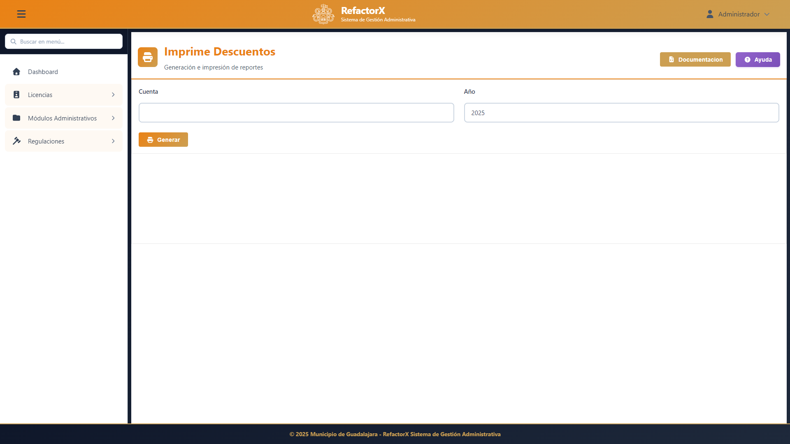

Para imprimir comprobantes de descuentos:

1. Localice el descuento autorizado
2. Haga clic en "Imprimir"
3. Seleccione el tipo de documento:
   - Comprobante para el contribuyente
   - Oficio de autorización
   - Reporte administrativo
4. Configure las opciones de impresión
5. Genere el documento

El documento incluirá:
- Folio del descuento
- Datos del contribuyente
- Concepto del adeudo
- Monto original y descuento aplicado
- Total a pagar
- Vigencia del descuento
- Firma electrónica del autorizador

---

## 7. Bloqueos de Cuenta

### 7.1 ¿Cuándo Bloquear una Cuenta?

Los bloqueos de cuenta se aplican en situaciones especiales:

- Inconsistencias en pagos
- Solicitudes en proceso de revisión
- Disputas legales pendientes
- Investigaciones de irregularidades
- Suspensión temporal del servicio

### 7.2 Bloqueo de Multas

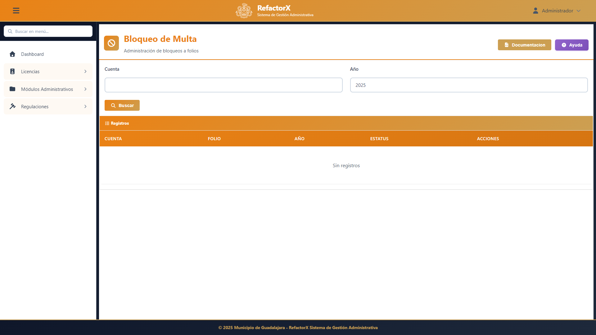

Para aplicar un bloqueo:

1. Acceda a **Bloqueos > Bloquear Multa**
2. Busque la multa o cuenta
3. Complete los datos del bloqueo:
   - **Motivo**: Seleccione o describa la razón
   - **Tipo de Bloqueo**: Temporal o permanente
   - **Vigencia**: Fecha de inicio y fin (si aplica)
   - **Observaciones**: Detalles adicionales
4. Ingrese el número de oficio de autorización
5. Confirme el bloqueo

**Efectos del Bloqueo**:
- No se podrán registrar pagos
- No se generarán nuevos requerimientos
- Se suspenden los plazos legales
- Aparece una alerta en todas las consultas

### 7.3 Bloqueo de Cuentas de Requerimiento

Para bloquear cuentas con requerimientos activos:

1. Acceda a **Bloqueos > Cuentas con Requerimiento**
2. Consulte la lista de cuentas bloqueables
3. Seleccione la cuenta
4. Verifique que existan motivos válidos:
   - Notificación pendiente
   - Recurso de revisión en proceso
   - Amparo interpuesto
5. Aplique el bloqueo temporal
6. El sistema notificará automáticamente al ejecutor asignado

### 7.4 Desbloqueo de Cuentas

Para desbloquear una cuenta:

1. Localice la cuenta bloqueada
2. Verifique que se haya resuelto el motivo del bloqueo
3. Haga clic en "Desbloquear"
4. Ingrese la justificación
5. Adjunte el oficio de autorización
6. Confirme la operación
7. El sistema restablecerá todas las funciones

**Importante**: Los desbloqueos deben ser autorizados por el mismo nivel jerárquico que autorizó el bloqueo o superior.

---

## 8. Derechos Especiales

### 8.1 Derechos de Fosas

El módulo de Derechos de Fosas gestiona los descuentos en recargos para servicios de panteón:

#### Consulta de Fosas

1. Acceda a **Derechos > Fosas**
2. Seleccione el panteón:
   - Panteón de Mezquitán
   - Panteón de San Andrés
   - Panteón de Guadalajara
3. Ingrese el número de fosa
4. El sistema mostrará:
   - Titular del servicio
   - Tipo de fosa (perpetua, temporal)
   - Adeudos pendientes
   - Historial de pagos

#### Aplicación de Descuentos

1. Verifique el adeudo total
2. Seleccione el tipo de descuento:
   - Descuento en recargos
   - Bonificación especial
3. Calcule el monto a descontar
4. Registre el funcionario autorizador
5. Aplique el descuento
6. Genere el recibo de pago

### 8.2 Derechos de Transmisiones

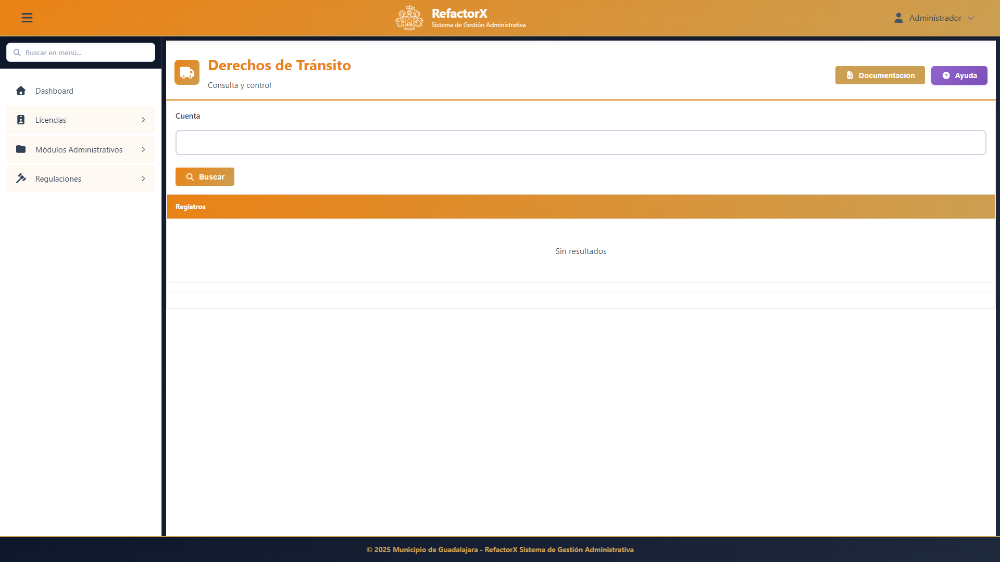

Gestiona descuentos en transmisiones patrimoniales:

#### Búsqueda de Transmisiones

1. Acceda a **Derechos > Transmisiones**
2. Ingrese el folio de la operación
3. Seleccione el tipo:
   - Transmisión completa
   - Diferencias de impuesto
4. El sistema mostrará:
   - Datos de la escritura
   - Notario interviniente
   - Base gravable
   - Impuesto calculado
   - Recargos generados

#### Autorización de Descuentos

1. Verifique los montos calculados
2. Valide que proceda el descuento
3. Ingrese el porcentaje autorizado
4. Especifique si aplica a:
   - Impuesto principal
   - Recargos
   - Ambos conceptos
5. Registre la autorización
6. Genere el formato de pago actualizado

### 8.3 Derechos de Mercados

Administra descuentos en rentas de mercados municipales:

#### Búsqueda de Locales

1. Acceda a **Derechos > Mercados**
2. Seleccione la recaudadora
3. Elija el mercado
4. Seleccione la sección
5. Busque el local por número o locatario
6. El sistema mostrará:
   - Datos del locatario
   - Tipo de local y giro
   - Cuota mensual
   - Adeudos acumulados

#### Aplicación de Descuentos

1. Verifique el adeudo total del local
2. Seleccione el concepto a descontar:
   - Renta ordinaria
   - Renta extraordinaria
   - Recargos
3. Ingrese el porcentaje de descuento
4. Especifique el periodo de aplicación
5. Registre el autorizador
6. Aplique el descuento
7. Actualice el estado de cuenta

**Nota**: Los descuentos en mercados pueden aplicarse a periodos específicos o al total del adeudo.

---

## 9. Catálogo de Ejecutores

### 9.1 Gestión de Ejecutores

El catálogo de ejecutores fiscales es fundamental para la asignación de requerimientos.

#### Alta de Ejecutores

1. Acceda a **Catálogos > Ejecutores**
2. Haga clic en "Nuevo Ejecutor"
3. Complete el formulario:
   - **Clave**: Código único del ejecutor
   - **Nombre Completo**: Apellidos y nombre
   - **RFC**: Registro Federal de Contribuyentes
   - **Cargo**: Puesto oficial
   - **Área**: Departamento de adscripción
   - **Teléfono**: Extensión o celular
   - **Correo Electrónico**: Para notificaciones
4. Asigne permisos especiales (si aplica):
   - Requerimientos prediales
   - Requerimientos de licencias
   - Embargos
   - Multas especiales
5. Establezca las zonas de responsabilidad
6. Guarde el registro

#### Consulta y Modificación

1. Busque el ejecutor por nombre o clave
2. Seleccione el registro
3. Haga clic en "Editar"
4. Modifique los datos necesarios
5. Guarde los cambios

#### Desactivación de Ejecutores

Para dar de baja a un ejecutor:

1. Localice el registro del ejecutor
2. Haga clic en "Desactivar"
3. Ingrese el motivo:
   - Renuncia
   - Cambio de área
   - Baja definitiva
4. El sistema reasignará automáticamente los requerimientos pendientes
5. Confirme la operación

**Importante**: Los ejecutores desactivados permanecen en el sistema para consulta histórica pero no pueden recibir nuevas asignaciones.

---

## 10. Empresas Recaudadoras

### 10.1 Administración de Empresas

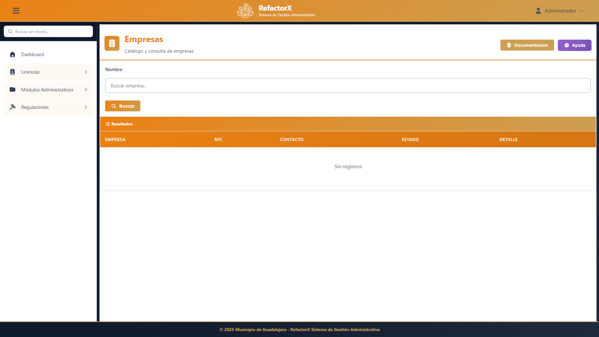

El catálogo de empresas recaudadoras registra las entidades autorizadas para recibir pagos.

#### Registro de Nuevas Empresas

1. Acceda a **Catálogos > Empresas Recaudadoras**
2. Haga clic en "Nueva Empresa"
3. Complete los datos fiscales:
   - **Razón Social**: Nombre completo de la empresa
   - **RFC**: Con homoclave
   - **Domicilio Fiscal**: Calle, número, colonia, CP
   - **Representante Legal**: Nombre del apoderado
   - **Teléfono y Correo**: Datos de contacto
4. Datos operativos:
   - **Número de Convenio**: Folio del convenio con el Municipio
   - **Fecha de Inicio**: Vigencia del convenio
   - **Tipo de Servicio**: Concepto que recauda
   - **Comisión**: Porcentaje pactado
5. Adjunte documentación:
   - Convenio firmado (PDF)
   - Acta constitutiva
   - Poder del representante legal
6. Guarde el registro

### 10.2 Actualización de Fechas

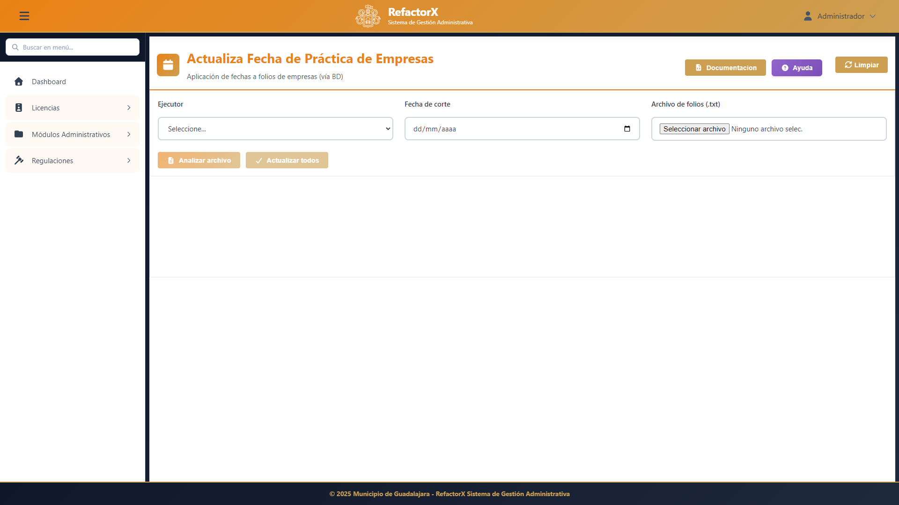

Para actualizar periodos de vigencia de las empresas:

1. Acceda a **Empresas > Actualizar Fechas**
2. Seleccione la empresa
3. Modifique según corresponda:
   - Fecha de inicio de operaciones
   - Fecha de término del convenio
   - Fecha de última actualización
4. Ingrese la justificación del cambio
5. Adjunte el documento soporte (adendum, renovación)
6. Guarde los cambios

#### Renovación de Convenios

Cuando un convenio está próximo a vencer:

1. El sistema generará una alerta 30 días antes
2. Gestione la renovación con el proveedor
3. Actualice las fechas en el sistema
4. Adjunte el nuevo convenio
5. Actualice las condiciones si hubo cambios:
   - Nueva comisión
   - Horarios de servicio
   - Formas de pago aceptadas

### 10.3 Suspensión de Empresas

Para suspender temporalmente una empresa:

1. Localice el registro de la empresa
2. Haga clic en "Suspender"
3. Indique el motivo:
   - Incumplimiento de convenio
   - Auditoría en proceso
   - Solicitud de la empresa
4. Establezca el periodo de suspensión
5. El sistema desactivará automáticamente:
   - Recepción de nuevos pagos
   - Generación de reportes
   - Acceso al sistema (si aplica)

---

## 11. Reportes

### 11.1 Tipos de Reportes

El módulo incluye diversos reportes para análisis y seguimiento:

- Reportes operativos
- Reportes ejecutivos
- Reportes legales y oficiales
- Estadísticas y análisis
- Cartas y notificaciones

### 11.2 Carta de Invitación al Pago

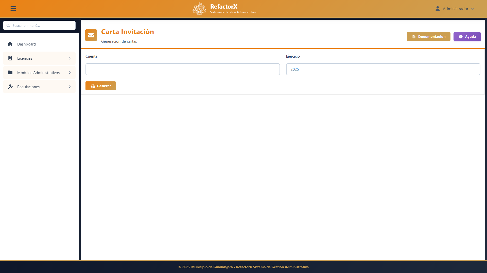

Para generar cartas de invitación:

1. Acceda a **Reportes > Carta de Invitación**
2. Seleccione el tipo de carta:
   - **Invitación**: Primera notificación amigable
   - **Recordatorio**: Segunda notificación
   - **Urgente**: Notificación previa a requerimiento
3. Defina los criterios de selección:
   - Rango de adeudos
   - Tipo de contribuyente
   - Zona geográfica
   - Ejercicios adeudados
4. Configure el contenido:
   - Texto personalizado (opcional)
   - Fecha límite para pago
   - Beneficios por pronto pago
5. Genere las cartas
6. Opciones de salida:
   - Impresión masiva
   - Generación de PDFs individuales
   - Envío por correo electrónico

### 11.3 Firma Electrónica

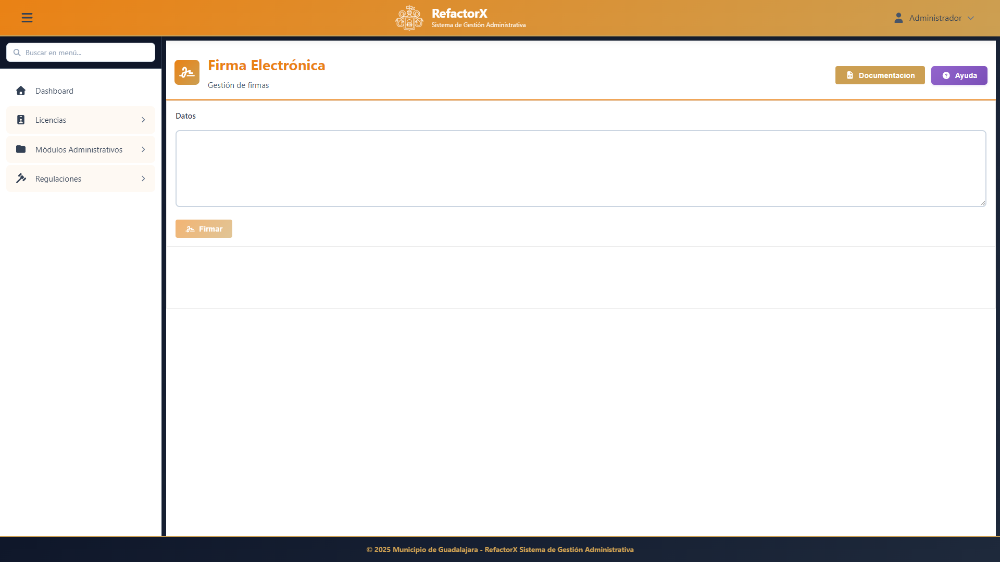

Para documentos oficiales con firma electrónica:

1. Genere el documento (requerimiento, multa, carta)
2. Acceda a **Herramientas > Firma Electrónica**
3. Seleccione el documento a firmar
4. Ingrese sus credenciales:
   - Usuario autorizado
   - Contraseña
   - Token (si aplica)
5. El sistema:
   - Validará su identidad
   - Generará el hash del documento
   - Aplicará el sello digital
   - Registrará la operación
6. El documento firmado incluirá:
   - Cadena de firma electrónica
   - Fecha y hora del firmado
   - Folio único de validación
   - Código QR para verificación

#### Verificación de Firmas

Para verificar un documento firmado:

1. Acceda a **Herramientas > Verificar Firma**
2. Ingrese el folio de validación o escanee el código QR
3. El sistema mostrará:
   - Estado del documento (válido/inválido)
   - Nombre del firmante
   - Fecha y hora de la firma
   - Integridad del documento

### 11.4 Reportes Estadísticos

#### Reporte de Multas por Periodo

1. Acceda a **Reportes > Estadísticos > Multas**
2. Seleccione el rango de fechas
3. Filtre por:
   - Tipo de multa
   - Ejecutor
   - Estado (vigente/pagada/cancelada)
4. El reporte mostrará:
   - Número de multas emitidas
   - Monto total
   - Promedio por multa
   - Gráficas de tendencias

#### Reporte de Requerimientos

1. Acceda a **Reportes > Estadísticos > Requerimientos**
2. Seleccione el periodo
3. Filtre por ejecutor o área
4. El sistema mostrará:
   - Requerimientos emitidos
   - Requerimientos cumplidos
   - Requerimientos vencidos
   - Tasa de efectividad

#### Reporte de Recaudación

1. Acceda a **Reportes > Estadísticos > Recaudación**
2. Configure los parámetros:
   - Periodo de análisis
   - Desglose por concepto
   - Comparativo con años anteriores
3. El reporte incluirá:
   - Ingresos totales
   - Desglose por tipo de pago
   - Empresas recaudadoras más efectivas
   - Gráficas de evolución

### 11.5 Exportación de Datos

Todos los reportes pueden exportarse en diferentes formatos:

1. Genere el reporte deseado
2. Haga clic en "Exportar"
3. Seleccione el formato:
   - **PDF**: Para impresión y archivo
   - **Excel**: Para análisis adicional
   - **CSV**: Para importación en otros sistemas
   - **XML**: Para intercambio electrónico
4. Configure las opciones de exportación
5. Descargue el archivo

---

## 12. Glosario

### Términos Generales

**Adeudo**: Cantidad de dinero que el contribuyente debe al Municipio por concepto de impuestos, derechos o multas.

**Cancelación**: Anulación de una multa o requerimiento por motivos legales o administrativos, previa autorización.

**Contribuyente**: Persona física o moral obligada al pago de impuestos, derechos o aprovechamientos municipales.

**Cuenta Catastral**: Número único de identificación de un predio en el padrón municipal.

**Ejercicio Fiscal**: Periodo de 12 meses (generalmente calendario) para el cual se generan obligaciones tributarias.

**Ejecutor Fiscal**: Funcionario municipal facultado para notificar y ejecutar requerimientos de pago.

**Folio**: Número consecutivo único que identifica un documento o transacción en el sistema.

**Prescripción**: Extinción del derecho del Municipio para exigir el pago de un crédito fiscal por el transcurso del tiempo establecido en ley.

**Recargo**: Cantidad adicional que se cobra por el pago extemporáneo de una obligación fiscal.

**RFC**: Registro Federal de Contribuyentes, clave única de identificación fiscal.

**Saldo a Favor**: Cantidad que el Municipio debe devolver o aplicar al contribuyente por pago en exceso o resolución favorable.

### Términos del Módulo

**Bloqueo de Cuenta**: Suspensión temporal de operaciones en una cuenta por motivos administrativos o legales.

**Carta de Invitación**: Notificación preventiva al contribuyente invitándolo a regularizar su situación antes de iniciar procedimiento de cobro coactivo.

**Descuento Autorizado**: Reducción en el monto a pagar, autorizada por funcionario competente según reglamento vigente.

**Diferencias de Impuesto**: Cantidad adicional determinada por autoridad revisora cuando detecta errores en la declaración o autoliquidación.

**Empresa Recaudadora**: Entidad privada autorizada mediante convenio para recibir pagos municipales.

**Firma Electrónica**: Medio de identificación electrónico que produce los mismos efectos legales que la firma autógrafa.

**Multa Municipal**: Sanción económica impuesta por infracción a reglamentos u ordenamientos municipales.

**Requerimiento de Pago**: Notificación oficial mediante la cual se exige al contribuyente el pago de un adeudo dentro de un plazo determinado, bajo apercibimiento de iniciar procedimiento de ejecución.

**Sello Digital**: Dato electrónico integrado en un documento digital que garantiza su integridad y autoría.

**Transmisión Patrimonial**: Operación mediante la cual se transfiere la propiedad de un bien inmueble, gravada con el impuesto respectivo.

### Abreviaturas Comunes

- **AS-400**: Sistema legacy anterior de gestión municipal
- **CP**: Código Postal
- **DM**: Módulo de Derechos Municipales
- **FE**: Firma Electrónica
- **PDF**: Formato de documento portátil
- **QR**: Código de respuesta rápida
- **RFC**: Registro Federal de Contribuyentes
- **RP**: Registro Público
- **RPP**: Registro Público de la Propiedad
- **SP**: Stored Procedure (procedimiento almacenado)
- **UMA**: Unidad de Medida y Actualización

---

## Soporte y Asistencia

### Contacto

Para soporte técnico o dudas sobre el uso del sistema:

- **Mesa de Ayuda**: Extensión 1234
- **Correo Electrónico**: soporte.refactorx@guadalajara.gob.mx
- **Horario**: Lunes a Viernes de 8:00 a 16:00 hrs

### Capacitación

Se ofrecen cursos de capacitación periódicos para usuarios nuevos y actualización para usuarios existentes. Consulte el calendario de capacitación con el área de Recursos Humanos.

### Actualizaciones del Manual

Este manual se actualiza periódicamente. Verifique que está consultando la versión más reciente:

- **Versión**: 1.0
- **Fecha**: Diciembre 2025
- **Última Revisión**: Diciembre 2025

---

**Municipio de Guadalajara**
**Tesorería Municipal**
**Sistema RefactorX**

*Este manual es propiedad del Municipio de Guadalajara. Queda prohibida su reproducción parcial o total sin autorización.*
