# Manual de Usuario - Otras Obligaciones

## Sistema RefactorX - Municipio de Guadalajara

**Version:** 1.0
**Fecha:** Diciembre 2025
**Modulo:** Otras Obligaciones

---

## Tabla de Contenidos

1. [Introduccion](#1-introduccion)
2. [Menu Principal](#2-menu-principal)
3. [Gestion General (G)](#3-gestion-general-g)
   - 3.1 [GNuevos - Alta de Registros](#31-gnuevos---alta-de-registros)
   - 3.2 [GConsulta - Consulta General](#32-gconsulta---consulta-general)
   - 3.3 [GConsulta2 - Consulta Avanzada](#33-gconsulta2---consulta-avanzada)
   - 3.4 [GActualiza - Actualizar Datos](#34-gactualiza---actualizar-datos)
   - 3.5 [GBaja - Baja de Registros](#35-gbaja---baja-de-registros)
   - 3.6 [GAdeudos - Consulta de Adeudos](#36-gadeudos---consulta-de-adeudos)
   - 3.7 [GAdeudosGral - Adeudos Generales](#37-gadeudosgral---adeudos-generales)
   - 3.8 [GAdeudos_OpcMult - Adeudos Multiple](#38-gadeudos_opcmult---adeudos-multiple)
   - 3.9 [GAdeudos_OpcMult_RA - Reactivacion](#39-gadeudos_opcmult_ra---reactivacion)
   - 3.10 [GFacturacion - Facturacion General](#310-gfacturacion---facturacion-general)
   - 3.11 [GRep_Padron - Reporte de Padron](#311-grep_padron---reporte-de-padron)
4. [Gestion Repositorio (R)](#4-gestion-repositorio-r)
   - 4.1 [RNuevos - Alta en Repositorio](#41-rnuevos---alta-en-repositorio)
   - 4.2 [RConsulta - Consulta Repositorio](#42-rconsulta---consulta-repositorio)
   - 4.3 [RActualiza - Actualizar Repositorio](#43-ractualiza---actualizar-repositorio)
   - 4.4 [RBaja - Baja en Repositorio](#44-rbaja---baja-en-repositorio)
   - 4.5 [RAdeudos - Adeudos Repositorio](#45-radeudos---adeudos-repositorio)
   - 4.6 [RAdeudos_OpcMult - Adeudos Multiple R](#46-radeudos_opcmult---adeudos-multiple-r)
   - 4.7 [RFacturacion - Facturacion Repositorio](#47-rfacturacion---facturacion-repositorio)
   - 4.8 [RPagados - Historial de Pagos](#48-rpagados---historial-de-pagos)
   - 4.9 [RRep_Padron - Reporte Padron R](#49-rrep_padron---reporte-padron-r)
5. [Catalogos y Utilidades](#5-catalogos-y-utilidades)
   - 5.1 [Rubros](#51-rubros)
   - 5.2 [Etiquetas](#52-etiquetas)
   - 5.3 [Apremios](#53-apremios)
   - 5.4 [CargaCartera](#54-cargacartera)
   - 5.5 [CargaValores](#55-cargavalores)
   - 5.6 [AuxRep - Reporte Auxiliar](#56-auxrep---reporte-auxiliar)
6. [Glosario](#6-glosario)

---

## 1. Introduccion

El modulo de **Otras Obligaciones** gestiona las obligaciones fiscales complementarias del Municipio de Guadalajara que no corresponden a otros modulos especificos. Este modulo permite:

- Alta, consulta, actualizacion y baja de registros
- Gestion de adeudos (concentrados y detallados)
- Operaciones multiples sobre adeudos (pagar, condonar, cancelar, prescribir)
- Generacion de facturacion y reportes
- Administracion de catalogos (rubros, etiquetas)
- Gestion de apremios por periodo
- Carga de cartera y valores

### Estructura del Modulo

El modulo esta organizado en dos secciones principales:
- **G (General):** Gestion principal de obligaciones
- **R (Repositorio):** Gestion del repositorio historico

---

## 2. Menu Principal

El menu principal muestra todas las opciones disponibles del modulo con indicadores de progreso.

**Acceso:** Menu > Otras Obligaciones

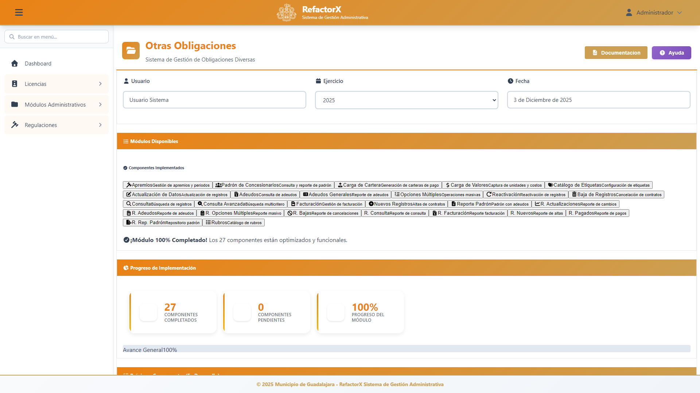

**Secciones disponibles:**

| Seccion | Descripcion |
|---------|-------------|
| Gestion General (G) | Alta, consulta, actualiza, baja, adeudos |
| Gestion Repositorio (R) | Operaciones en repositorio historico |
| Catalogos | Rubros, etiquetas, apremios |
| Utilidades | Carga de cartera y valores |
| Reportes | Padron, auxiliares |

---

## 3. Gestion General (G)

### 3.1 GNuevos - Alta de Registros

Permite dar de alta nuevos registros de obligaciones.

**Acceso:** Menu > Otras Obligaciones > Gestion General > Nuevos

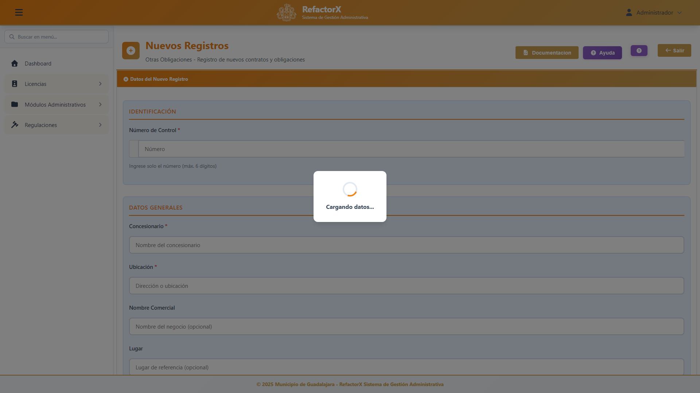

**Datos requeridos:**
- Numero de control (mercado + letra)
- Tabla de obligacion
- Datos del contribuyente
- Ejercicio inicial
- Periodo inicial

**Procedimiento:**
1. Seleccione la tabla de obligacion
2. Ingrese el numero de control
3. Complete los datos del contribuyente
4. Configure ejercicio y periodo inicial
5. Haga clic en **Guardar**

---

### 3.2 GConsulta - Consulta General

Permite consultar informacion general de obligaciones registradas.

**Acceso:** Menu > Otras Obligaciones > Gestion General > Consulta

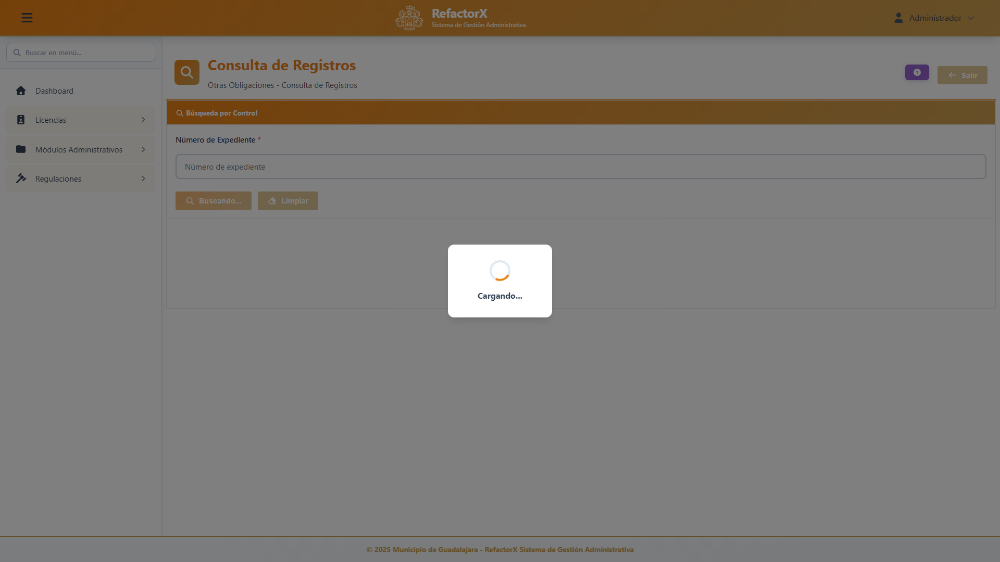

**Criterios de busqueda:**
- Numero de control
- Tabla de obligacion
- Nombre del contribuyente

**Informacion mostrada:**
- Datos generales del registro
- Historial de adeudos
- Historial de pagos

---

### 3.3 GConsulta2 - Consulta Avanzada

Busqueda avanzada con multiples criterios y filtros.

**Acceso:** Menu > Otras Obligaciones > Gestion General > Consulta Avanzada

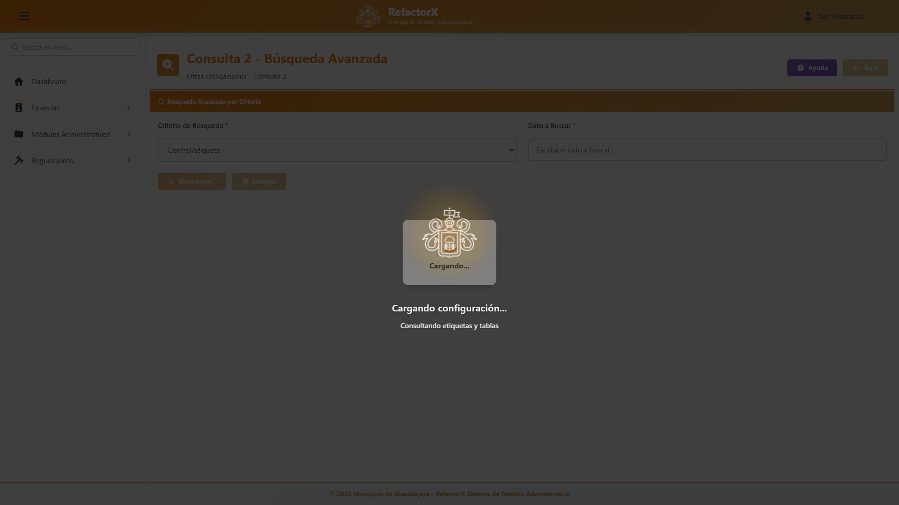

**Funcionalidades:**
- Busqueda por coincidencia parcial
- Filtros por tabla, estado, ejercicio
- Visualizacion de adeudos y pagados
- Exportacion a Excel

---

### 3.4 GActualiza - Actualizar Datos

Permite actualizar diferentes aspectos de un registro.

**Acceso:** Menu > Otras Obligaciones > Gestion General > Actualizar

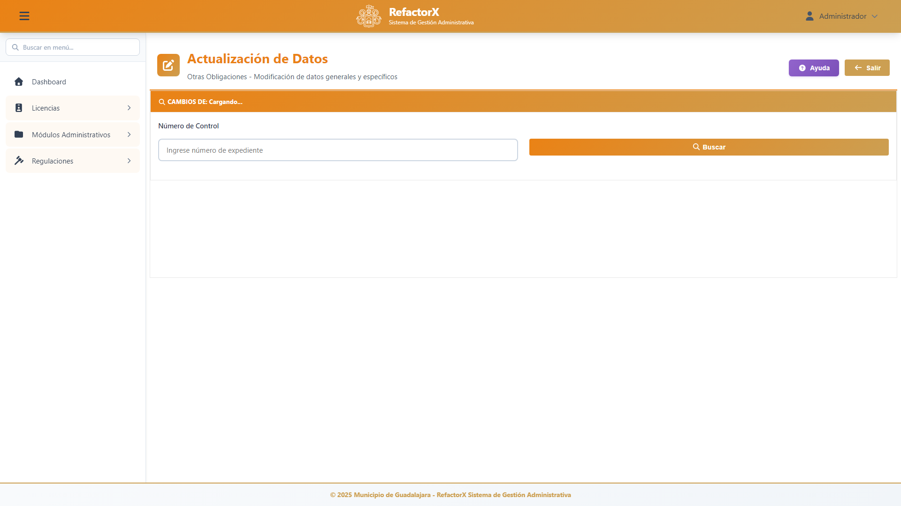

**Opciones de actualizacion:**
| Opcion | Descripcion |
|--------|-------------|
| Datos Generales | Nombre, direccion, telefono |
| Ubicacion | Colonia, calle, numero |
| Periodo Inicial | Ejercicio y periodo de inicio |
| Multas | Aplicacion de multas |
| Suspensiones | Gestion de suspensiones |
| Tipo de Local | Clasificacion del local |

**Procedimiento:**
1. Busque el registro por numero de control
2. Seleccione la opcion de actualizacion
3. Modifique los datos necesarios
4. Confirme los cambios

---

### 3.5 GBaja - Baja de Registros

Proceso para dar de baja un registro del padron.

**Acceso:** Menu > Otras Obligaciones > Gestion General > Baja

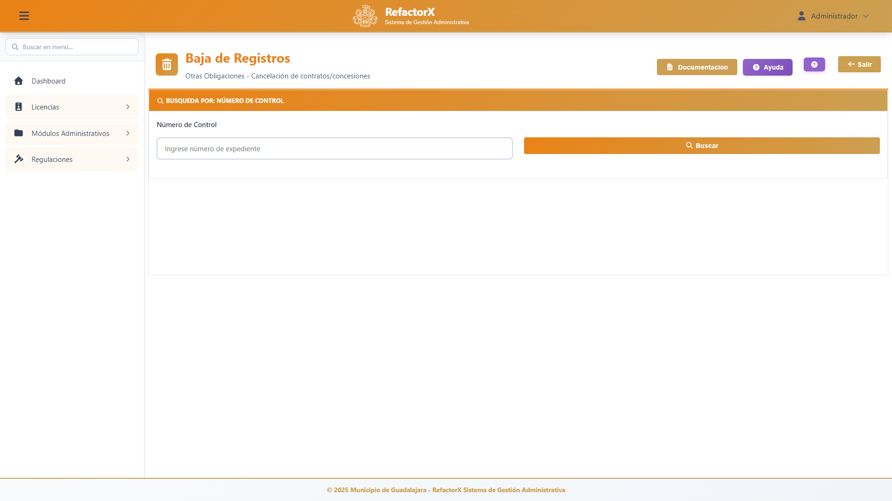

**Consideraciones:**
- Se verifica que no existan adeudos pendientes
- Se muestra resumen de pagos realizados
- Requiere confirmacion del motivo de baja
- El sistema guarda historial de la operacion

**Procedimiento:**
1. Busque el registro a dar de baja
2. Revise el resumen de adeudos y pagos
3. Ingrese el motivo de baja
4. Confirme la operacion

---

### 3.6 GAdeudos - Consulta de Adeudos

Consulta detallada de adeudos por registro.

**Acceso:** Menu > Otras Obligaciones > Gestion General > Adeudos

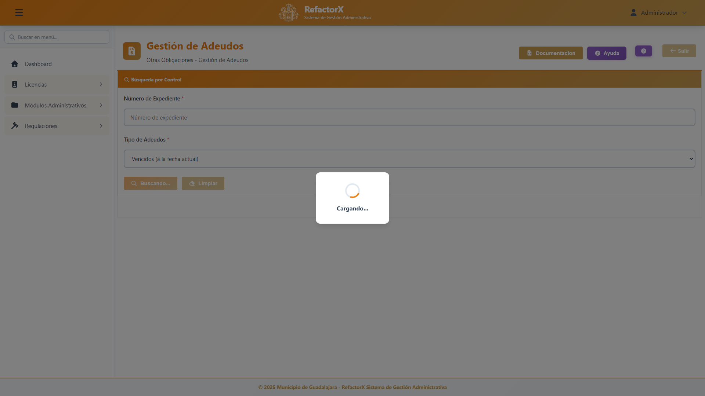

**Vistas disponibles:**
- **Concentrada:** Totales por ejercicio
- **Detallada:** Desglose por periodo

**Informacion mostrada:**
- Ejercicio y periodo
- Importe original
- Recargos
- Total a pagar
- Estatus

---

### 3.7 GAdeudosGral - Adeudos Generales

Consulta global de adeudos de todo el padron.

**Acceso:** Menu > Otras Obligaciones > Gestion General > Adeudos Generales

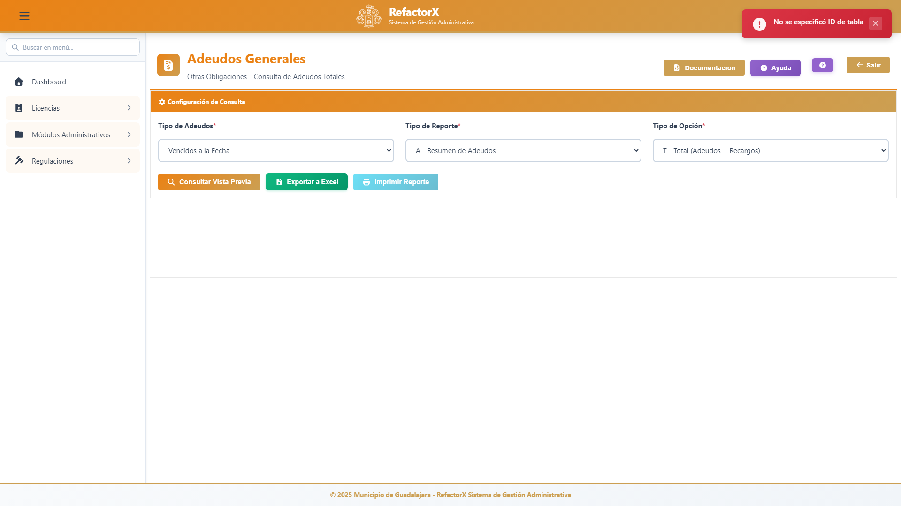

**Funcionalidades:**
- Filtros por tabla y ejercicio
- Totalizacion automatica
- Exportacion a Excel
- Ordenamiento por diferentes columnas

---

### 3.8 GAdeudos_OpcMult - Adeudos Multiple

Permite realizar operaciones multiples sobre adeudos.

**Acceso:** Menu > Otras Obligaciones > Gestion General > Adeudos Multiple

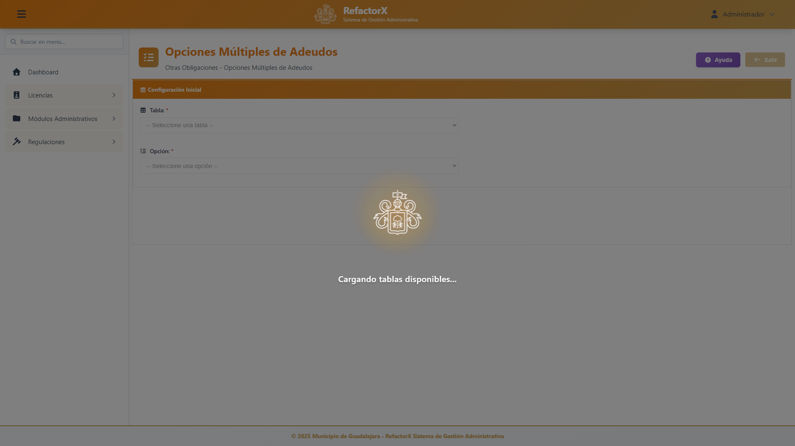

**Operaciones disponibles:**

| Operacion | Descripcion |
|-----------|-------------|
| Pagar | Registrar pago del adeudo |
| Condonar | Aplicar condonacion autorizada |
| Cancelar | Cancelar adeudo por error |
| Prescribir | Marcar como prescrito |

**Procedimiento:**
1. Busque el registro con adeudos
2. Seleccione los periodos a afectar
3. Elija la operacion a realizar
4. Complete los parametros de pago (si aplica)
5. Confirme la operacion

---

### 3.9 GAdeudos_OpcMult_RA - Reactivacion

Reactivacion de adeudos previamente dados de baja o cancelados.

**Acceso:** Menu > Otras Obligaciones > Gestion General > Reactivacion

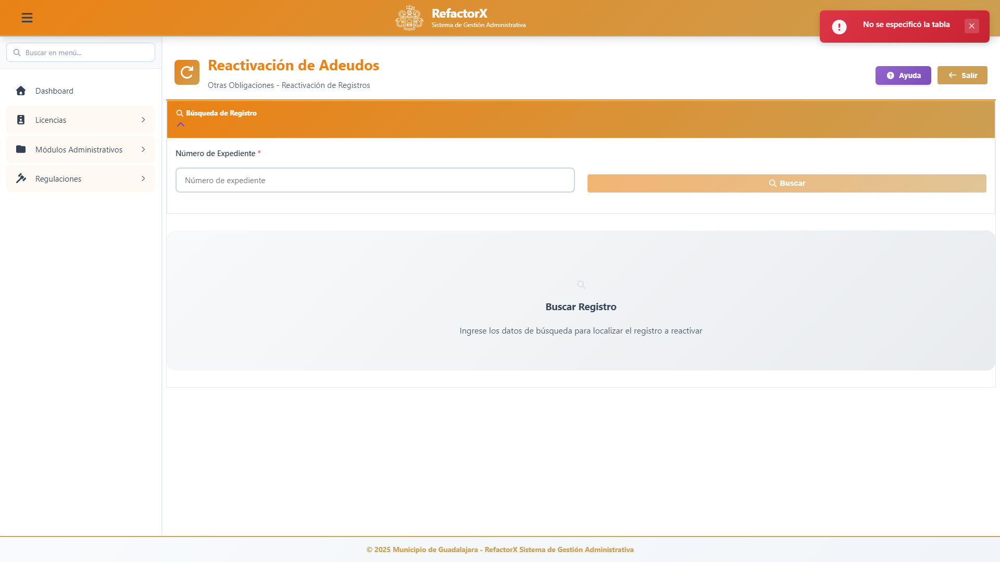

**Casos de uso:**
- Revertir cancelacion por error
- Reactivar prescripcion revocada
- Restaurar condonacion no autorizada

---

### 3.10 GFacturacion - Facturacion General

Generacion de reportes de facturacion.

**Acceso:** Menu > Otras Obligaciones > Gestion General > Facturacion

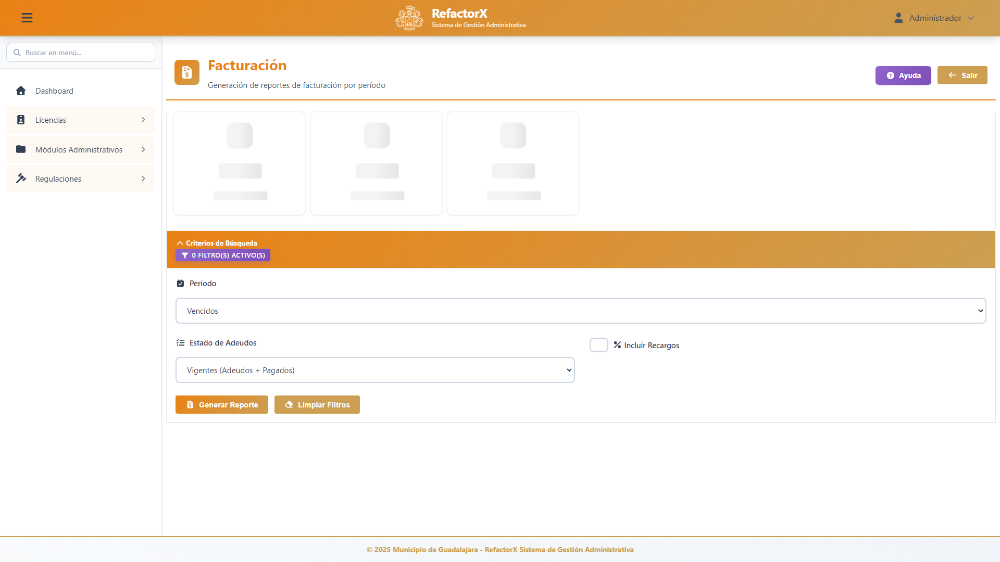

**Filtros disponibles:**
- Rango de fechas
- Tabla de obligacion
- Estado de pago

**Funcionalidades:**
- Totalizacion de importes
- Exportacion a Excel
- Impresion del reporte

---

### 3.11 GRep_Padron - Reporte de Padron

Reporte completo del padron de obligaciones.

**Acceso:** Menu > Otras Obligaciones > Gestion General > Reporte Padron

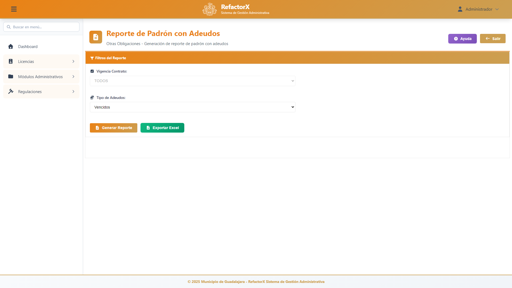

**Contenido del reporte:**
- Listado de contribuyentes
- Estado de cada registro
- Resumen de adeudos
- Totales por tabla

---

## 4. Gestion Repositorio (R)

### 4.1 RNuevos - Alta en Repositorio

Alta de registros en el repositorio historico.

**Acceso:** Menu > Otras Obligaciones > Repositorio > Nuevos

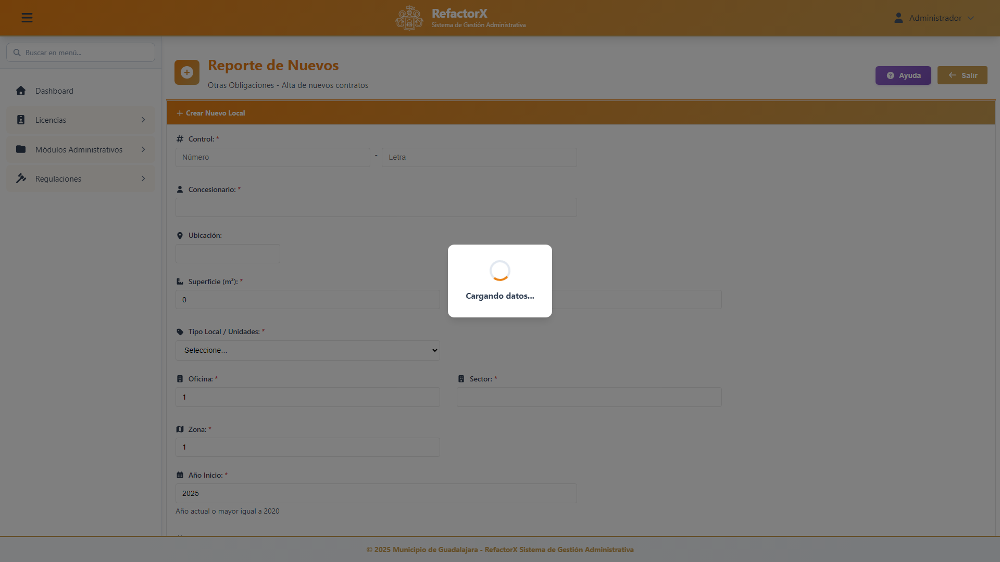

**Validaciones:**
- Verificacion de unicidad de control
- Validacion de datos obligatorios
- Formato de numero de control

---

### 4.2 RConsulta - Consulta Repositorio

Consulta de registros en el repositorio.

**Acceso:** Menu > Otras Obligaciones > Repositorio > Consulta

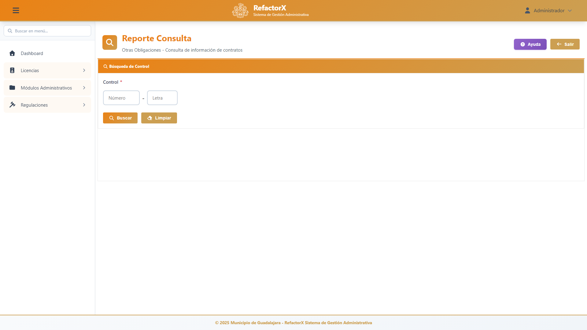

**Estadisticas mostradas:**
- Total de registros
- Registros vigentes
- Registros dados de baja
- Registros con adeudo

---

### 4.3 RActualiza - Actualizar Repositorio

Actualizacion de datos en el repositorio.

**Acceso:** Menu > Otras Obligaciones > Repositorio > Actualizar

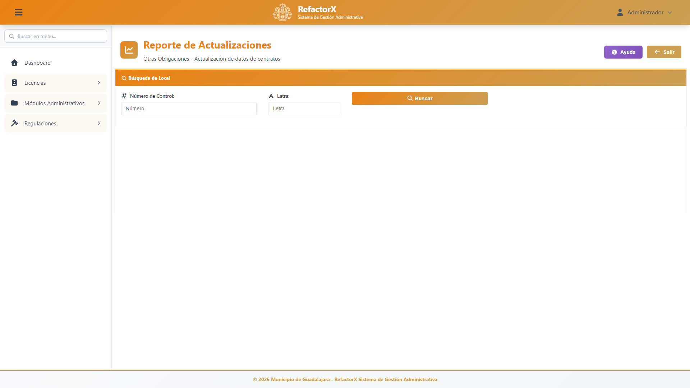

**Opciones de actualizacion:**
1. Concesionario - Datos del titular
2. Ubicacion - Direccion del local
3. Licencia - Numero de licencia asociada
4. Superficie - Metros cuadrados
5. Tipo de Local - Clasificacion
6. Inicio de Obligacion - Fecha inicial

**Nota:** Algunas opciones requieren verificar que no existan pagos pendientes.

---

### 4.4 RBaja - Baja en Repositorio

Baja de registros del repositorio.

**Acceso:** Menu > Otras Obligaciones > Repositorio > Baja

**Estados posibles:**
| Estado | Badge | Descripcion |
|--------|-------|-------------|
| V | Verde | Vigente |
| B | Rojo | Dado de baja |
| S | Amarillo | Suspendido |

---

### 4.5 RAdeudos - Adeudos Repositorio

Consulta de adeudos del repositorio.

**Acceso:** Menu > Otras Obligaciones > Repositorio > Adeudos

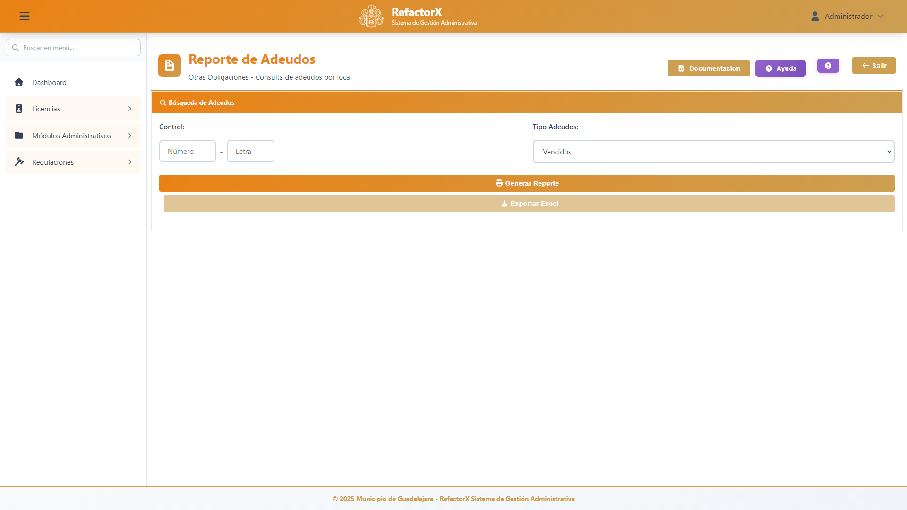

**Vistas:**
- Concentrada por ejercicio
- Desglosada por periodo

---

### 4.6 RAdeudos_OpcMult - Adeudos Multiple R

Operaciones multiples sobre adeudos del repositorio.

**Acceso:** Menu > Otras Obligaciones > Repositorio > Adeudos Multiple

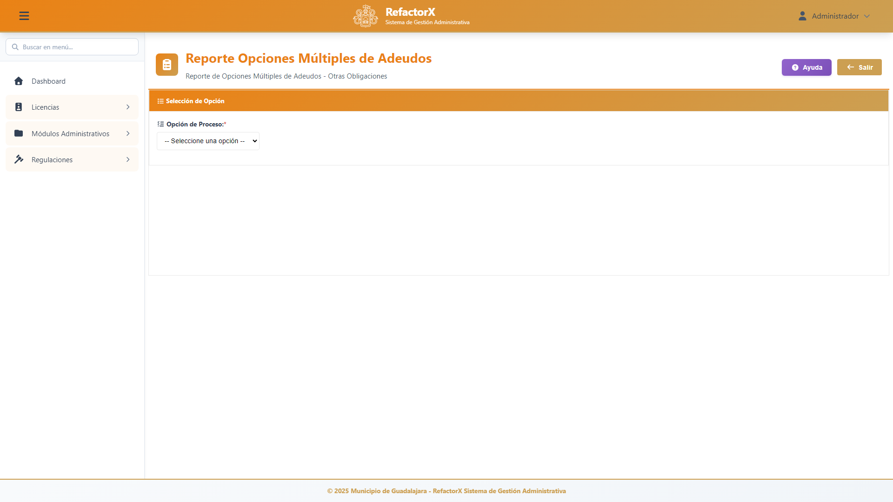

**Parametros de pago:**
- Recaudadora
- Tipo de operacion
- Fecha de pago
- Numero de recibo

---

### 4.7 RFacturacion - Facturacion Repositorio

Reporte de facturacion del repositorio.

**Acceso:** Menu > Otras Obligaciones > Repositorio > Facturacion

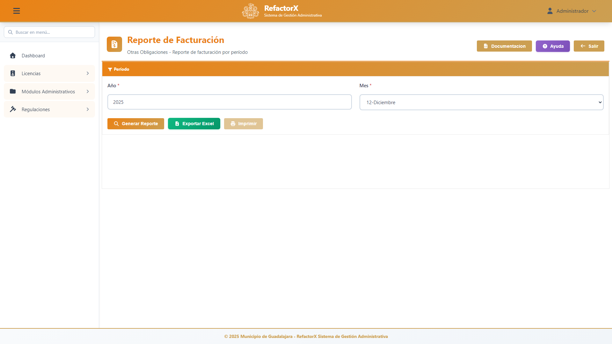

**Metricas:**
- Total de registros
- Monto total facturado
- Promedio por registro

---

### 4.8 RPagados - Historial de Pagos

Consulta del historial de pagos realizados.

**Acceso:** Menu > Otras Obligaciones > Repositorio > Pagados

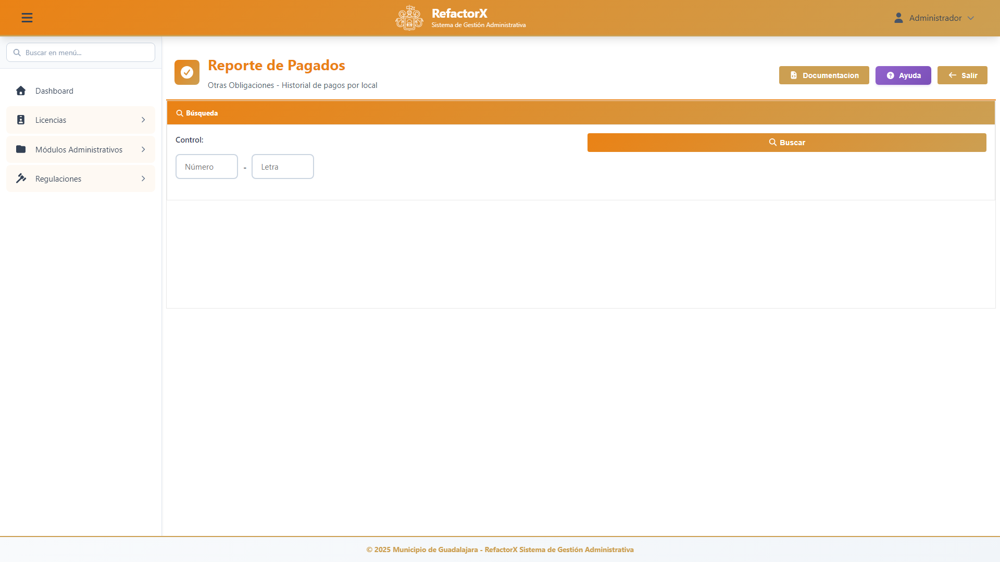

**Informacion mostrada:**
- Fecha de pago
- Numero de recibo
- Importe pagado
- Recargos
- Total

**Funcionalidades:**
- Totalizacion automatica
- Exportacion a Excel
- Filtro por periodo

---

### 4.9 RRep_Padron - Reporte Padron R

Reporte del padron en repositorio.

**Acceso:** Menu > Otras Obligaciones > Repositorio > Reporte Padron

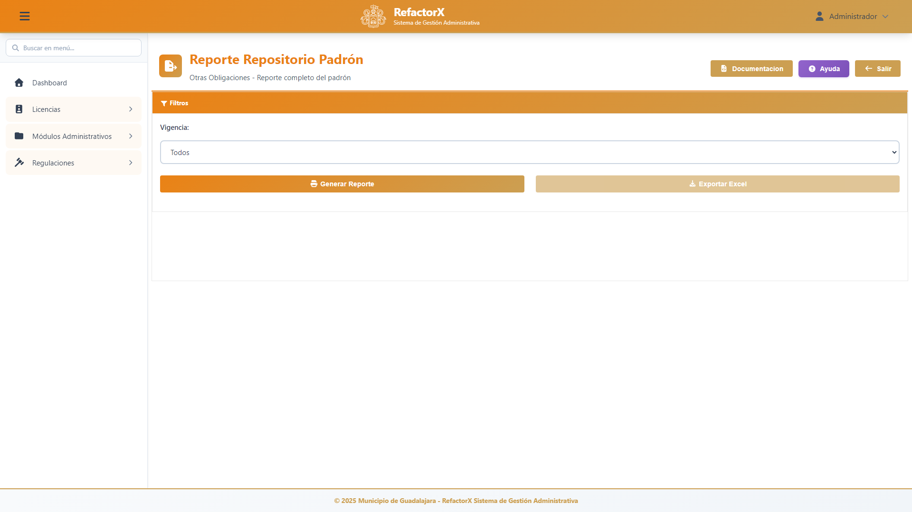

---

## 5. Catalogos y Utilidades

### 5.1 Rubros

Administracion del catalogo de rubros de obligacion.

**Acceso:** Menu > Otras Obligaciones > Catalogos > Rubros

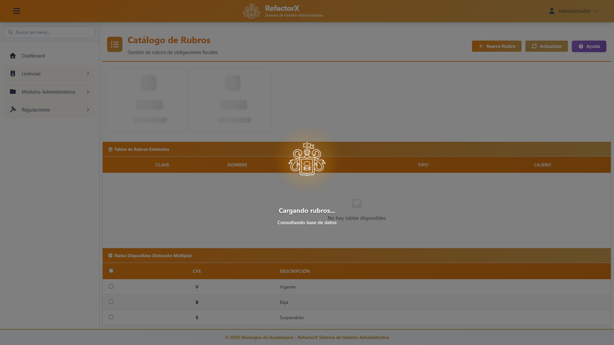

**Operaciones:**
- Alta de nuevos rubros
- Modificacion de rubros existentes
- Activar/Desactivar rubros

---

### 5.2 Etiquetas

Configuracion de etiquetas por tabla de obligacion.

**Acceso:** Menu > Otras Obligaciones > Catalogos > Etiquetas

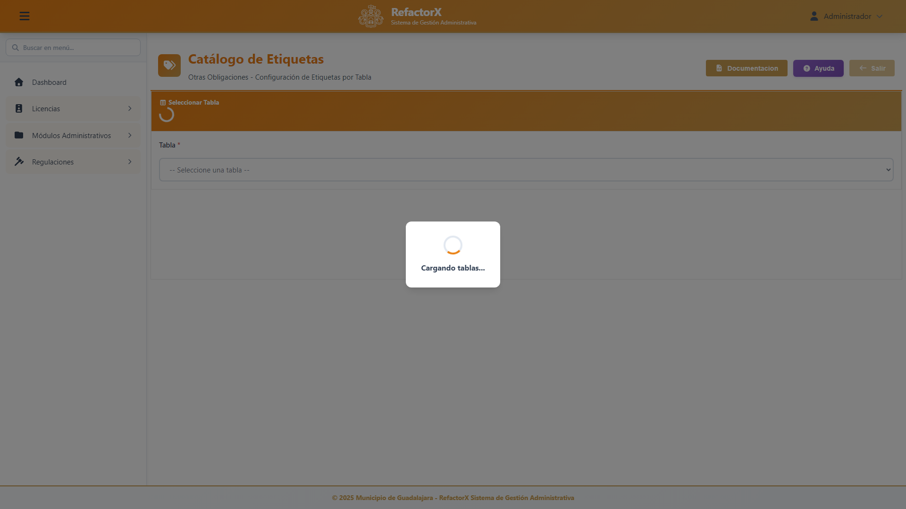

**Campos configurables (19 campos):**
- Etiquetas de formularios
- Nombres de columnas
- Textos de ayuda
- Mensajes del sistema

**Procedimiento:**
1. Seleccione la tabla de obligacion
2. Modifique las etiquetas necesarias
3. Haga clic en **Guardar Cambios**

---

### 5.3 Apremios

Gestion de apremios por periodo fiscal.

**Acceso:** Menu > Otras Obligaciones > Catalogos > Apremios

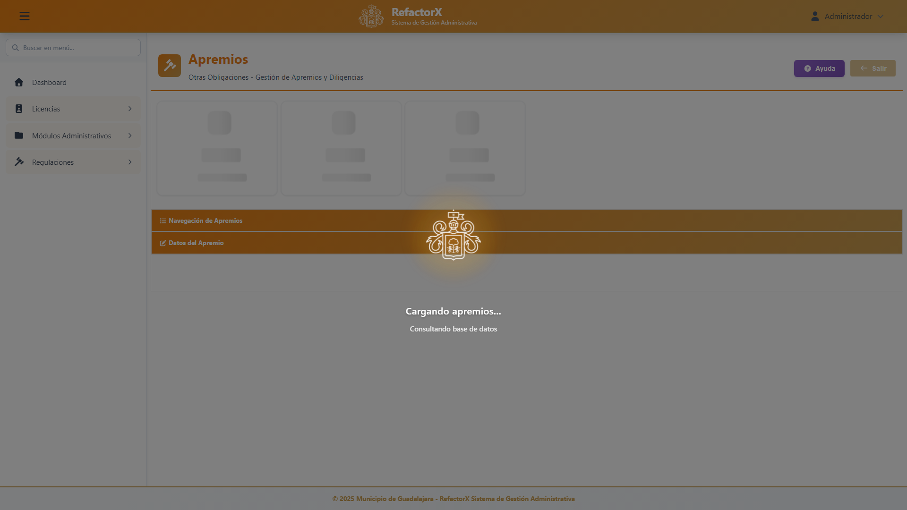

**Funcionalidades:**
- Alta de nuevos apremios
- Modificacion de porcentajes
- Eliminacion de apremios
- Consulta por periodo

---

### 5.4 CargaCartera

Generacion de cartera de adeudos.

**Acceso:** Menu > Otras Obligaciones > Utilidades > Carga Cartera

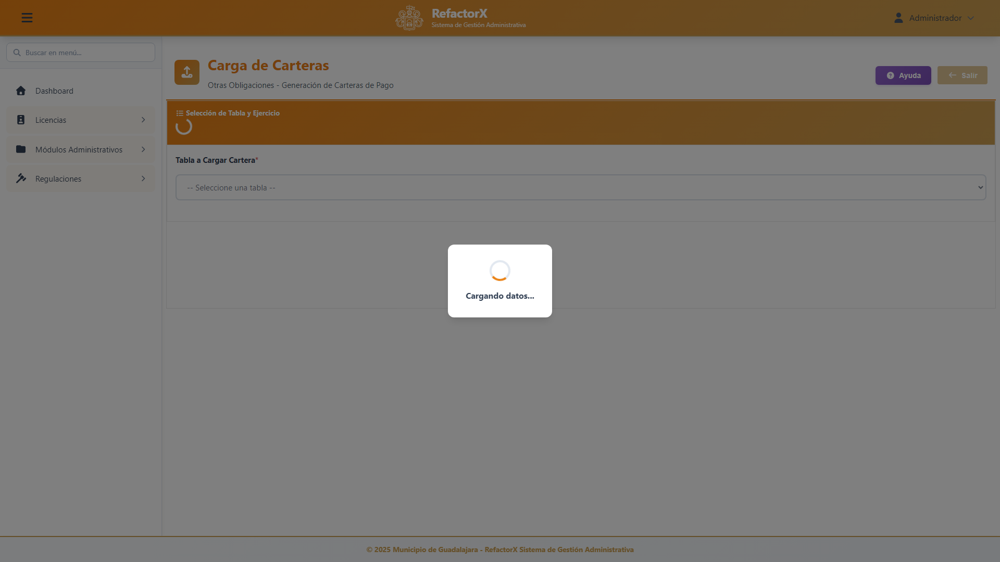

**Proceso:**
1. Seleccione la tabla de obligacion
2. Elija el ejercicio fiscal
3. Revise las unidades a procesar
4. Confirme la generacion de cartera

**Validaciones:**
- Verificacion de ejercicio no generado
- Confirmacion detallada con totales
- Registro de fecha de generacion

---

### 5.5 CargaValores

Carga masiva de valores unitarios.

**Acceso:** Menu > Otras Obligaciones > Utilidades > Carga Valores

**Funcionalidades:**
- Seleccion de tabla
- Edicion de valores por unidad
- Insercion masiva
- Validacion de duplicados

---

### 5.6 AuxRep - Reporte Auxiliar

Reporte auxiliar del padron sin adeudos.

**Acceso:** Menu > Otras Obligaciones > Reportes > Auxiliar

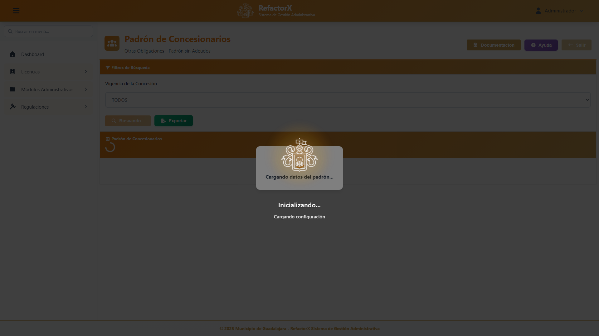

**Uso:**
- Identificar contribuyentes al corriente
- Generar listados para notificaciones
- Exportar a Excel

---

## 6. Glosario

| Termino | Definicion |
|---------|------------|
| **Control** | Numero identificador unico del registro |
| **Tabla** | Tipo de obligacion fiscal |
| **Ejercicio** | Ano fiscal de referencia |
| **Periodo** | Mes o bimestre dentro del ejercicio |
| **Adeudo** | Monto pendiente de pago |
| **Recargo** | Cargo adicional por mora |
| **Condonacion** | Perdon parcial o total de adeudo |
| **Prescripcion** | Caducidad del derecho de cobro |
| **Repositorio** | Base de datos historica |
| **Cartera** | Conjunto de adeudos generados |
| **Apremio** | Porcentaje adicional por incumplimiento |
| **Etiqueta** | Texto configurable de interfaz |
| **Rubro** | Categoria de obligacion |

---

## Anexos

### Atajos de Teclado

| Combinacion | Accion |
|-------------|--------|
| F5 | Actualizar datos |
| Enter | Buscar |
| Esc | Cancelar operacion |
| Ctrl+P | Imprimir |

### Formatos de Exportacion

- **Excel (.xlsx)** - Hojas de calculo
- **PDF** - Documentos oficiales

---

## Soporte Tecnico

Para asistencia tecnica contacte a:

- **Correo:** soporte@guadalajara.gob.mx
- **Telefono:** (33) 3837-0000
- **Horario:** Lunes a Viernes 8:00 - 16:00 hrs

---

**RefactorX - Sistema de Gestion Administrativa**
**Municipio de Guadalajara**
**2025**
