# Manual de Usuario - Padron de Licencias

## Sistema RefactorX - Municipio de Guadalajara

**Version:** 1.0
**Fecha:** Diciembre 2025
**Modulo:** Padron de Licencias

---

## Tabla de Contenidos

1. [Introduccion](#1-introduccion)
2. [Procesos Administrativos](#2-procesos-administrativos)
3. [Consultas](#3-consultas)
4. [Catalogos](#4-catalogos)
5. [Tramites y Solicitudes](#5-tramites-y-solicitudes)
6. [Modificaciones](#6-modificaciones)
7. [Bajas y Cancelaciones](#7-bajas-y-cancelaciones)
8. [Bloqueos](#8-bloqueos)
9. [Busquedas](#9-busquedas)
10. [Reportes](#10-reportes)
11. [Utilidades](#11-utilidades)
12. [Glosario](#12-glosario)

---

## 1. Introduccion

El modulo de **Padron de Licencias** gestiona el proceso completo de licencias comerciales y permisos municipales del Municipio de Guadalajara, desde la solicitud inicial hasta la emision final, incluyendo renovaciones, modificaciones y control de anuncios publicitarios.

### Funcionalidades principales:

- Gestion de licencias comerciales
- Control de anuncios publicitarios
- Administracion de tramites y solicitudes
- Catalogos de giros, requisitos y actividades economicas
- Bloqueos por diferentes criterios (RFC, domicilio, etc.)
- Generacion de reportes y estadisticas
- Emision de documentos oficiales (constancias, dictamenes)

### Beneficios del Sistema:

- Eliminacion de formularios en papel
- Calculo automatico de derechos
- Generacion automatica de documentos oficiales
- Seguimiento en tiempo real del estatus de tramites
- Historial completo de movimientos
- Consultas instantaneas desde cualquier ubicacion

---

## 2. Procesos Administrativos

### 2.1 Proceso de Nueva Licencia

**Flujo:** Solicitud → Revision → Dictamen → Emision

**Tiempo estimado:** 15-20 dias habiles

**Pasos del proceso:**
1. Captura de datos del solicitante
2. Verificacion de documentos
3. Inspeccion fisica (si aplica)
4. Emision de dictamen
5. Generacion de licencia

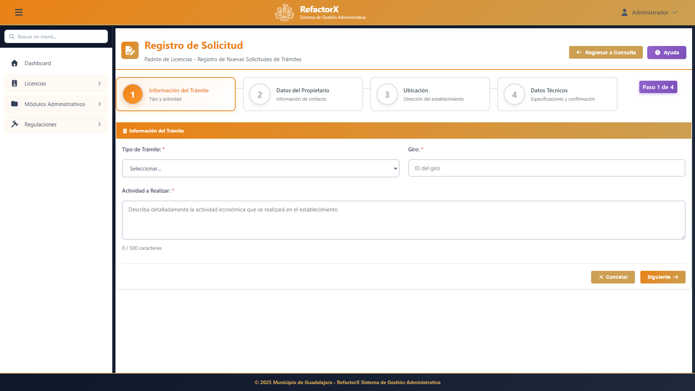

---

### 2.2 Proceso de Renovacion

**Flujo:** Consulta → Verificacion → Actualizacion → Pago → Renovacion

**Tiempo estimado:** 5-7 dias habiles

**Pasos:**
1. Consultar licencia existente
2. Verificar vigencia y estatus
3. Actualizar datos si es necesario
4. Realizar pago correspondiente
5. Obtener renovacion

---

### 2.3 Proceso de Modificaciones

**Flujo:** Solicitud → Validacion → Aprobacion → Actualizacion

**Casos comunes:**
- Cambio de giro comercial
- Ampliacion de actividades
- Cambio de domicilio
- Actualizacion de representante legal

---

### 2.4 Gestion de Anuncios

**Flujo:** Registro → Validacion → Autorizacion → Instalacion

**Tipos de anuncios:**
- Anuncios adosados
- Anuncios en via publica
- Anuncios luminosos
- Anuncios temporales

---

## 3. Consultas

### 3.1 Consulta de Licencias

Permite buscar y visualizar informacion detallada de licencias comerciales registradas.

**Acceso:** Menu > Licencias > Consulta de Licencias

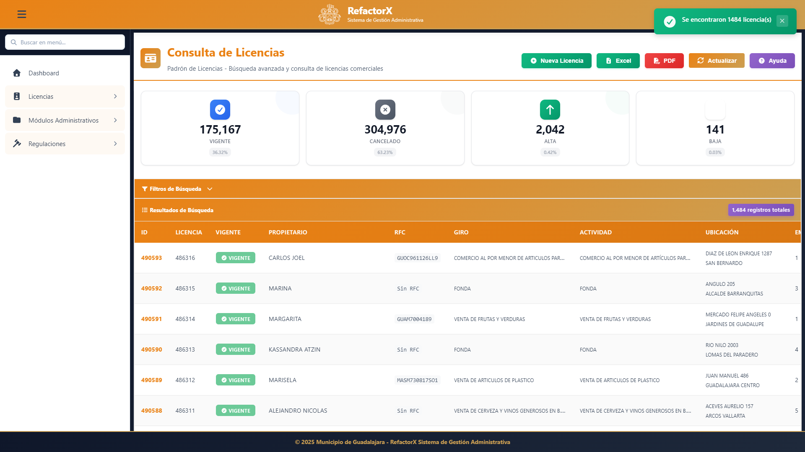

**Criterios de busqueda:**
- Numero de licencia
- RFC del contribuyente
- Razon social o nombre comercial
- Domicilio del establecimiento
- Giro comercial

**Informacion mostrada:**
- Datos generales de la licencia
- Datos del contribuyente
- Giro autorizado
- Fecha de emision y vigencia
- Estatus actual
- Historial de movimientos

---

### 3.2 Consulta de Anuncios

Permite buscar y gestionar anuncios publicitarios registrados en el padron.

**Acceso:** Menu > Licencias > Consulta de Anuncios

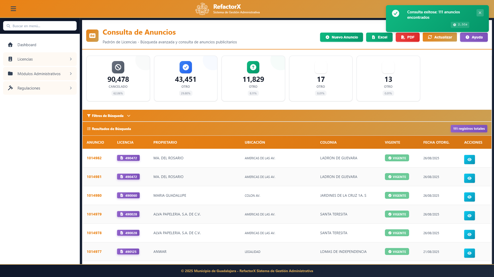

**Campos de busqueda:**
- Numero de anuncio
- Licencia asociada
- Ubicacion
- Tipo de anuncio

---

### 3.3 Consulta de Tramites

Visualiza el estado y seguimiento de tramites en proceso.

**Acceso:** Menu > Licencias > Consulta de Tramites

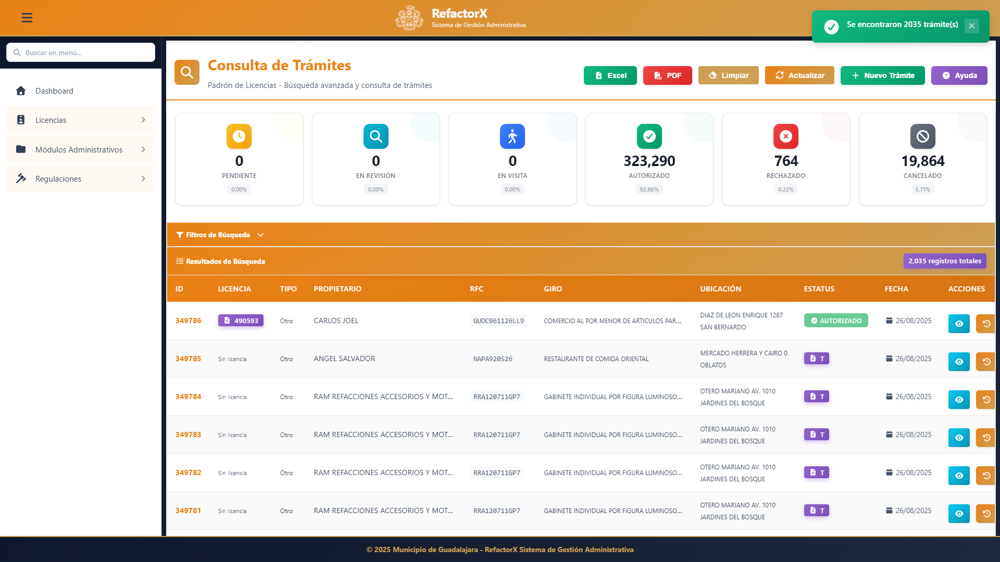

**Estados de tramite:**
| Estado | Descripcion |
|--------|-------------|
| En proceso | Tramite en revision |
| Aprobado | Tramite autorizado |
| Rechazado | Tramite no autorizado |
| Cancelado | Tramite sin efecto |
| En revision | Pendiente de documentos |

---

### 3.4 Licencias Vigentes

Muestra el padron completo de licencias activas y vigentes.

**Acceso:** Menu > Licencias > Licencias Vigentes

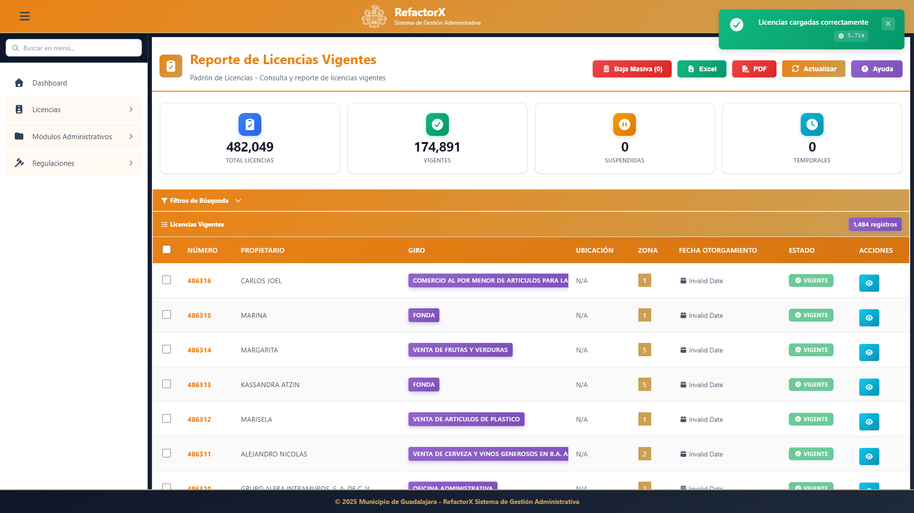

**Funcionalidades:**
- Listado de todas las licencias vigentes
- Filtros por zona, giro y fecha de vencimiento
- Exportacion del padron a Excel

---

### 3.5 Consulta de Usuarios

Administracion de usuarios del sistema.

**Acceso:** Menu > Administracion > Usuarios

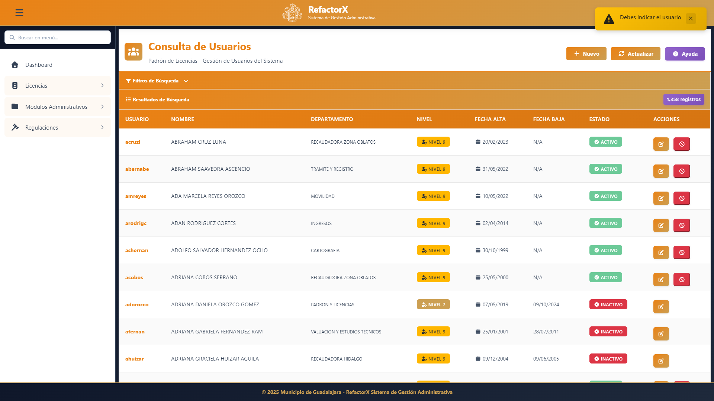

---

### 3.6 Giros con Adeudo

Consulta de giros que tienen adeudos pendientes.

**Acceso:** Menu > Licencias > Giros con Adeudo

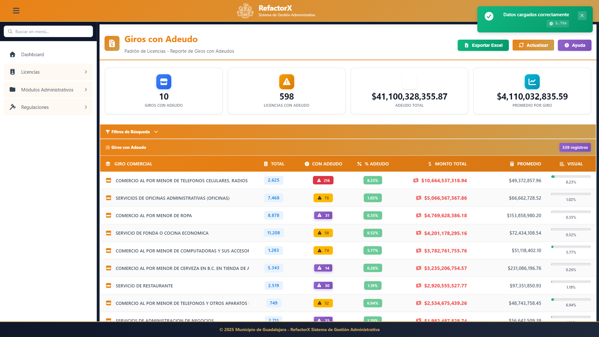

---

### 3.7 Giros Vigentes por Cliente

Muestra los giros vigentes asociados a un contribuyente especifico.

**Acceso:** Menu > Licencias > Giros Vigentes

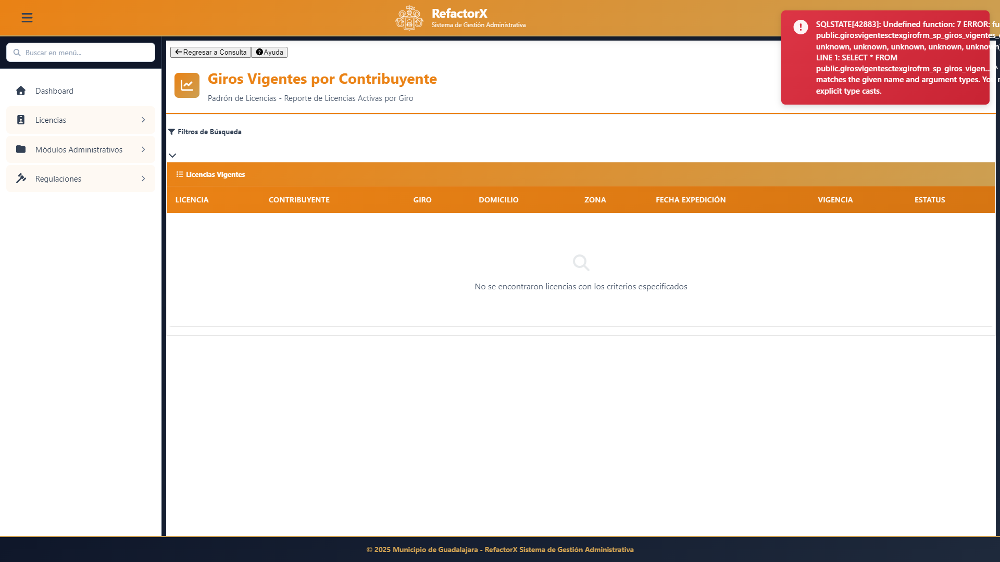

---

## 4. Catalogos

### 4.1 Catalogo de Giros

Administra los giros comerciales permitidos en el municipio. Los giros determinan el tipo de actividad comercial que puede realizar un establecimiento.

**Acceso:** Menu > Catalogos > Giros

**Estadisticas del catalogo:**
- Total de giros registrados
- Giros activos
- Giros inactivos
- Clasificacion SCIAN

**Informacion por giro:**
| Campo | Descripcion |
|-------|-------------|
| ID | Identificador unico del giro |
| Descripcion | Nombre de la actividad comercial |
| Clasificacion | Tipo de actividad |
| Tipo | Comercial, Industrial, Servicios |
| Requerimientos | Requisitos asociados |
| Estatus | Activo/Inactivo |

---

### 4.2 Catalogo de Requisitos

Define los requisitos documentales necesarios para cada tipo de tramite.

**Acceso:** Menu > Catalogos > Requisitos

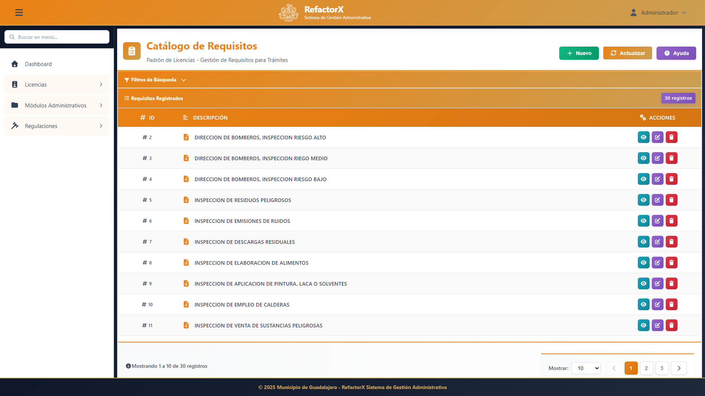

**Tipos de requisitos comunes:**
- Identificacion oficial vigente
- Comprobante de domicilio
- Acta constitutiva (personas morales)
- Poder notarial del representante
- Dictamen de uso de suelo
- Dictamen de proteccion civil
- Licencia de construccion
- Visto bueno de bomberos

---

### 4.3 Catalogo de Actividades

Gestiona las actividades economicas permitidas segun clasificacion SCIAN.

**Acceso:** Menu > Catalogos > Actividades

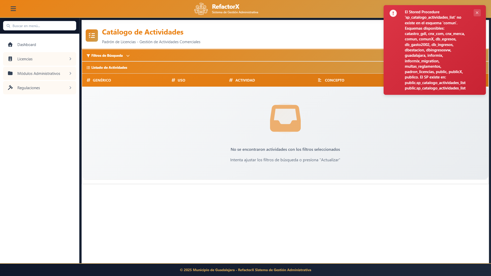

---

### 4.4 Grupos de Licencias

Agrupa licencias por caracteristicas comunes para facilitar la administracion.

**Acceso:** Menu > Catalogos > Grupos de Licencias

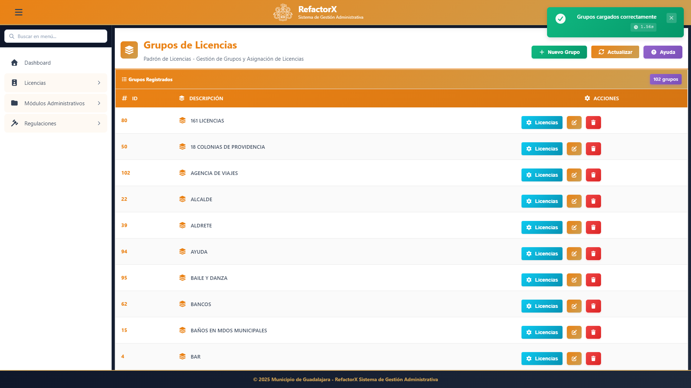

**Administracion de Grupos:**

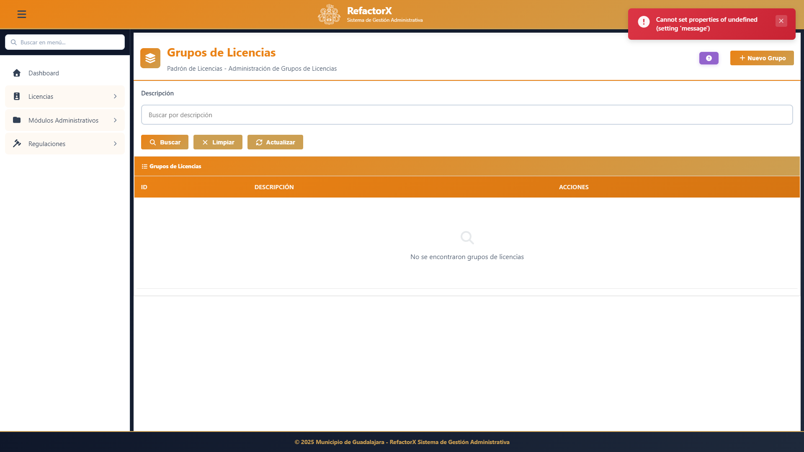

---

### 4.5 Grupos de Anuncios

Clasifica los anuncios publicitarios por tipo y caracteristicas.

**Acceso:** Menu > Catalogos > Grupos de Anuncios

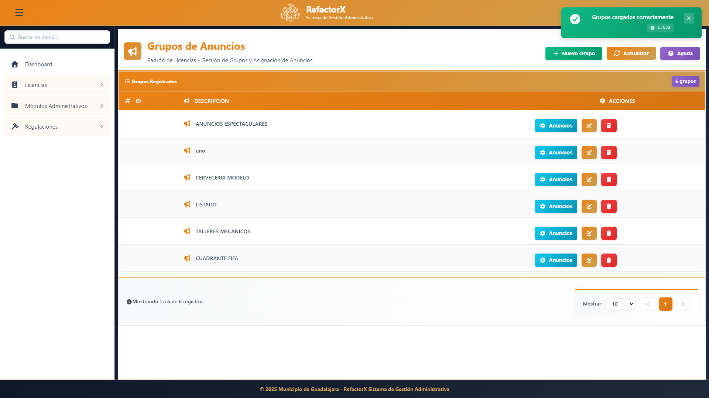

---

### 4.6 Zonas de Licencia

Define las zonas geograficas del municipio para el otorgamiento de licencias.

**Acceso:** Menu > Catalogos > Zonas de Licencia

---

### 4.7 Zonas de Anuncio

Establece las zonas permitidas para instalacion de anuncios publicitarios.

**Acceso:** Menu > Catalogos > Zonas de Anuncio

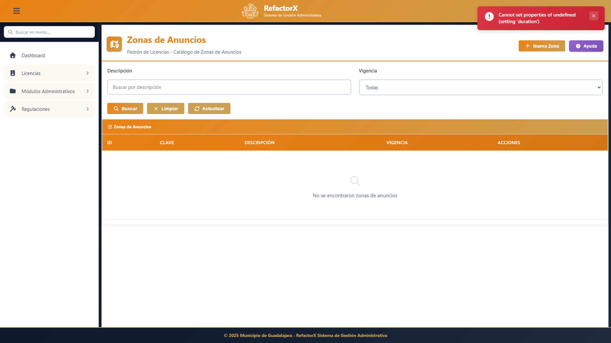

---

### 4.8 Dependencias

Catalogo de dependencias municipales relacionadas con el proceso de licencias.

**Acceso:** Menu > Catalogos > Dependencias

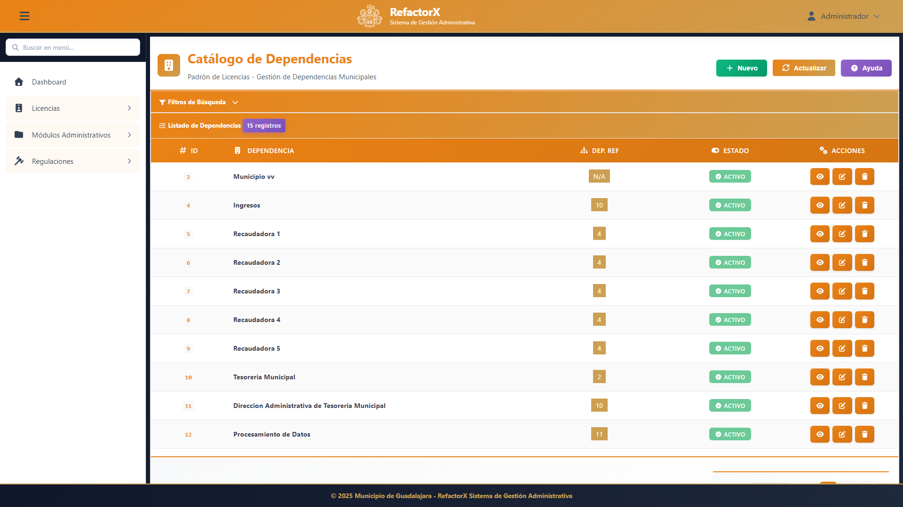

---

### 4.9 Estatus

Catalogo de estados posibles para licencias y tramites.

**Acceso:** Menu > Catalogos > Estatus

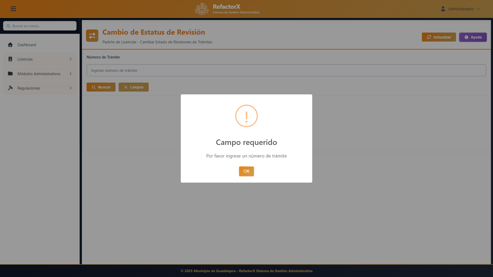

---

### 4.10 Empresas

Administracion de empresas y comercios registrados.

**Acceso:** Menu > Catalogos > Empresas

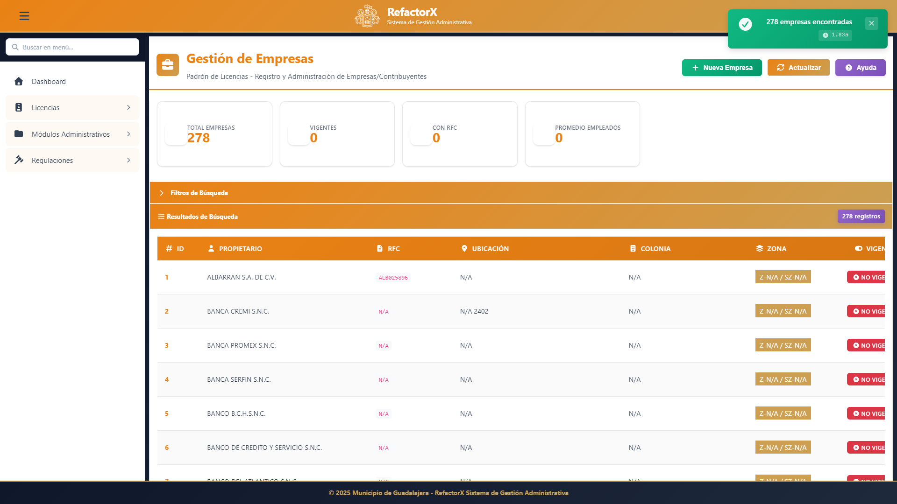

---

### 4.11 Tipos de Bloqueo

Catalogo de motivos de bloqueo disponibles.

**Acceso:** Menu > Catalogos > Tipos de Bloqueo

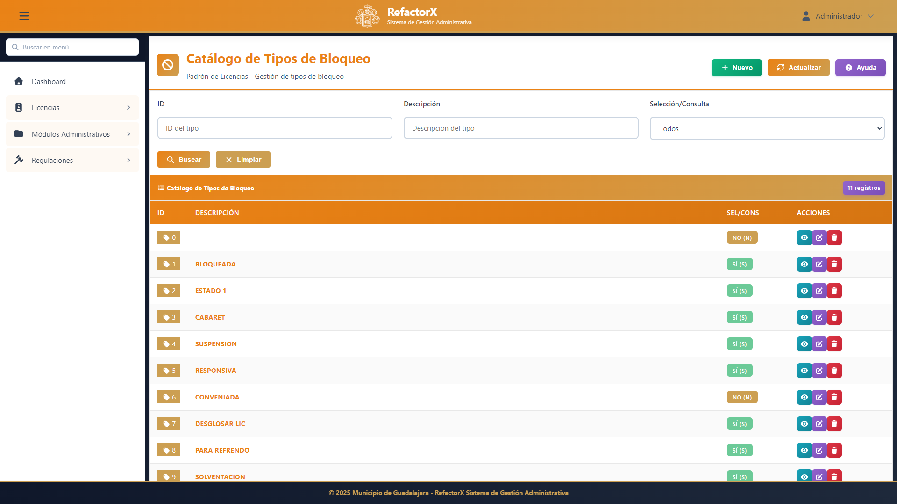

---

## 5. Tramites y Solicitudes

### 5.1 Registro de Solicitud

Permite capturar una nueva solicitud de licencia comercial.

**Acceso:** Menu > Tramites > Nueva Solicitud

**Datos requeridos:**

**Del solicitante:**
- RFC
- Nombre o razon social
- Domicilio fiscal
- Telefono de contacto
- Correo electronico

**Del establecimiento:**
- Nombre comercial
- Domicilio del establecimiento
- Giro solicitado
- Superficie del local
- Horario de operacion

**Documentos a anexar:**
- Identificacion oficial
- Comprobante de domicilio
- Acta constitutiva (en su caso)
- Uso de suelo compatible

---

### 5.2 Liga de Requisitos

Asocia los requisitos necesarios a un tramite especifico.

**Acceso:** Menu > Tramites > Liga de Requisitos

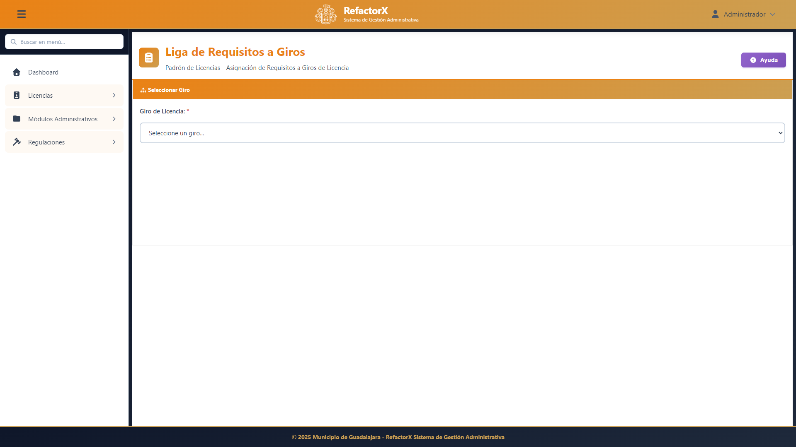

---

### 5.3 Liga de Anuncio

Permite asociar un anuncio publicitario a una licencia existente.

**Acceso:** Menu > Tramites > Liga de Anuncio

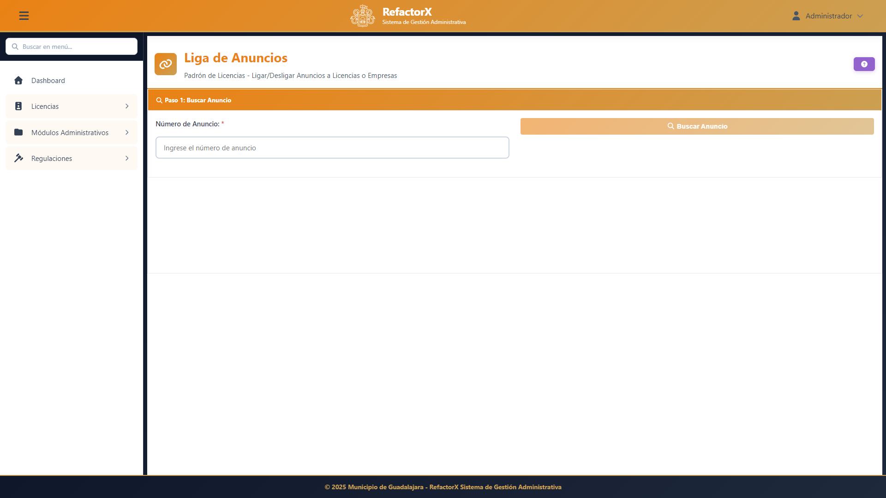

---

### 5.4 Constancia No Oficial

Genera constancias informativas no oficiales.

**Acceso:** Menu > Tramites > Constancia No Oficial

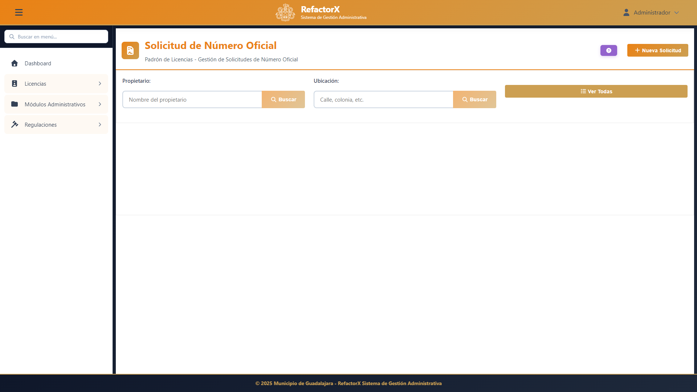

---

### 5.5 Constancia Oficial

Emision de constancias oficiales de licencia.

**Acceso:** Menu > Tramites > Constancia

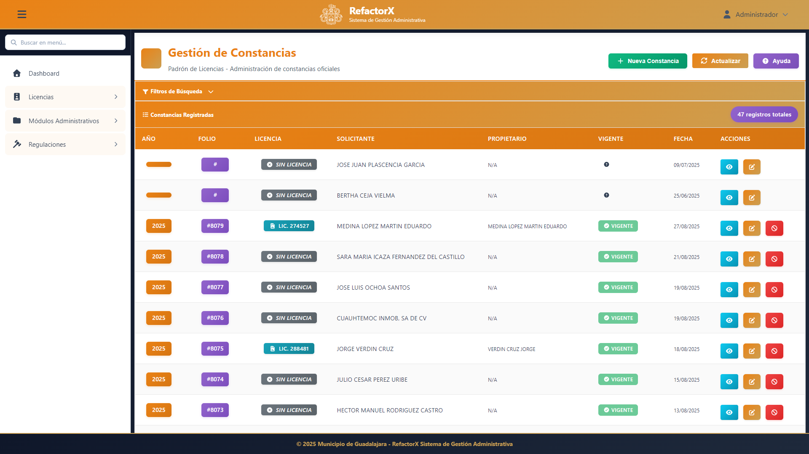

---

### 5.6 Dictamen

Proceso de dictamen tecnico para tramites.

**Acceso:** Menu > Tramites > Dictamen

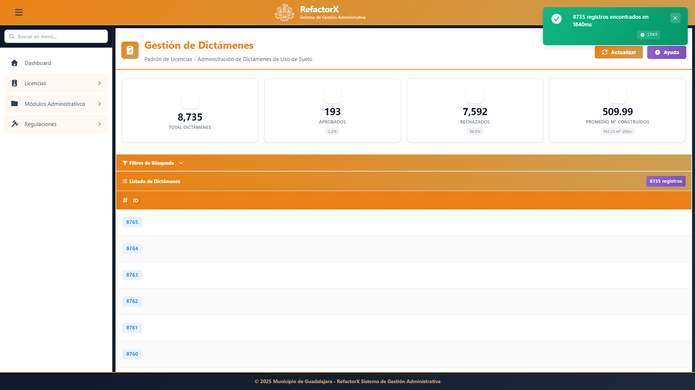

---

### 5.7 Dictamen de Uso de Suelo

Consulta y gestion de dictamenes de uso de suelo.

**Acceso:** Menu > Tramites > Uso de Suelo

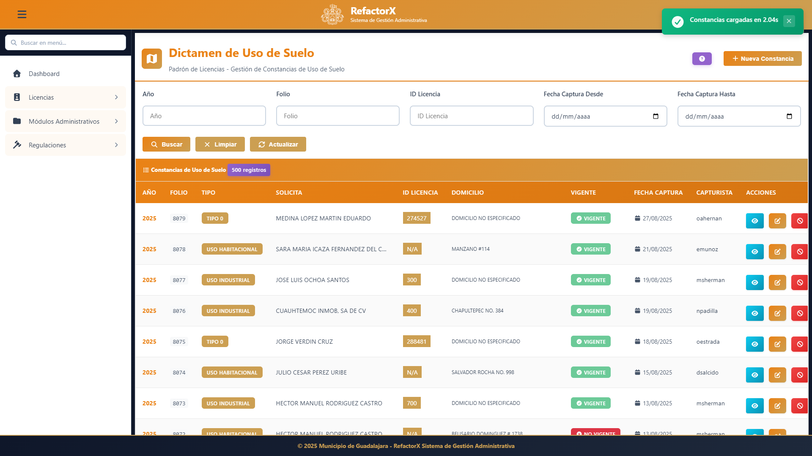

---

### 5.8 Agenda de Visitas

Programacion de visitas de inspeccion.

**Acceso:** Menu > Tramites > Agenda de Visitas

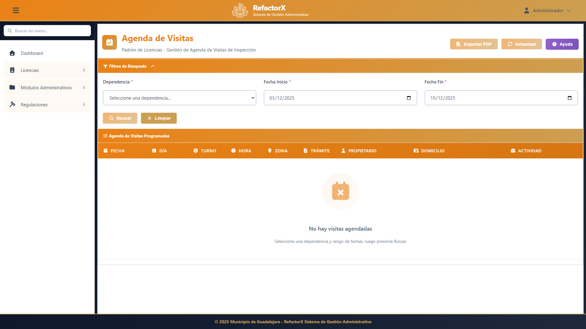

---

### 5.9 Certificaciones

Gestion de certificaciones y permisos especiales.

**Acceso:** Menu > Tramites > Certificaciones

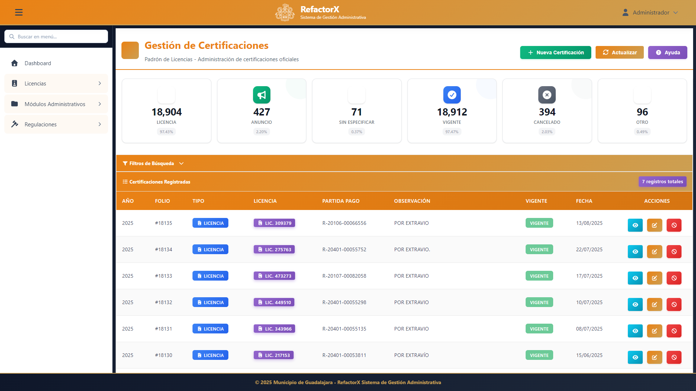

---

## 6. Modificaciones

### 6.1 Modificar Licencia

Permite actualizar los datos de una licencia existente.

**Acceso:** Menu > Licencias > Modificar Licencia

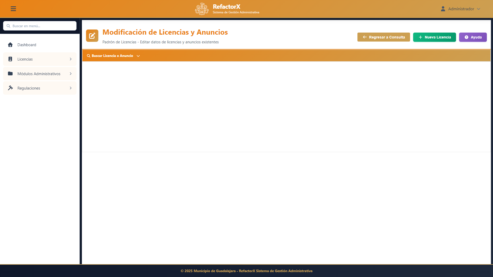

**Campos editables:**
- Razon social / Nombre comercial
- Domicilio fiscal
- Domicilio del establecimiento
- Giro comercial
- Datos del representante
- Horario de operacion

**Procedimiento:**
1. Busque la licencia a modificar por numero o RFC
2. Haga clic en **Editar**
3. Modifique los campos necesarios
4. Haga clic en **Guardar** para confirmar los cambios

---

### 6.2 Modificar Tramite

Actualiza informacion de tramites en proceso.

**Acceso:** Menu > Tramites > Modificar Tramite

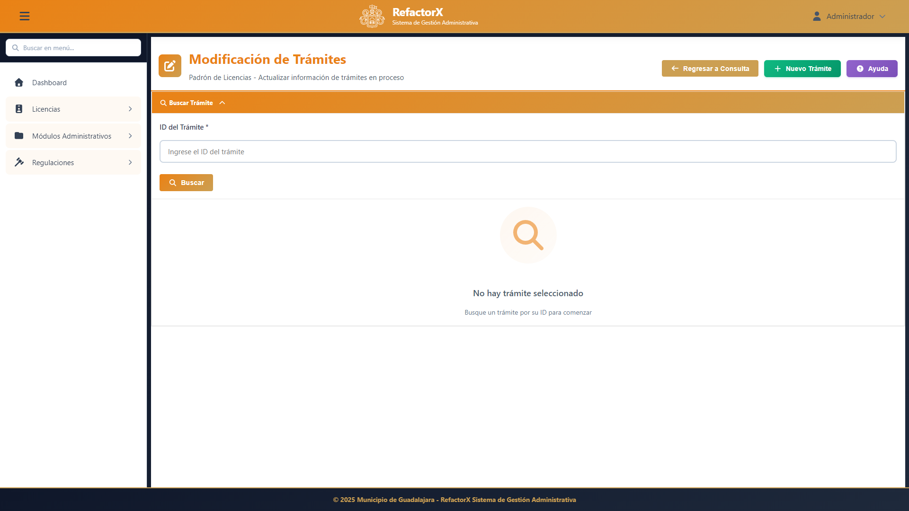

---

### 6.3 Modificar Adeudo

Ajuste de adeudos asociados a una licencia.

**Acceso:** Menu > Licencias > Modificar Adeudo

---

## 7. Bajas y Cancelaciones

### 7.1 Baja de Licencia

Proceso para dar de baja una licencia comercial.

**Acceso:** Menu > Licencias > Baja de Licencia

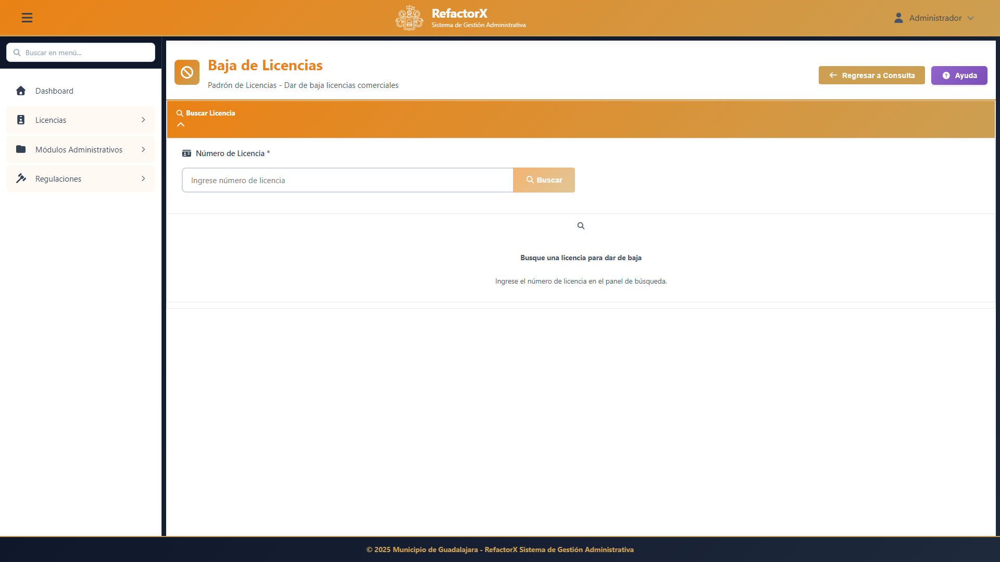

**Motivos de baja:**
- Solicitud del contribuyente
- Cierre del negocio
- Incumplimiento de requisitos
- Cambio de domicilio fuera del municipio
- Defuncion del titular

**Tramite de Baja:**

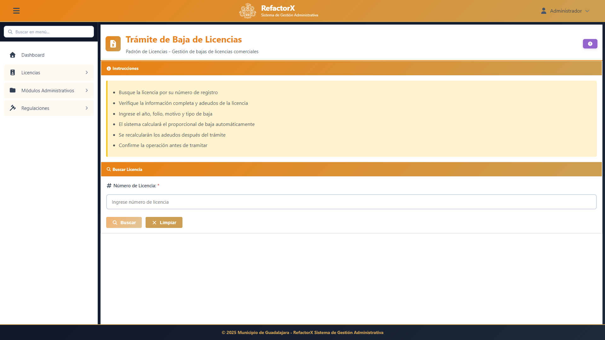

---

### 7.2 Baja de Anuncio

Proceso para dar de baja un anuncio publicitario.

**Acceso:** Menu > Anuncios > Baja de Anuncio

**Tramite de Baja:**

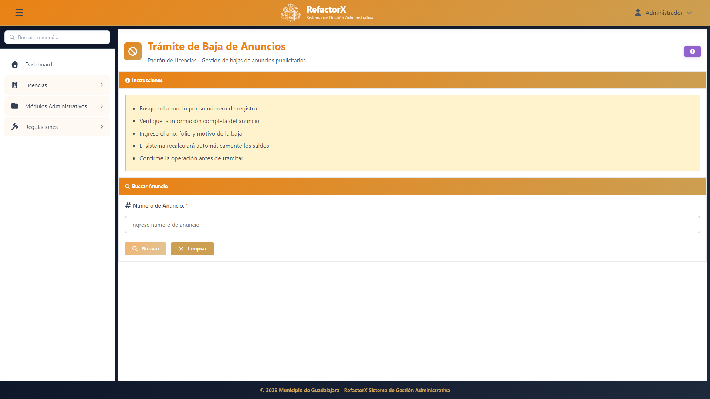

---

### 7.3 Cancelar Tramite

Cancela un tramite en proceso antes de su conclusion.

**Acceso:** Menu > Tramites > Cancelar Tramite

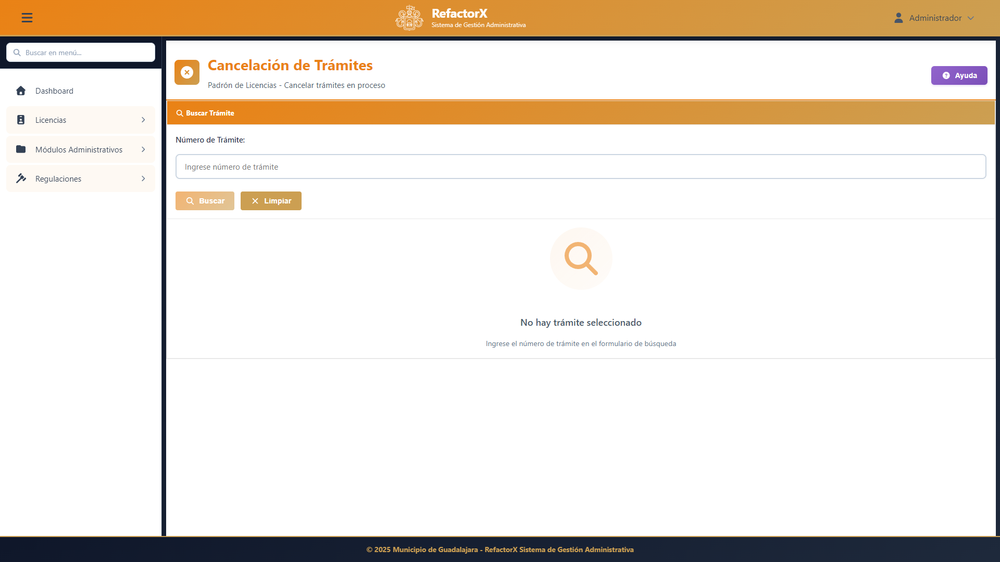

**Consideraciones importantes:**
- Solo se pueden cancelar tramites en estado "En proceso"
- Se requiere justificacion del motivo de cancelacion
- El sistema guarda registro de todas las cancelaciones
- No se puede cancelar un tramite ya concluido

---

### 7.4 Reactivar Tramite

Reactiva un tramite previamente cancelado o suspendido.

**Acceso:** Menu > Tramites > Reactivar Tramite

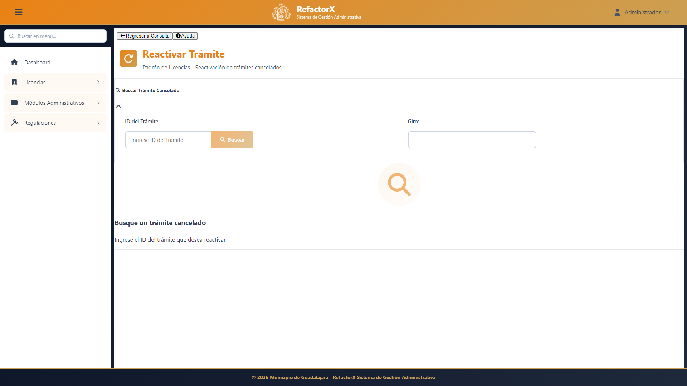

---

## 8. Bloqueos

### 8.1 Bloquear Licencia

Aplica bloqueo a una licencia especifica que impide su operacion.

**Acceso:** Menu > Bloqueos > Bloquear Licencia

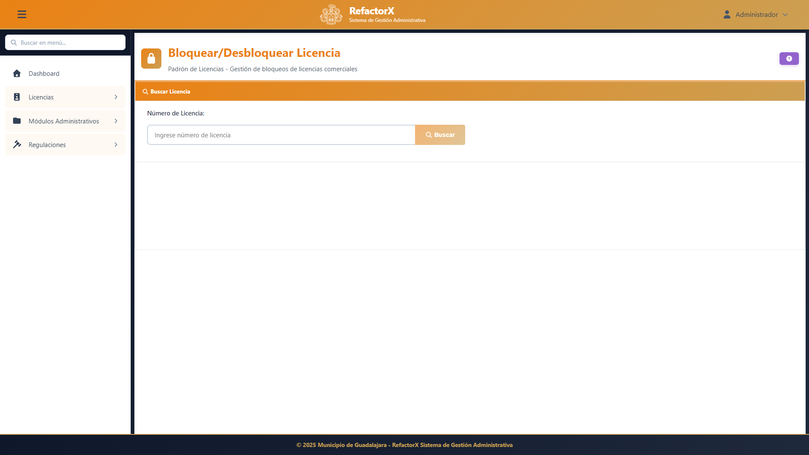

**Tipos de bloqueo:**
| Tipo | Descripcion |
|------|-------------|
| Adeudo fiscal | Deudas pendientes con el municipio |
| Procedimiento administrativo | Proceso legal en curso |
| Orden judicial | Mandato de autoridad judicial |
| Revision documental | Documentacion incompleta |
| Inspeccion pendiente | Verificacion fisica requerida |

---

### 8.2 Bloquear Anuncio

Aplica bloqueo a un anuncio publicitario.

**Acceso:** Menu > Bloqueos > Bloquear Anuncio

---

### 8.3 Bloquear Tramite

Suspende temporalmente un tramite en proceso.

**Acceso:** Menu > Bloqueos > Bloquear Tramite

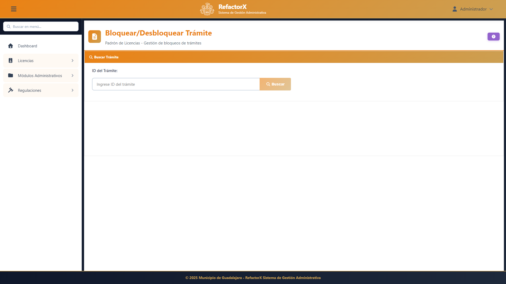

---

### 8.4 Bloqueo por RFC

Bloquea todas las licencias asociadas a un RFC especifico. Util cuando un contribuyente tiene adeudos o problemas legales.

**Acceso:** Menu > Bloqueos > Bloqueo por RFC

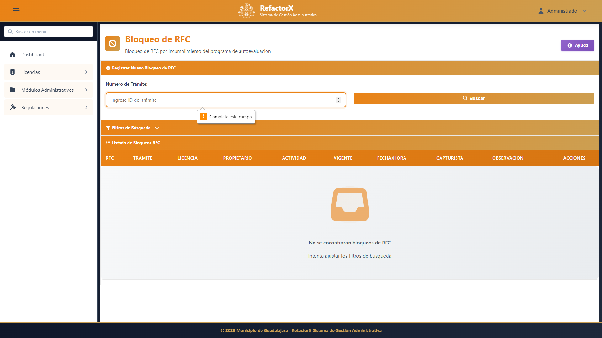

---

### 8.5 Bloqueo por Domicilio

Bloquea operaciones en un domicilio especifico. Util cuando hay problemas con el inmueble.

**Acceso:** Menu > Bloqueos > Bloqueo por Domicilio

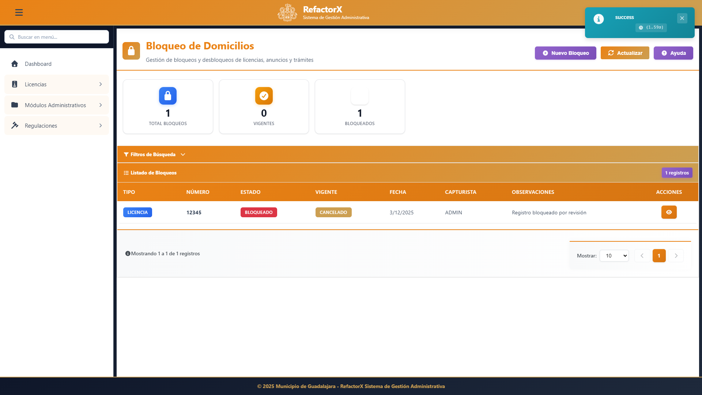

**Historial de Bloqueos por Domicilio:**

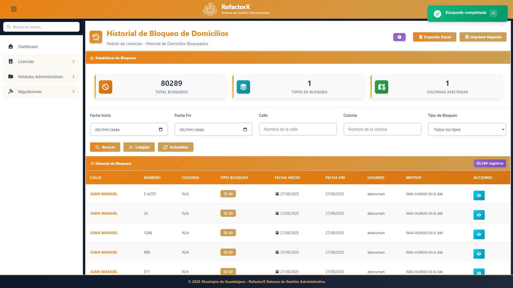

---

## 9. Busquedas

### 9.1 Buscar Giro

Herramienta para localizar giros en el catalogo por descripcion o clasificacion.

**Acceso:** Menu > Busquedas > Buscar Giro

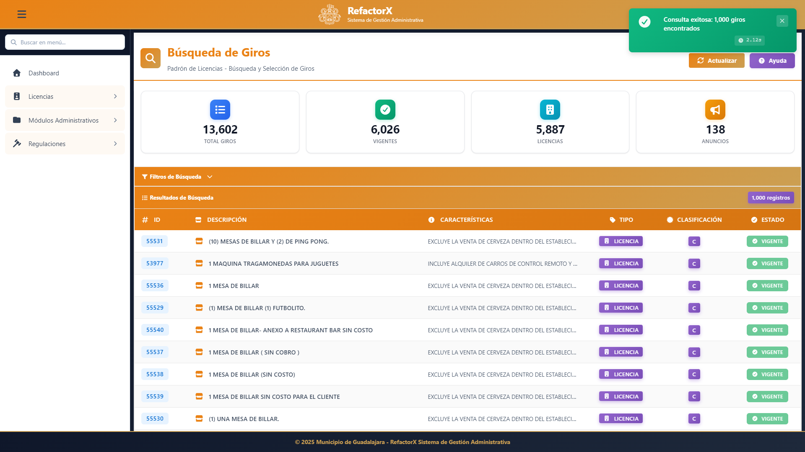

---

### 9.2 Buscar Actividad

Localiza actividades economicas por descripcion o codigo SCIAN.

**Acceso:** Menu > Busquedas > Buscar Actividad

---

### 9.3 Buscar SCIAN

Busqueda por codigo SCIAN (Sistema de Clasificacion Industrial de America del Norte).

**Acceso:** Menu > Busquedas > Buscar SCIAN

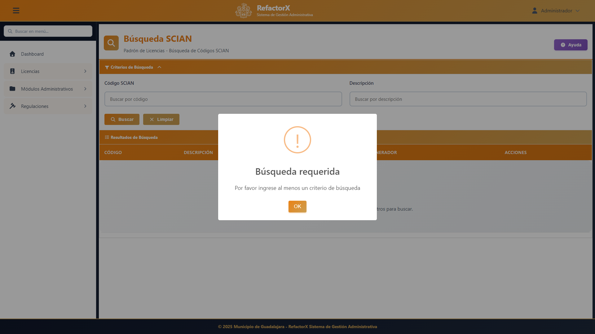

---

### 9.4 Buscar Calle

Localiza calles en el catalogo de vialidades del municipio.

**Acceso:** Menu > Busquedas > Buscar Calle

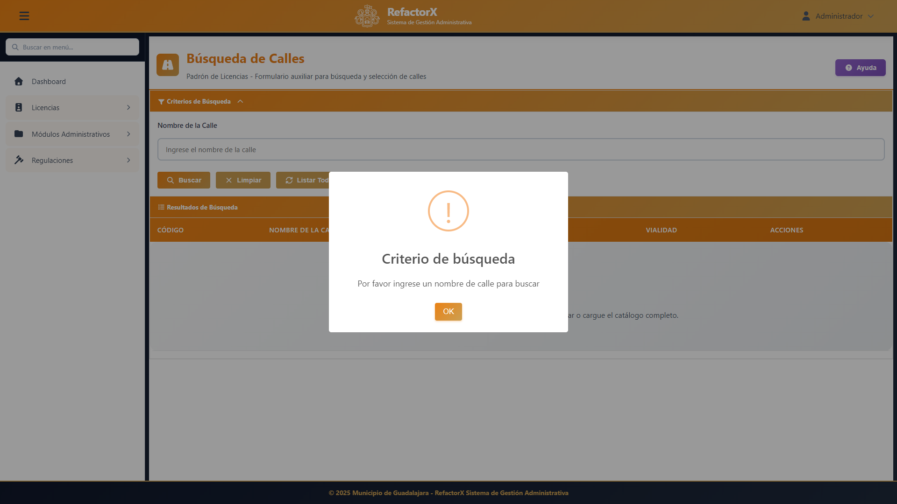

**Seleccion de Calle:**

---

### 9.5 Buscar Colonia

Localiza colonias del municipio por nombre o codigo postal.

**Acceso:** Menu > Busquedas > Buscar Colonia

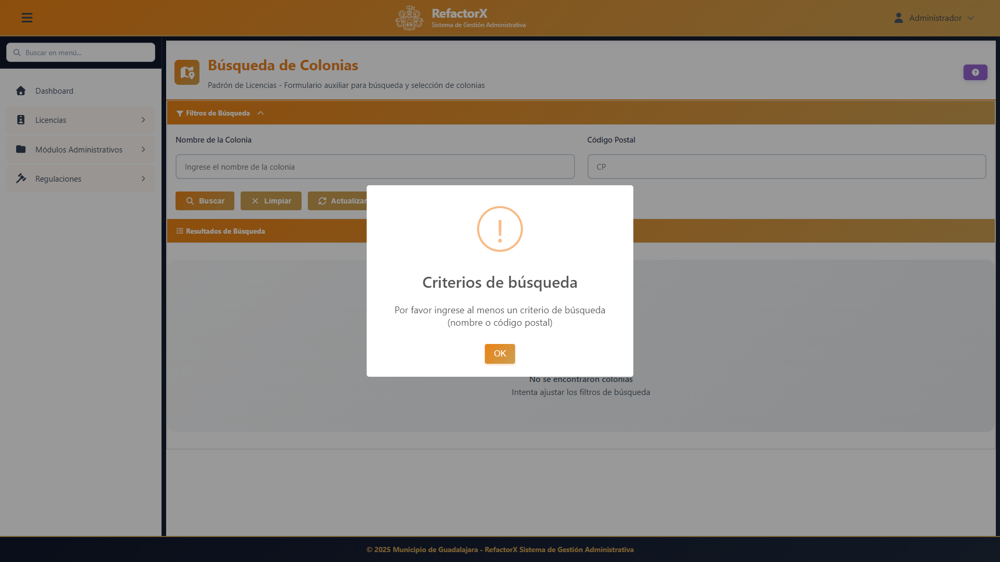

---

### 9.6 Cruces de Calles

Herramienta para localizar intersecciones de calles y ubicar domicilios con precision.

**Acceso:** Menu > Busquedas > Cruces

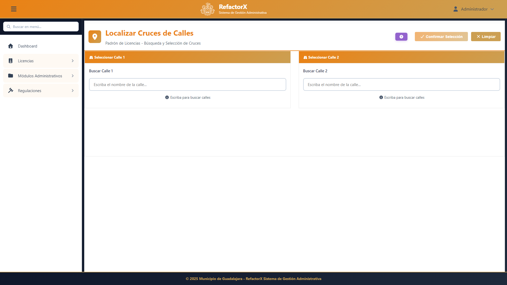

**Como usar:**
1. En el panel izquierdo **"Seleccionar Calle 1"**, escriba el nombre de la primera calle
2. Seleccione la calle de la lista de resultados
3. En el panel derecho **"Seleccionar Calle 2"**, escriba el nombre de la segunda calle
4. Seleccione la calle de la lista de resultados
5. El sistema mostrara el cruce correspondiente
6. Haga clic en **Confirmar Seleccion** para usar la ubicacion

---

### 9.7 Busqueda General

Busqueda avanzada con multiples criterios.

**Acceso:** Menu > Busquedas > General

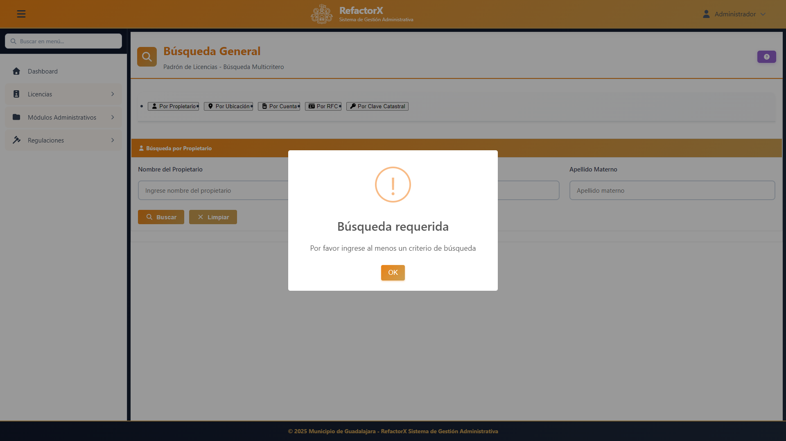

---

## 10. Reportes

### 10.1 Reporte de Documentos

Genera reportes de documentos emitidos en un periodo determinado.

**Acceso:** Menu > Reportes > Documentos

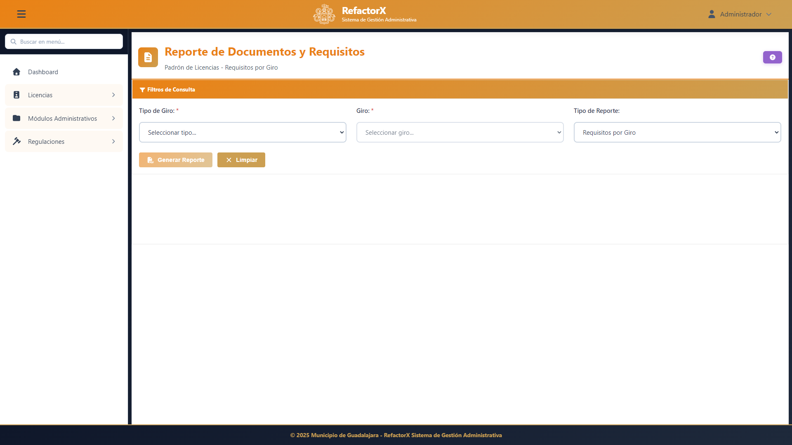

---

### 10.2 Reporte Estadistico

Muestra estadisticas generales del modulo de licencias.

**Acceso:** Menu > Reportes > Estadisticos

**Metricas disponibles:**
- Licencias por zona
- Licencias por giro
- Tramites por periodo
- Comparativos anuales
- Tendencias de crecimiento

---

### 10.3 Reporte por Estado

Genera reportes filtrados por estado de licencia.

**Acceso:** Menu > Reportes > Por Estado

---

### 10.4 Licencias Suspendidas

Lista de licencias con suspension activa y motivos.

**Acceso:** Menu > Reportes > Suspendidas

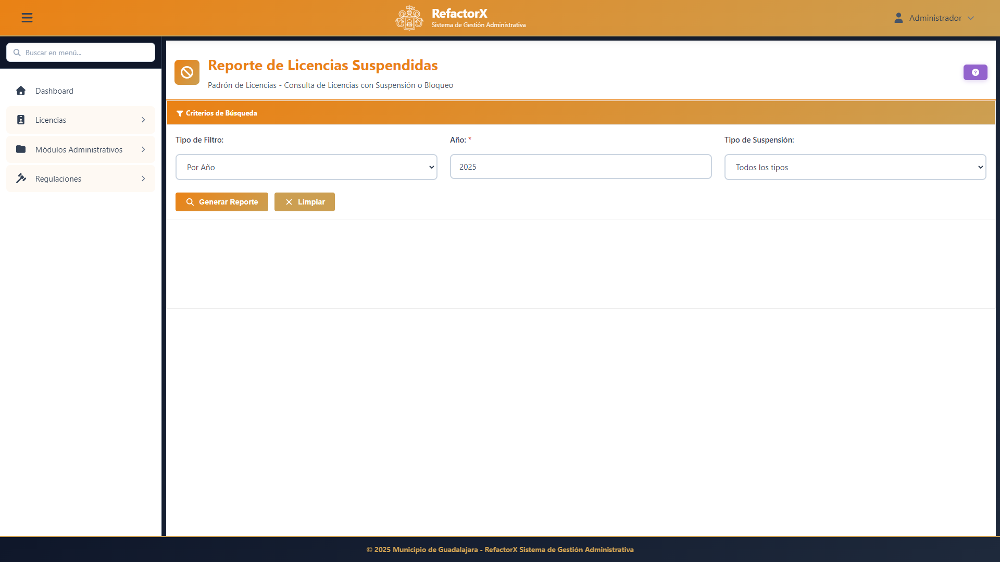

---

### 10.5 Reporte de Anuncios Excel

Exporta el padron completo de anuncios a formato Excel.

**Acceso:** Menu > Reportes > Anuncios Excel

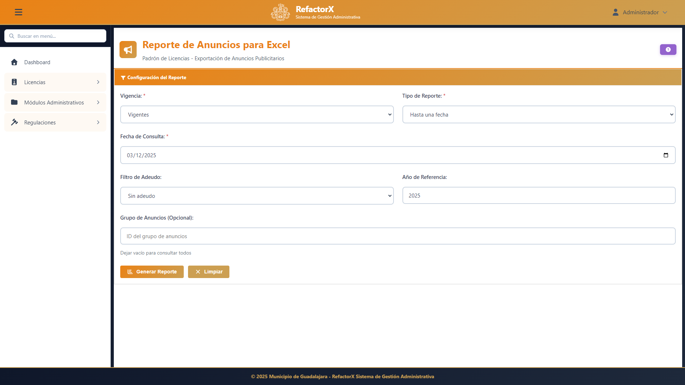

---

### 10.6 Impresion de Licencia Reglamentada

Genera documento oficial de licencia.

**Acceso:** Menu > Reportes > Licencia Reglamentada

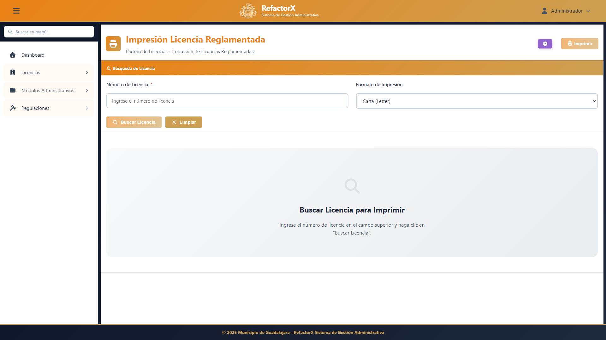

---

### 10.7 Impresion de Oficio

Genera oficios relacionados con licencias.

**Acceso:** Menu > Reportes > Oficio

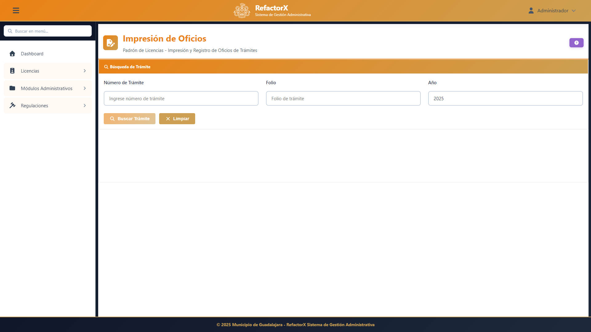

---

### 10.8 Impresion de Recibo

Genera recibos de pago.

**Acceso:** Menu > Reportes > Recibo

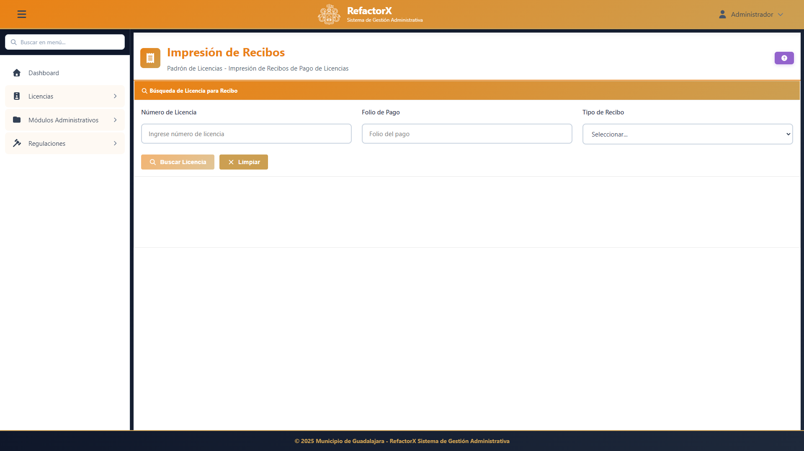

---

### 10.9 Formatos de Ecologia

Formatos especiales para tramites de ecologia.

**Acceso:** Menu > Reportes > Ecologia

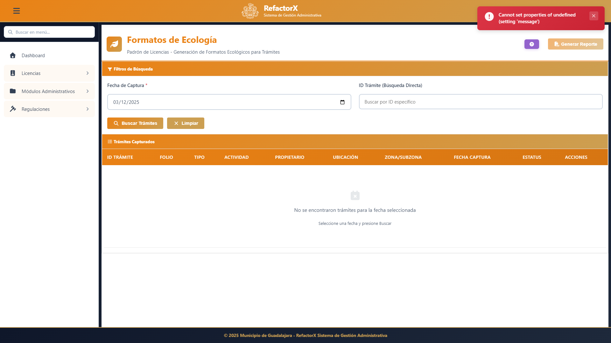

---

## 11. Utilidades

### 11.1 Cambiar Contrasena

Permite al usuario cambiar su contrasena de acceso al sistema.

**Acceso:** Menu > Configuracion > Cambiar Contrasena

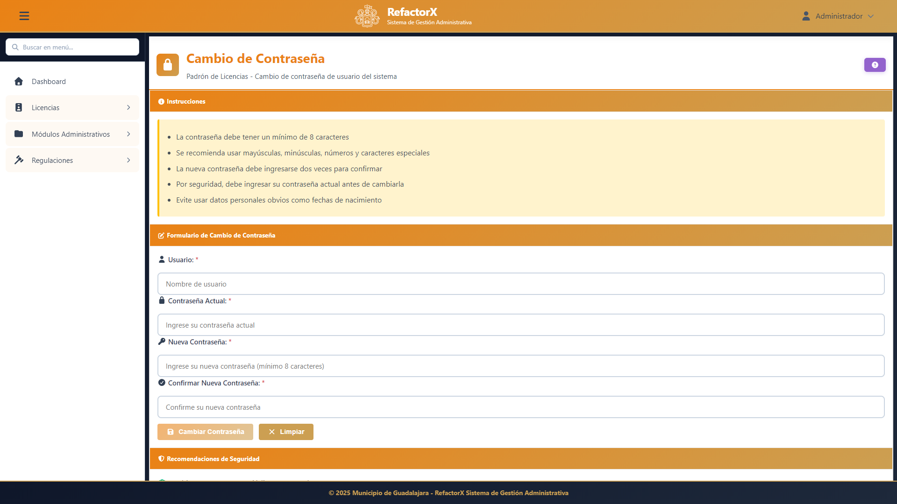

**Requisitos de la nueva contrasena:**
- Minimo 8 caracteres
- Al menos una letra mayuscula
- Al menos un numero
- Al menos un caracter especial

---

### 11.2 Firma de Usuario

Configura la firma electronica del usuario para documentos oficiales.

**Acceso:** Menu > Configuracion > Firma

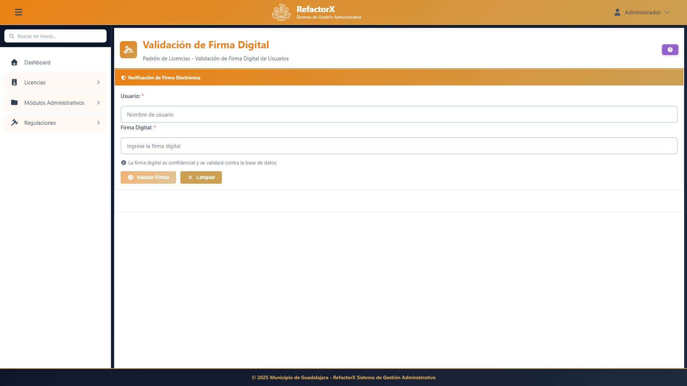

**Cambio de Firma:**

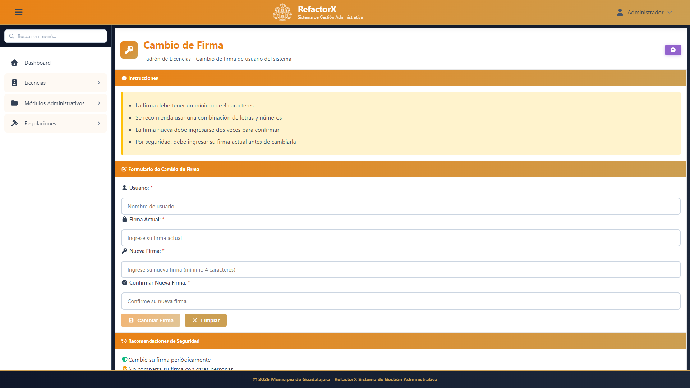

---

### 11.3 Prepago

Gestion de pagos anticipados de derechos de licencia.

**Acceso:** Menu > Pagos > Prepago

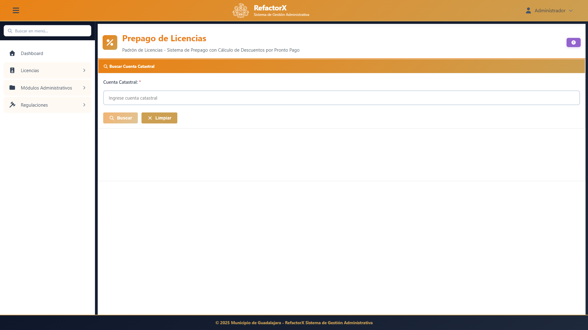

---

### 11.4 Conexion TDM

Configuracion de conexion con el sistema de Tesoreria Municipal (TDM).

**Acceso:** Menu > Configuracion > TDM

---

### 11.5 Conexion Catastro

Integracion con el sistema de catastro municipal.

**Acceso:** Menu > Configuracion > Catastro

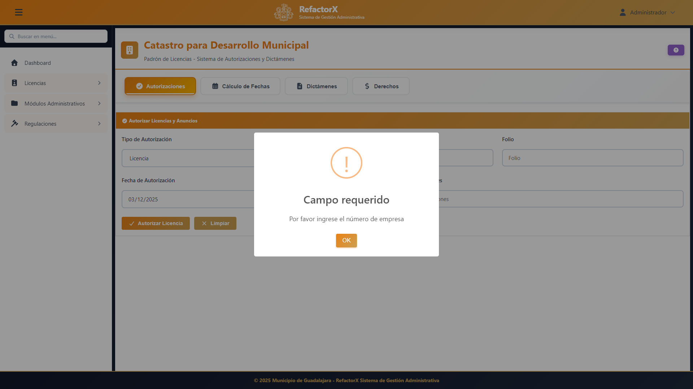

---

### 11.6 Carga de Datos

Importacion masiva de datos al sistema.

**Acceso:** Menu > Utilidades > Carga de Datos

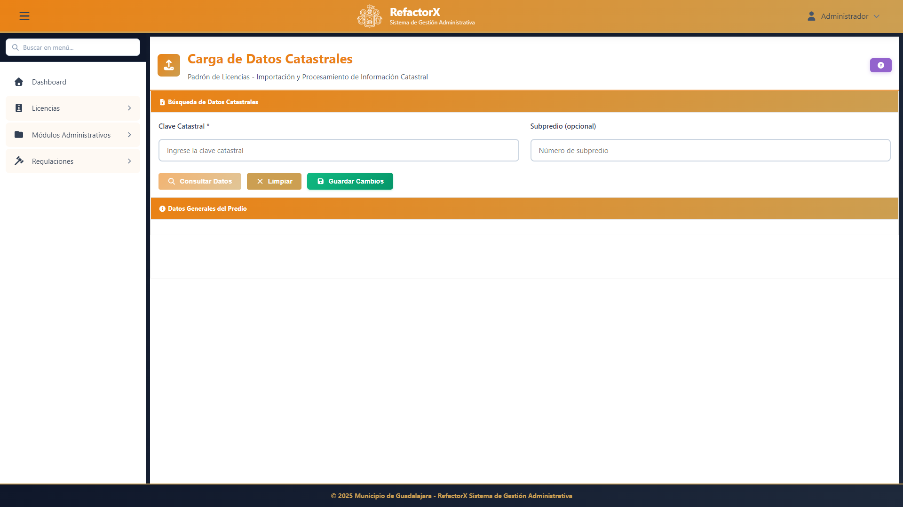

---

### 11.7 Semaforo de Tramites

Visualizacion del estado de tramites mediante semaforo de colores.

**Acceso:** Menu > Utilidades > Semaforo

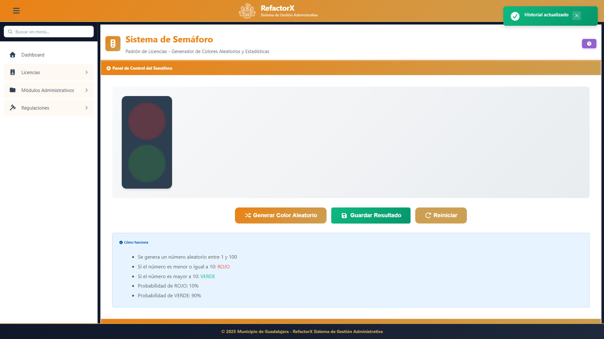

---

### 11.8 Observaciones

Registro de observaciones en tramites.

**Acceso:** Menu > Utilidades > Observaciones

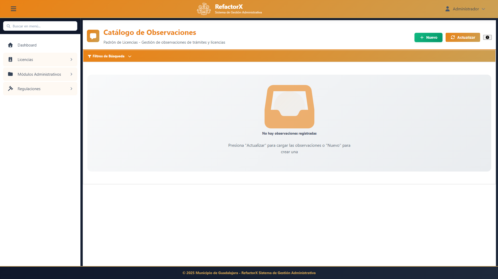

---

### 11.9 Privilegios

Administracion de permisos y privilegios de usuarios.

**Acceso:** Menu > Administracion > Privilegios

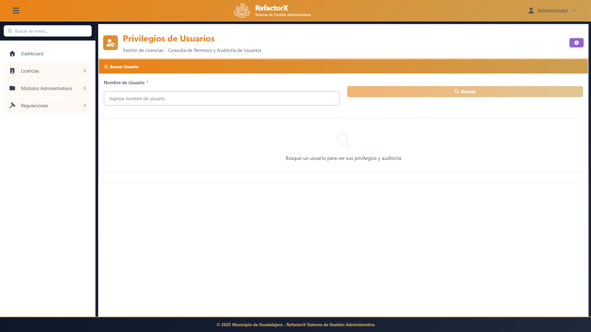

---

## 12. Glosario

| Termino | Definicion |
|---------|------------|
| **Giro** | Actividad comercial principal del establecimiento |
| **SCIAN** | Sistema de Clasificacion Industrial de America del Norte |
| **RFC** | Registro Federal de Contribuyentes |
| **Padron** | Registro oficial de contribuyentes |
| **Licencia** | Autorizacion municipal para operar un negocio |
| **Anuncio** | Publicidad comercial que requiere permiso municipal |
| **Dictamen** | Resolucion tecnica sobre un tramite |
| **Constancia** | Documento oficial que acredita un estatus |
| **Bloqueo** | Restriccion aplicada a una licencia o tramite |
| **Vigencia** | Periodo de validez de una licencia |
| **Contribuyente** | Persona fisica o moral titular de la licencia |
| **Uso de suelo** | Autorizacion para determinado uso del inmueble |

---

## Anexos

### Atajos de Teclado

| Combinacion | Accion |
|-------------|--------|
| F1 | Ayuda contextual |
| F2 | Buscar |
| F3 | Nuevo registro |
| F4 | Editar |
| F5 | Actualizar/Refrescar |
| Ctrl+S | Guardar |
| Ctrl+P | Imprimir |
| Esc | Cancelar/Cerrar |

### Formatos de Exportacion

El sistema permite exportar informacion a los siguientes formatos:
- **Excel (.xlsx)** - Para analisis y manipulacion de datos
- **PDF** - Para documentos oficiales e impresion
- **CSV** - Para integracion con otros sistemas

---

## Soporte Tecnico

Para asistencia tecnica contacte a:

- **Correo:** soporte@guadalajara.gob.mx
- **Telefono:** (33) 3837-0000
- **Horario:** Lunes a Viernes 8:00 - 16:00 hrs

---

**RefactorX - Sistema de Gestion Administrativa**
**Municipio de Guadalajara**
**2025**
