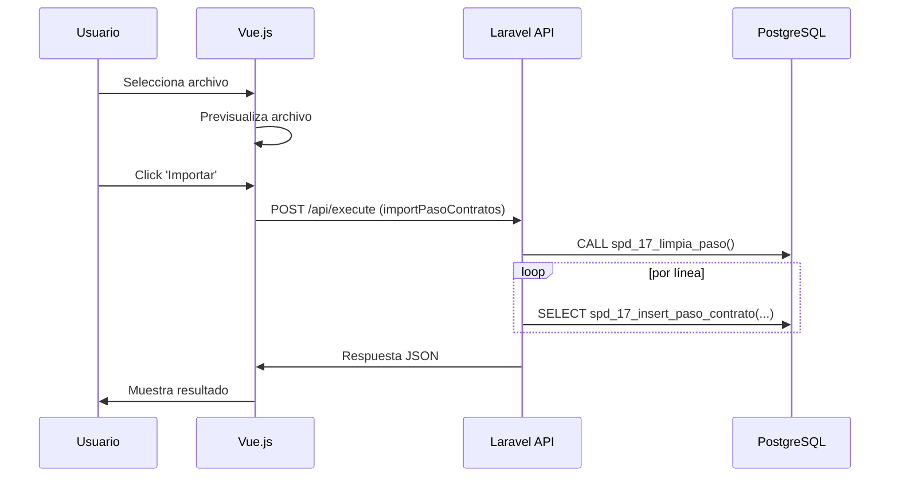

# Documentación Técnica: Migración PasoContratos Delphi → Laravel + Vue.js + PostgreSQL

## 1. Descripción General
El formulario PasoContratos permite cargar archivos de texto con información de contratos, previsualizarlos, limpiar la tabla de paso y almacenar los datos en la tabla temporal `ta_17_paso_cont` para su posterior procesamiento. El proceso se ha migrado a una arquitectura moderna usando Laravel (backend/API), Vue.js (frontend) y PostgreSQL (base de datos).

## 2. Arquitectura
- **Frontend**: Componente Vue.js independiente, página completa, sin tabs. Permite cargar archivo, previsualizar, importar y ver preview de la tabla de paso.
- **Backend**: Controlador Laravel con endpoint único `/api/execute` usando patrón eRequest/eResponse. Toda la lógica de negocio se canaliza por este endpoint.
- **Base de Datos**: PostgreSQL. Toda la lógica de inserción y limpieza se realiza mediante stored procedures.

## 3. Flujo de Trabajo
1. El usuario selecciona un archivo de texto plano (`.txt` o `.csv`) con los datos de contratos, separados por `|`.
2. El frontend previsualiza el archivo (primeras filas) antes de importar.
3. El usuario puede limpiar la tabla de paso antes de importar nuevos datos.
4. Al importar, el archivo se envía al backend, que limpia la tabla y llama el SP de inserción por cada línea.
5. El usuario puede ver un preview de los datos cargados en la tabla de paso.

## 4. API (Laravel)
- **Endpoint único**: `/api/execute` (POST)
- **Parámetros**:
  - `action`: string (ej: 'importPasoContratos', 'limpiarTablaPaso', 'getPasoContratosPreview', 'loadFilePreview')
  - `payload`: objeto con datos específicos de la acción
- **Respuestas**: Siempre JSON con `success`, `message`, `data`

## 5. Stored Procedures
- `spd_17_limpia_paso()`: Limpia la tabla de paso.
- `spd_17_insert_paso_contrato(...)`: Inserta un registro en la tabla de paso.

## 6. Frontend (Vue.js)
- Página independiente, sin tabs.
- Permite cargar archivo, previsualizar, importar, limpiar y ver preview de la tabla de paso.
- Usa fetch API para comunicarse con `/api/execute`.
- Maneja errores y muestra mensajes de éxito/fallo.

## 7. Seguridad
- Validación básica de archivo y campos.
- El backend valida número de campos antes de insertar.
- El endpoint puede protegerse con middleware de autenticación según la política del sistema.

## 8. Consideraciones
- El proceso es idempotente: limpiar + importar siempre deja la tabla en estado consistente.
- El SP de inserción puede extenderse para validaciones adicionales.
- El frontend puede extenderse para mostrar errores de validación por línea.

## 9. Extensibilidad
- Se pueden agregar acciones adicionales al endpoint `/api/execute` siguiendo el patrón eRequest/eResponse.
- Los stored procedures pueden evolucionar para lógica más compleja (validaciones, transformaciones, etc).

## 10. Diagrama de Secuencia (Resumen)

