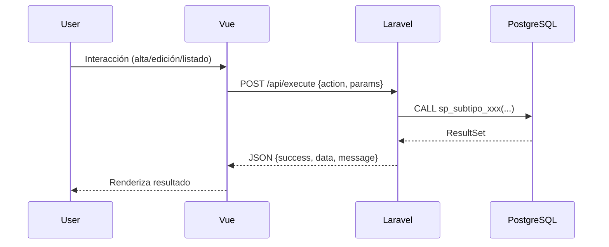

# Documentación Técnica: Migración de Formulario SubTipo (Delphi) a Laravel + Vue.js + PostgreSQL

## Arquitectura General
- **Backend:** Laravel 10+ (API RESTful, endpoint único `/api/execute`)
- **Frontend:** Vue.js 3 (SPA, cada formulario es una página independiente)
- **Base de Datos:** PostgreSQL (toda la lógica de negocio en stored procedures)
- **Patrón de integración:** eRequest/eResponse (todas las operaciones via `/api/execute`)

## Endpoints
- **POST /api/execute**
  - **Body:** `{ action: 'nombre_accion', params: { ... } }`
  - **Acciones soportadas:**
    - `list_subtipos`: Lista todos los subtipos
    - `get_subtipo`: Obtiene un subtipo por ID
    - `create_subtipo`: Crea un nuevo subtipo
    - `update_subtipo`: Actualiza un subtipo existente
    - `delete_subtipo`: Elimina un subtipo
    - `last_subtipo_by_tipo`: Obtiene el último subtipo de un tipo

## Stored Procedures
- Toda la lógica de negocio y validación reside en stored procedures PostgreSQL.
- Los procedimientos devuelven siempre un `TABLE` para facilitar la integración con Laravel.

## Controlador Laravel
- El controlador recibe la acción y los parámetros, despacha la llamada al stored procedure correspondiente y retorna el resultado en formato JSON.
- Maneja errores y validaciones básicas.

## Componente Vue.js
- Página independiente `/subtipos`.
- Tabla con listado, botones para agregar, editar y eliminar.
- Formularios modales para alta/edición.
- Confirmación para eliminar.
- Navegación breadcrumb.
- Llama siempre a `/api/execute` con la acción adecuada.

## Seguridad
- Se recomienda proteger el endpoint con autenticación JWT o Laravel Sanctum.
- Validar que el usuario tenga permisos para crear/modificar/eliminar.

## Validaciones
- Todas las validaciones de integridad y unicidad deben estar en los stored procedures.
- El frontend realiza validaciones mínimas de campos requeridos.

## Consideraciones de Migración
- Los campos y lógica de Delphi se mapearon 1:1 a la estructura de la tabla y los procedimientos.
- El flujo de "agregar" busca el último subtipo por tipo y suma 1 al valor de subtipo.
- El campo `id_usuario` debe ser proporcionado por el frontend (o por el backend si hay sesión).

## Estructura de la Tabla (Referencia)
```sql
CREATE TABLE ta_17_subtipo_conv (
    tipo smallint NOT NULL,
    subtipo smallint NOT NULL,
    desc_subtipo varchar(50) NOT NULL,
    cuenta_ingreso integer NOT NULL,
    id_usuario integer NOT NULL,
    fecha_actual timestamp NOT NULL DEFAULT now(),
    PRIMARY KEY (tipo, subtipo)
);
```

## Flujo de Operaciones
1. **Listar:**
   - Acción: `list_subtipos`
   - Llama a `sp_subtipo_list()`
2. **Agregar:**
   - Acción: `create_subtipo`
   - Llama a `sp_subtipo_create(tipo, subtipo, desc_subtipo, cuenta_ingreso, id_usuario)`
3. **Editar:**
   - Acción: `update_subtipo`
   - Llama a `sp_subtipo_update(tipo, subtipo, desc_subtipo, cuenta_ingreso, id_usuario)`
4. **Eliminar:**
   - Acción: `delete_subtipo`
   - Llama a `sp_subtipo_delete(tipo, subtipo)`
5. **Obtener último subtipo por tipo:**
   - Acción: `last_subtipo_by_tipo`
   - Llama a `sp_subtipo_last_by_tipo(tipo)`

## Manejo de Errores
- Los errores de SQL o de lógica se devuelven en el campo `message` del JSON.
- El frontend muestra alertas en caso de error.

## Integración
- El frontend y backend se comunican exclusivamente por `/api/execute`.
- El backend es responsable de traducir la acción a la llamada al stored procedure.

## Extensibilidad
- El patrón eRequest/eResponse permite agregar nuevas acciones y procedimientos sin modificar la estructura del endpoint.

# Diagrama de Flujo


